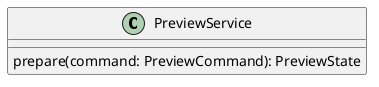

# UC-01 — Review Join Preview and Permissions

### Description

As a prospective participant, I want to review my camera and microphone preview so that I understand how I will appear before joining.

### Actors

Prospective Participant; Preview Service.

### Priority

P0.

### Trigger

**TRG-UC-01-01** — The prospective participant opens a session preview.

### Preconditions

- **PRE-UC-01-01** — The client displays the pre-join interface.

### Postconditions

- **POST-UC-01-01** — The client displays the selected camera and microphone state.
- **POST-UC-01-02** — The client displays the returned permission outcome when permission is requested.

### Basic Flow

1. The prospective participant opens the pre-join interface.
2. The client presents the camera, microphone, name, and permission controls shown by the design.
3. The prospective participant chooses the displayed permission action.
4. The client requests access and receives an outcome.
5. The client renders the media preview and current control states.

### Alternative Flows

#### AF-UC-01-01

1. The prospective participant turns the microphone or camera off.
2. The client renders the corresponding muted preview state.

### Exception Flows

#### EF-UC-01-01

1. Access is not granted.
2. The client displays the permission-denied dialog and its visible recovery action.

### UML Model

Classifiers and helper semantics are imported from the [shared domain model](shared-domain-model.md).



### Business Rules

```ocl
-- BR-UC-01-01
-- Source: Assumption
-- Assumption: A-01
context PreviewService::prepare(command: PreviewCommand): PreviewState
post BR_UC_01_01_PermissionAndHardware:
  (result.cameraEnabled implies result.cameraPermission = PermissionStatus::GRANTED and result.cameraAvailable and command.requestCamera) and
  (result.microphoneEnabled implies result.microphonePermission = PermissionStatus::GRANTED and result.microphoneAvailable and command.requestMicrophone)
```

```ocl
-- BR-UC-01-02
-- Source: Assumption
-- Assumption: A-01
context PreviewService::prepare(command: PreviewCommand): PreviewState
post BR_UC_01_02_ViewerPreviewMuted:
  command.role = ParticipantRole::VIEWER implies not result.cameraEnabled and not result.microphoneEnabled
```

```ocl
-- BR-UC-01-03
-- Source: Assumption
-- Assumption: A-01
context PreviewService::prepare(command: PreviewCommand): PreviewState
post BR_UC_01_03_NameReadiness:
  result.isReadyToJoin = (command.displayName <> null and command.displayName.trim().size() > 0 and command.displayName.trim().size() <= 50)
```

```ocl
-- BR-UC-01-04
-- Source: Assumption
-- Assumption: A-01
context PreviewService::prepare(command: PreviewCommand): PreviewState
post BR_UC_01_04_PreviewKey:
  result.participantKey = command.participantKey
```

```ocl
-- BR-UC-01-05
-- Source: Assumption
-- Assumption: A-01
context PreviewService::prepare(command: PreviewCommand): PreviewState
post BR_UC_01_05_CameraDeniedState:
  result.cameraPermission <> PermissionStatus::GRANTED implies not result.cameraEnabled
```

```ocl
-- BR-UC-01-06
-- Source: Assumption
-- Assumption: A-01
context PreviewService::prepare(command: PreviewCommand): PreviewState
post BR_UC_01_06_MicrophoneDeniedState:
  result.microphonePermission <> PermissionStatus::GRANTED implies not result.microphoneEnabled
```

```ocl
-- BR-UC-01-07
-- Source: Assumption
-- Assumption: A-01
context PreviewService::prepare(command: PreviewCommand): PreviewState
post BR_UC_01_07_ClientLocalPreview:
  Participant.allInstances() = Participant.allInstances()@pre and
  MediaPreference.allInstances() = MediaPreference.allInstances()@pre and
  ViewPreference.allInstances() = ViewPreference.allInstances()@pre
```

### Related UI

- Broadcaster Preview `6007:51245`.
- Video Conferencing Desktop Preview `6066:89727`.
- Video Conferencing Mobile Preview `6066:89005`.

### Related APIs

None. This interaction is client-local.

### Notes

Preview preparation is client-local. Its participantKey identifies local draft state, not persisted session membership.
