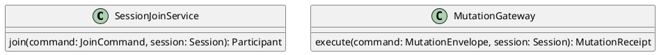

# UC-02 — Join a Session

### Description

As a participant, I want to join a session with my selected identity and media state so that I can participate.

### Actors

Participant; Session Service.

### Priority

P0.

### Trigger

**TRG-UC-02-01** — The participant chooses Join from the preview interface.

### Preconditions

- **PRE-UC-02-01** — The client displays a completed preview interface.

### Postconditions

- **POST-UC-02-01** — The client displays the joined session or a returned recovery state.
- **POST-UC-02-02** — The participant tile reflects the returned identity and media state.

### Basic Flow

1. The participant enters a display name and chooses Join.
2. The client submits the join request.
3. The system returns the joined participant and session summary.
4. The client renders the active session and participant tile.

### Alternative Flows

#### AF-UC-02-01

1. The participant changes a preview control before choosing Join.
2. The client submits the updated selections with the join request.

### Exception Flows

#### EF-UC-02-01

1. The system returns that the session cannot be joined.
2. The client displays the returned recovery state while preserving the preview context.

### UML Model

Classifiers and helper semantics are imported from the [shared domain model](shared-domain-model.md).



### Business Rules

```ocl
-- BR-UC-02-01
-- Source: Assumption
-- Assumption: A-19
context SessionJoinService::join(command: JoinCommand, session: Session): Participant
pre BR_UC_02_01_TrustedJoinPrincipal:
  RequestContext::authenticated and command.sessionId = RequestContext::sessionId and
  command.principalId = RequestContext::principalId and
  Principal.allInstances()->exists(p | p.id = command.principalId and p.userId = command.userId)
```

```ocl
-- BR-UC-02-02
-- Source: Assumption
-- Assumption: A-19
context SessionJoinService::join(command: JoinCommand, session: Session): Participant
pre BR_UC_02_02_TargetSession:
  command.sessionId = session.id and session.status <> SessionStatus::ENDED
```

```ocl
-- BR-UC-02-03
-- Source: Assumption
-- Assumption: A-20
context SessionJoinService::join(command: JoinCommand, session: Session): Participant
pre BR_UC_02_03_CommandKey:
  command.idempotencyKey <> null and command.idempotencyKey.trim().size() > 0
```

```ocl
-- BR-UC-02-04
-- Source: Assumption
-- Assumption: A-01
context SessionJoinService::join(command: JoinCommand, session: Session): Participant
pre BR_UC_02_04_Name:
  command.displayName <> null and command.displayName.trim().size() > 0 and command.displayName.trim().size() <= 50
```

```ocl
-- BR-UC-02-05
-- Source: Assumption
-- Assumption: A-02
context SessionJoinService::join(command: JoinCommand, session: Session): Participant
pre BR_UC_02_05_NoDuplicateMembership:
  not session.participants->exists(p | p.principalId = command.principalId and p.status = ParticipantStatus::JOINED)
```

```ocl
-- BR-UC-02-06
-- Source: Assumption
-- Assumption: A-02
context SessionJoinService::join(command: JoinCommand, session: Session): Participant
pre BR_UC_02_06_Capacity:
  let count : Integer = session.participants->select(p | p.status = ParticipantStatus::JOINED)->size() in
  (session.kind = SessionKind::VIDEO_CONFERENCE implies count < 100) and
  (session.kind = SessionKind::LIVE_STREAM implies count < 1000)
```

```ocl
-- BR-UC-02-07
-- Source: Assumption
-- Assumption: A-02
context SessionJoinService::join(command: JoinCommand, session: Session): Participant
post BR_UC_02_07_CreatedIdentity:
  result.oclIsNew() and result.id <> null and result.sessionId = command.sessionId and result.principalId = command.principalId and result.userId = command.userId
```

```ocl
-- BR-UC-02-08
-- Source: Assumption
-- Assumption: A-02
context SessionJoinService::join(command: JoinCommand, session: Session): Participant
post BR_UC_02_08_JoinedParticipant:
  result.status = ParticipantStatus::JOINED and result.displayName = command.displayName.trim() and
  result.joinedAt <> null and result.leftAt = null and result.version = 1 and
  session.participants = session.participants@pre->including(result)
```

```ocl
-- BR-UC-02-09
-- Source: Assumption
-- Assumption: A-02
context SessionJoinService::join(command: JoinCommand, session: Session): Participant
post BR_UC_02_09_ExclusiveRole:
  result.role = if command.principalId = session.designatedHostPrincipalId
    then ParticipantRole::HOST
    else if session.kind = SessionKind::LIVE_STREAM then ParticipantRole::VIEWER
      else ParticipantRole::BROADCASTER endif endif
```

```ocl
-- BR-UC-02-10
-- Source: Assumption
-- Assumption: A-02
context SessionJoinService::join(command: JoinCommand, session: Session): Participant
post BR_UC_02_10_EffectiveMedia:
  result.microphoneEnabled = (result.role <> ParticipantRole::VIEWER and command.microphoneEnabled) and
  result.cameraEnabled = (result.role <> ParticipantRole::VIEWER and command.cameraEnabled)
```

```ocl
-- BR-UC-02-11
-- Source: Assumption
-- Assumption: A-02
context SessionJoinService::join(command: JoinCommand, session: Session): Participant
post BR_UC_02_11_HostOpensSession:
  if result.role = ParticipantRole::HOST then
    session.hostParticipantId = result.id and session.status = SessionStatus::LIVE
  else session.hostParticipantId = session.hostParticipantId@pre and session.status = session.status@pre endif
```

```ocl
-- BR-UC-02-12
-- Source: Assumption
-- Assumption: A-13
context SessionJoinService::join(command: JoinCommand, session: Session): Participant
pre BR_UC_02_12_DraftBackground:
  command.virtualBackgroundId = null or VirtualBackground.allInstances()->exists(b | b.id = command.virtualBackgroundId and b.active)
```

```ocl
-- BR-UC-02-13
-- Source: Assumption
-- Assumption: A-12
context SessionJoinService::join(command: JoinCommand, session: Session): Participant
post BR_UC_02_13_InitializePreferences:
  MediaPreference.allInstances()->one(m | m.participantId = result.id and m.oclIsNew() and
    m.microphoneDeviceId = command.microphoneDeviceId and m.cameraDeviceId = command.cameraDeviceId and
    m.speakerDeviceId = command.speakerDeviceId and m.virtualBackgroundId = command.virtualBackgroundId and m.updatedAt <> null) and
  ViewPreference.allInstances()->one(v | v.participantId = result.id and v.oclIsNew() and
    v.layout = LayoutMode::EQUAL_PROMINENCE and v.focusedParticipantId = null and v.sidePanel = null and
    not v.pictureInPicture and v.updatedAt <> null)
```

```ocl
-- BR-UC-02-14
-- Source: Assumption
-- Assumption: A-20
context MutationGateway::execute(command: MutationEnvelope, session: Session): MutationReceipt
pre BR_UC_02_14_GatewayIdentityAndTransaction:
  RequestContext::authenticated and command.principalId = RequestContext::principalId and
  command.sessionId = RequestContext::sessionId and command.sessionId = session.id and
  TransactionContext::lockedSessionId = session.id and TransactionContext::isolation = IsolationLevel::SERIALIZABLE and
  TransactionContext::atomicCommit and command.idempotencyKey <> null and command.idempotencyKey.trim().size() > 0
```

```ocl
-- BR-UC-02-15
-- Source: Assumption
-- Assumption: A-20
context MutationGateway::execute(command: MutationEnvelope, session: Session): MutationReceipt
post BR_UC_02_15_ReplayOrDispatch:
  let previous : Set(IdempotencyRecord) = IdempotencyRecord.allInstances()@pre->select(r |
    r.principalId = command.principalId and r.sessionId = command.sessionId and r.operation = command.operation and
    r.idempotencyKey = command.idempotencyKey and DateTime::isAfter(r.expiresAt, DateTime::now())) in
  if previous->notEmpty() then
    result.dispatchCount = 0 and session.version = session.version@pre and
    if previous->any(true).payloadHash = command.payloadHash then
      result.outcome = MutationOutcome::COMPLETED and result.responseReference = previous->any(true).responseReference
    else result.outcome = MutationOutcome::REJECTED endif
  else
    result.dispatchCount = 1 and
    if result.outcome = MutationOutcome::COMPLETED then session.version = session.version@pre + 1
    else session.version = session.version@pre endif
  endif
```

```ocl
-- BR-UC-02-16
-- Source: Assumption
-- Assumption: A-20
context MutationGateway::execute(command: MutationEnvelope, session: Session): MutationReceipt
post BR_UC_02_16_PersistReceipt:
  (result.dispatchCount = 1 and result.outcome = MutationOutcome::COMPLETED) implies
  IdempotencyRecord.allInstances()->one(r | r.principalId = command.principalId and r.sessionId = command.sessionId and
    r.operation = command.operation and r.idempotencyKey = command.idempotencyKey and
    r.payloadHash = command.payloadHash and r.responseReference = result.responseReference and
    r.completedAt = result.completedAt and r.expiresAt = DateTime::addHours(r.completedAt, 24))
```

```ocl
-- BR-UC-02-17
-- Source: Assumption
-- Assumption: A-20
context MutationGateway::execute(command: MutationEnvelope, session: Session): MutationReceipt
post BR_UC_02_17_NoEffectsOnReplayOrRejection:
  (result.dispatchCount = 0 or result.outcome = MutationOutcome::REJECTED) implies
  DomainState::snapshot(session.id) = DomainState::snapshot@pre(session.id)
```

```ocl
-- BR-UC-02-18
-- Source: Assumption
-- Assumption: A-22
context Session
inv BR_UC_02_18_SessionParticipantBindings:
  self.participants = Participant.allInstances()->select(p | p.sessionId = self.id) and
  self.participants->select(p | p.status = ParticipantStatus::JOINED)->isUnique(principalId) and
  self.participants->select(p | p.status = ParticipantStatus::JOINED and p.role = ParticipantRole::HOST)->size() <= 1
```

```ocl
-- BR-UC-02-19
-- Source: Assumption
-- Assumption: A-22
context Session
inv BR_UC_02_19_SessionCapacityInvariant:
  let joined : Set(Participant) = self.participants->select(p | p.status = ParticipantStatus::JOINED) in
  (self.kind = SessionKind::VIDEO_CONFERENCE implies joined->size() <= 100) and
  (self.kind = SessionKind::LIVE_STREAM implies joined->size() <= 1000 and
    joined->select(p | p.role <> ParticipantRole::VIEWER)->size() <= 10)
```

### Related UI

- Broadcaster Preview `6007:51245`.
- Video Conferencing Desktop Preview `6066:89727`.
- Live Streaming Mobile Preview `6012:44409`.
- Video Conferencing Mobile Preview `6066:89005`.

### Related APIs

`API-SESSION-JOIN`.
`API-SESSION-STATE`.

### Notes

The shared model defines trusted context, persistence mapping, and query helpers. Server mutation execution uses MutationGateway and its common OCL constraints in UC-02. API command dispatch selects the named operation; it does not combine the preconditions of different operations. Read operations have no domain writes.
