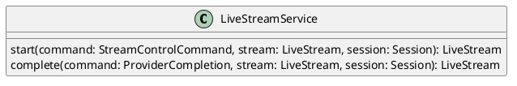

# UC-03 — Start a Live Stream

### Description

As a host, I want to start the configured live stream so that viewers can watch the broadcast.

### Actors

Host; Live Stream Service.

### Priority

P0.

### Trigger

**TRG-UC-03-01** — The host chooses the visible start-stream control.

### Preconditions

- **PRE-UC-03-01** — The client displays the broadcaster session interface.

### Postconditions

- **POST-UC-03-01** — The client displays the stream state returned by the system.
- **POST-UC-03-02** — Viewer-facing playback reflects the returned broadcast outcome.

### Basic Flow

1. The host reviews the broadcaster preview and chooses Start.
2. The client submits the stream-control request.
3. The system returns the current stream representation.
4. The client displays the starting state.
5. The client renders the live session when the updated representation is returned by the session-state request.

### Alternative Flows

#### AF-UC-03-01

1. The host opens the session menu before starting.
2. The client displays the available broadcaster actions.

### Exception Flows

#### EF-UC-03-01

1. The system cannot complete the start request.
2. The client displays a technical-failure state and keeps the broadcaster interface available.

### UML Model

Classifiers and helper semantics are imported from the [shared domain model](shared-domain-model.md).



### Business Rules

```ocl
-- BR-UC-03-01
-- Source: Assumption
-- Assumption: A-19
context LiveStreamService::start(command: StreamControlCommand, stream: LiveStream, session: Session): LiveStream
pre BR_UC_03_01_AuthenticatedMembership:
  RequestContext::authenticated and RequestContext::sessionId = command.sessionId and
  command.actorParticipantId = RequestContext::participantId and
  Participant.allInstances()->exists(p | p.id = command.actorParticipantId and
    p.principalId = RequestContext::principalId and p.sessionId = command.sessionId and
    p.status = ParticipantStatus::JOINED and p.role = ParticipantRole::HOST)
```

```ocl
-- BR-UC-03-02
-- Source: Assumption
-- Assumption: A-19
context LiveStreamService::start(command: StreamControlCommand, stream: LiveStream, session: Session): LiveStream
pre BR_UC_03_02_TargetSession:
  command.sessionId = session.id and session.status <> SessionStatus::ENDED
```

```ocl
-- BR-UC-03-03
-- Source: Assumption
-- Assumption: A-20
context LiveStreamService::start(command: StreamControlCommand, stream: LiveStream, session: Session): LiveStream
pre BR_UC_03_03_CommandKey:
  command.idempotencyKey <> null and command.idempotencyKey.trim().size() > 0
```

```ocl
-- BR-UC-03-04
-- Source: Assumption
-- Assumption: A-03
context LiveStreamService::start(command: StreamControlCommand, stream: LiveStream, session: Session): LiveStream
pre BR_UC_03_04_StreamTargetAndVersion:
  command.action = StreamAction::START and session.kind = SessionKind::LIVE_STREAM and
  session.status = SessionStatus::LIVE and stream.sessionId = session.id and command.expectedVersion = stream.version
```

```ocl
-- BR-UC-03-05
-- Source: Assumption
-- Assumption: A-03
context LiveStreamService::start(command: StreamControlCommand, stream: LiveStream, session: Session): LiveStream
post BR_UC_03_05_SameStreamVersion:
  result = stream and stream.version = stream.version@pre + 1
```

```ocl
-- BR-UC-03-06
-- Source: Assumption
-- Assumption: A-03
context LiveStreamService::start(command: StreamControlCommand, stream: LiveStream, session: Session): LiveStream
pre BR_UC_03_06_ReadyOnly:
  stream.status = StreamStatus::READY
```

```ocl
-- BR-UC-03-07
-- Source: Assumption
-- Assumption: A-03
context LiveStreamService::start(command: StreamControlCommand, stream: LiveStream, session: Session): LiveStream
post BR_UC_03_07_Starting:
  stream.status = StreamStatus::STARTING and stream.endedAt = null
```

```ocl
-- BR-UC-03-08
-- Source: Assumption
-- Assumption: A-03
context LiveStreamService::complete(command: ProviderCompletion, stream: LiveStream, session: Session): LiveStream
pre BR_UC_03_08_ProviderCompletionTarget:
  RequestContext::providerAuthenticated and command.sessionId = session.id and stream.sessionId = session.id and
  command.resourceId = stream.id and command.expectedVersion = stream.version and stream.status = StreamStatus::STARTING and
  session.status = SessionStatus::LIVE and TransactionContext::lockedSessionId = session.id and TransactionContext::atomicCommit
```

```ocl
-- BR-UC-03-09
-- Source: Assumption
-- Assumption: A-03
context LiveStreamService::complete(command: ProviderCompletion, stream: LiveStream, session: Session): LiveStream
post BR_UC_03_09_ProviderCompletionState:
  result = stream and stream.version = stream.version@pre + 1 and session.version = session.version@pre + 1 and
  if command.succeeded then stream.status = StreamStatus::LIVE and stream.startedAt <> null
  else stream.status = StreamStatus::READY endif
```

### Related UI

- Broadcaster Preview `6007:51245`.
- Live Session `6007:51075`.
- Live Streaming Desktop Features `6007:86770`.
- Live Streaming Mobile Features `6012:90506`.

### Related APIs

`API-LIVE-STREAM-CONTROL`.
`API-SESSION-STATE`.

### Notes

The shared model defines trusted context, persistence mapping, and query helpers. Server mutation execution uses MutationGateway and its common OCL constraints in UC-02. API command dispatch selects the named operation; it does not combine the preconditions of different operations. Read operations have no domain writes.
