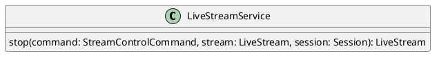

# UC-04 — Stop a Live Stream

### Description

As a host, I want to stop a live stream so that the broadcast ends for viewers.

### Actors

Host; Live Stream Service.

### Priority

P0.

### Trigger

**TRG-UC-04-01** — The host chooses the visible end-stream action.

### Preconditions

- **PRE-UC-04-01** — The client displays a running live session.

### Postconditions

- **POST-UC-04-01** — The host interface displays the returned ended state.
- **POST-UC-04-02** — The viewer interface displays the returned post-stream outcome.

### Basic Flow

1. The host opens the end-stream action.
2. The client presents the confirmation shown by the design.
3. The host confirms the action.
4. The client submits the stop request.
5. The system returns the ended stream representation.
6. The client displays the post-stream state.

### Alternative Flows

#### AF-UC-04-01

1. The host cancels the confirmation.
2. The client closes the dialog and restores the live session interface.

### Exception Flows

#### EF-UC-04-01

1. The system cannot complete the stop request.
2. The client displays the returned failure state and preserves the current session view.

### UML Model

Classifiers and helper semantics are imported from the [shared domain model](shared-domain-model.md).



### Business Rules

```ocl
-- BR-UC-04-01
-- Source: Assumption
-- Assumption: A-19
context LiveStreamService::stop(command: StreamControlCommand, stream: LiveStream, session: Session): LiveStream
pre BR_UC_04_01_AuthenticatedMembership:
  RequestContext::authenticated and RequestContext::sessionId = command.sessionId and
  command.actorParticipantId = RequestContext::participantId and
  Participant.allInstances()->exists(p | p.id = command.actorParticipantId and
    p.principalId = RequestContext::principalId and p.sessionId = command.sessionId and
    p.status = ParticipantStatus::JOINED and p.role = ParticipantRole::HOST)
```

```ocl
-- BR-UC-04-02
-- Source: Assumption
-- Assumption: A-19
context LiveStreamService::stop(command: StreamControlCommand, stream: LiveStream, session: Session): LiveStream
pre BR_UC_04_02_TargetSession:
  command.sessionId = session.id and session.status <> SessionStatus::ENDED
```

```ocl
-- BR-UC-04-03
-- Source: Assumption
-- Assumption: A-20
context LiveStreamService::stop(command: StreamControlCommand, stream: LiveStream, session: Session): LiveStream
pre BR_UC_04_03_CommandKey:
  command.idempotencyKey <> null and command.idempotencyKey.trim().size() > 0
```

```ocl
-- BR-UC-04-04
-- Source: Assumption
-- Assumption: A-04
context LiveStreamService::stop(command: StreamControlCommand, stream: LiveStream, session: Session): LiveStream
pre BR_UC_04_04_StreamTargetAndVersion:
  command.action = StreamAction::STOP and session.kind = SessionKind::LIVE_STREAM and
  session.status = SessionStatus::LIVE and stream.sessionId = session.id and command.expectedVersion = stream.version
```

```ocl
-- BR-UC-04-05
-- Source: Assumption
-- Assumption: A-04
context LiveStreamService::stop(command: StreamControlCommand, stream: LiveStream, session: Session): LiveStream
post BR_UC_04_05_SameStreamVersion:
  result = stream and stream.version = stream.version@pre + 1
```

```ocl
-- BR-UC-04-06
-- Source: Assumption
-- Assumption: A-04
context LiveStreamService::stop(command: StreamControlCommand, stream: LiveStream, session: Session): LiveStream
pre BR_UC_04_06_RunningOnly:
  stream.status = StreamStatus::LIVE or stream.status = StreamStatus::STARTING
```

```ocl
-- BR-UC-04-07
-- Source: Assumption
-- Assumption: A-04
context LiveStreamService::stop(command: StreamControlCommand, stream: LiveStream, session: Session): LiveStream
post BR_UC_04_07_EndedStream:
  stream.status = StreamStatus::ENDED and stream.endedAt <> null and session.status = session.status@pre
```

```ocl
-- BR-UC-04-08
-- Source: Assumption
-- Assumption: A-21
context LiveStreamService::stop(command: StreamControlCommand, stream: LiveStream, session: Session): LiveStream
post BR_UC_04_08_DemoteFormerStageParticipants:
  Participant.allInstances()@pre->select(p | p.sessionId = command.sessionId and p.role@pre = ParticipantRole::STAGE_PARTICIPANT)->forAll(p |
    p.role = ParticipantRole::VIEWER and not p.microphoneEnabled and not p.cameraEnabled)
```

```ocl
-- BR-UC-04-09
-- Source: Assumption
-- Assumption: A-21
context LiveStreamService::stop(command: StreamControlCommand, stream: LiveStream, session: Session): LiveStream
post BR_UC_04_09_StopContentShares:
  ContentShare.allInstances()@pre->select(cs | cs.sessionId = command.sessionId and cs.status@pre = ShareStatus::ACTIVE)->forAll(cs |
    cs.status = ShareStatus::STOPPED and cs.stoppedAt <> null and cs.version = cs.version@pre + 1)
```

```ocl
-- BR-UC-04-10
-- Source: Assumption
-- Assumption: A-21
context LiveStreamService::stop(command: StreamControlCommand, stream: LiveStream, session: Session): LiveStream
post BR_UC_04_10_CancelPendingRequests:
  StageRequest.allInstances()@pre->select(r | r.sessionId = command.sessionId and r.status@pre = StageRequestStatus::PENDING)->forAll(r |
    r.status = StageRequestStatus::CANCELLED and r.decidedAt <> null and r.version = r.version@pre + 1)
```

```ocl
-- BR-UC-04-11
-- Source: Assumption
-- Assumption: A-21
context LiveStreamService::stop(command: StreamControlCommand, stream: LiveStream, session: Session): LiveStream
post BR_UC_04_11_StopRecordings:
  Recording.allInstances()@pre->select(r | r.sessionId = command.sessionId and
    (r.status@pre = RecordingStatus::STARTING or r.status@pre = RecordingStatus::RECORDING))->forAll(r |
    r.status = RecordingStatus::STOPPED and r.stoppedAt <> null and r.version = r.version@pre + 1)
```

### Related UI

- Live Streaming Desktop Features `6007:86770`.
- Live Streaming Mobile Features `6012:90506`.

### Related APIs

`API-LIVE-STREAM-CONTROL`.
`API-SESSION-STATE`.

### Notes

The shared model defines trusted context, persistence mapping, and query helpers. Server mutation execution uses MutationGateway and its common OCL constraints in UC-02. API command dispatch selects the named operation; it does not combine the preconditions of different operations. Read operations have no domain writes.
