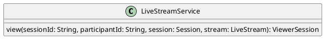

# UC-05 — Watch a Live Stream

### Description

As a viewer, I want to open the live session so that I can watch the broadcast and access viewer controls.

### Actors

Viewer; Live Stream Service.

### Priority

P0.

### Trigger

**TRG-UC-05-01** — The viewer opens the live-session interface.

### Preconditions

- **PRE-UC-05-01** — The client has a live-session destination to display.

### Postconditions

- **POST-UC-05-01** — The client displays live playback and the viewer controls returned by the system.

### Basic Flow

1. The viewer opens the live session.
2. The client requests the current session representation.
3. The system returns the viewer-facing stream state.
4. The client renders playback and viewer controls.

### Alternative Flows

#### AF-UC-05-01

1. The viewer opens the session menu.
2. The client displays the viewer actions shown by the design.

### Exception Flows

#### EF-UC-05-01

1. The live-session representation cannot be returned.
2. The client displays the visible loading or unavailable state.

### UML Model

Classifiers and helper semantics are imported from the [shared domain model](shared-domain-model.md).



### Business Rules

```ocl
-- BR-UC-05-01
-- Source: Assumption
-- Assumption: A-19
context LiveStreamService::view(sessionId: String, participantId: String, session: Session, stream: LiveStream): ViewerSession
pre BR_UC_05_01_AuthenticatedMembership:
  RequestContext::authenticated and RequestContext::sessionId = sessionId and
  participantId = RequestContext::participantId and
  Participant.allInstances()->exists(p | p.id = participantId and
    p.principalId = RequestContext::principalId and p.sessionId = sessionId and
    p.status = ParticipantStatus::JOINED)
```

```ocl
-- BR-UC-05-02
-- Source: Assumption
-- Assumption: A-05
context LiveStreamService::view(sessionId: String, participantId: String, session: Session, stream: LiveStream): ViewerSession
pre BR_UC_05_02_ViewerTarget:
  session.id = sessionId and stream.sessionId = sessionId and session.kind = SessionKind::LIVE_STREAM and
  session.status <> SessionStatus::ENDED and Participant.allInstances()->exists(p | p.id = participantId and
    (p.role = ParticipantRole::VIEWER or p.role = ParticipantRole::STAGE_PARTICIPANT))
```

```ocl
-- BR-UC-05-03
-- Source: Assumption
-- Assumption: A-05
context LiveStreamService::view(sessionId: String, participantId: String, session: Session, stream: LiveStream): ViewerSession
post BR_UC_05_03_ViewerRepresentation:
  result.sessionId = session.id and result.participantId = participantId and
  result.role = Participant.allInstances()->any(p | p.id = participantId).role and result.streamStatus = stream.status and
  result.streamVersion = stream.version and result.sessionVersion = session.version and result.initialAudioMuted and
  result.canPlayMedia = (stream.status = StreamStatus::LIVE) and
  result.canPublishMedia = (stream.status = StreamStatus::LIVE and result.role = ParticipantRole::STAGE_PARTICIPANT)
```

### Related UI

- Live Streaming Viewer `6007:51397`.
- Live Streaming Mobile Preview `6012:44409`.

### Related APIs

`API-LIVE-STREAM-VIEW`.
`API-SESSION-STATE`.

### Notes

The shared model defines trusted context, persistence mapping, and query helpers. Server mutation execution uses MutationGateway and its common OCL constraints in UC-02. API command dispatch selects the named operation; it does not combine the preconditions of different operations. Read operations have no domain writes.
