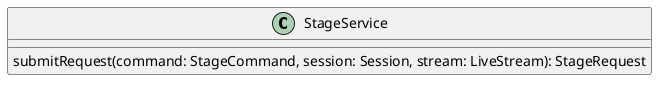

# UC-06 — Request Stage Access

### Description

As a viewer, I want to request stage access so that the host can consider adding me to the live stage.

### Actors

Viewer; Stage Service.

### Priority

P1.

### Trigger

**TRG-UC-06-01** — The viewer chooses the visible stage-request action.

### Preconditions

- **PRE-UC-06-01** — The client displays the viewer live-session interface.

### Postconditions

- **POST-UC-06-01** — The viewer interface displays the returned request state.
- **POST-UC-06-02** — The host interface displays the returned stage-request item.

### Basic Flow

1. The viewer chooses to request stage access.
2. The client submits the stage request.
3. The system returns the request representation.
4. The viewer client displays the returned request state.
5. The host client requests session state and displays the request item.

### Alternative Flows

#### AF-UC-06-01

1. The viewer withdraws the displayed request.
2. The client submits the cancellation and removes the pending presentation.

### Exception Flows

#### EF-UC-06-01

1. The stage service cannot complete the request.
2. The client displays the returned failure state and keeps playback available.

### UML Model

Classifiers and helper semantics are imported from the [shared domain model](shared-domain-model.md).



### Business Rules

```ocl
-- BR-UC-06-01
-- Source: Assumption
-- Assumption: A-19
context StageService::submitRequest(command: StageCommand, session: Session, stream: LiveStream): StageRequest
pre BR_UC_06_01_AuthenticatedMembership:
  RequestContext::authenticated and RequestContext::sessionId = command.sessionId and
  command.actorParticipantId = RequestContext::participantId and
  Participant.allInstances()->exists(p | p.id = command.actorParticipantId and
    p.principalId = RequestContext::principalId and p.sessionId = command.sessionId and
    p.status = ParticipantStatus::JOINED)
```

```ocl
-- BR-UC-06-02
-- Source: Assumption
-- Assumption: A-19
context StageService::submitRequest(command: StageCommand, session: Session, stream: LiveStream): StageRequest
pre BR_UC_06_02_TargetSession:
  command.sessionId = session.id and session.status <> SessionStatus::ENDED
```

```ocl
-- BR-UC-06-03
-- Source: Assumption
-- Assumption: A-20
context StageService::submitRequest(command: StageCommand, session: Session, stream: LiveStream): StageRequest
pre BR_UC_06_03_CommandKey:
  command.idempotencyKey <> null and command.idempotencyKey.trim().size() > 0
```

```ocl
-- BR-UC-06-04
-- Source: Assumption
-- Assumption: A-06
context StageService::submitRequest(command: StageCommand, session: Session, stream: LiveStream): StageRequest
pre BR_UC_06_04_StreamBinding:
  stream.sessionId = session.id and session.kind = SessionKind::LIVE_STREAM and stream.status = StreamStatus::LIVE
```

```ocl
-- BR-UC-06-05
-- Source: Assumption
-- Assumption: A-06
context StageService::submitRequest(command: StageCommand, session: Session, stream: LiveStream): StageRequest
pre BR_UC_06_05_RequestActions:
  command.action = StageRequestAction::CREATE or command.action = StageRequestAction::CANCEL
```

```ocl
-- BR-UC-06-06
-- Source: Assumption
-- Assumption: A-06
context StageService::submitRequest(command: StageCommand, session: Session, stream: LiveStream): StageRequest
pre BR_UC_06_06_CreateViewer:
  command.action = StageRequestAction::CREATE implies
  command.requestId = null and command.expectedVersion = null and
  Participant.allInstances()->exists(p | p.id = command.actorParticipantId and p.role = ParticipantRole::VIEWER) and
  not StageRequest.allInstances()->exists(r | r.sessionId = session.id and r.participantId = command.actorParticipantId and r.status = StageRequestStatus::PENDING)
```

```ocl
-- BR-UC-06-07
-- Source: Assumption
-- Assumption: A-06
context StageService::submitRequest(command: StageCommand, session: Session, stream: LiveStream): StageRequest
pre BR_UC_06_07_CancelOwnedPending:
  command.action = StageRequestAction::CANCEL implies StageRequest.allInstances()->one(r |
    r.id = command.requestId and r.sessionId = session.id and r.participantId = command.actorParticipantId and
    r.status = StageRequestStatus::PENDING and r.version = command.expectedVersion)
```

```ocl
-- BR-UC-06-08
-- Source: Assumption
-- Assumption: A-06
context StageService::submitRequest(command: StageCommand, session: Session, stream: LiveStream): StageRequest
post BR_UC_06_08_RequestOutcome:
  result.sessionId = session.id and result.participantId = command.actorParticipantId and
  if command.action = StageRequestAction::CREATE then result.oclIsNew() and result.status = StageRequestStatus::PENDING and
    result.version = 1 and result.createdAt <> null and result.decidedAt = null and result.decidedByParticipantId = null
  else result.id = command.requestId and not result.oclIsNew() and result.status = StageRequestStatus::CANCELLED and
    result.version = command.expectedVersion + 1 and result.decidedAt <> null and result.decidedByParticipantId = null endif
```

```ocl
-- BR-UC-06-09
-- Source: Assumption
-- Assumption: A-22
context StageRequest
inv BR_UC_06_09_OnePendingRequest:
  StageRequest.allInstances()->select(r | r.sessionId = self.sessionId and r.participantId = self.participantId and r.status = StageRequestStatus::PENDING)->size() <= 1
```

### Related UI

- Live Streaming Viewer `6007:51397`.
- Live Streaming Desktop Features `6007:86770`.
- Live Streaming Mobile Features `6012:90506`.

### Related APIs

`API-STAGE-REQUEST-CREATE`.
`API-SESSION-STATE`.

### Notes

The shared model defines trusted context, persistence mapping, and query helpers. Server mutation execution uses MutationGateway and its common OCL constraints in UC-02. API command dispatch selects the named operation; it does not combine the preconditions of different operations. Read operations have no domain writes.
