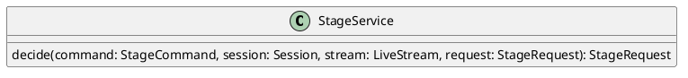

# UC-07 — Respond to a Stage Request

### Description

As a host, I want to accept or reject a viewer's stage request so that the viewer receives a clear participation outcome.

### Actors

Host; Stage Service.

### Priority

P1.

### Trigger

**TRG-UC-07-01** — The host opens a displayed stage request and chooses a response.

### Preconditions

- **PRE-UC-07-01** — The host interface displays a stage-request item.

### Postconditions

- **POST-UC-07-01** — The host and viewer interfaces display the returned decision outcome.

### Basic Flow

1. The host opens the displayed request.
2. The client presents the available response actions.
3. The host chooses Accept.
4. The client submits the response.
5. The system returns the updated stage request and participant representation.
6. The host client renders the viewer on the stage.
7. The viewer client requests session state and renders its returned participation state.

### Alternative Flows

#### AF-UC-07-01

1. The host chooses Reject.
2. The client submits the response and displays the returned rejected outcome.

### Exception Flows

#### EF-UC-07-01

1. The stage service cannot complete the response.
2. The client displays the returned failure state and retains the request item.

### UML Model

Classifiers and helper semantics are imported from the [shared domain model](shared-domain-model.md).



### Business Rules

```ocl
-- BR-UC-07-01
-- Source: Assumption
-- Assumption: A-19
context StageService::decide(command: StageCommand, session: Session, stream: LiveStream, request: StageRequest): StageRequest
pre BR_UC_07_01_AuthenticatedMembership:
  RequestContext::authenticated and RequestContext::sessionId = command.sessionId and
  command.actorParticipantId = RequestContext::participantId and
  Participant.allInstances()->exists(p | p.id = command.actorParticipantId and
    p.principalId = RequestContext::principalId and p.sessionId = command.sessionId and
    p.status = ParticipantStatus::JOINED and p.role = ParticipantRole::HOST)
```

```ocl
-- BR-UC-07-02
-- Source: Assumption
-- Assumption: A-19
context StageService::decide(command: StageCommand, session: Session, stream: LiveStream, request: StageRequest): StageRequest
pre BR_UC_07_02_TargetSession:
  command.sessionId = session.id and session.status <> SessionStatus::ENDED
```

```ocl
-- BR-UC-07-03
-- Source: Assumption
-- Assumption: A-20
context StageService::decide(command: StageCommand, session: Session, stream: LiveStream, request: StageRequest): StageRequest
pre BR_UC_07_03_CommandKey:
  command.idempotencyKey <> null and command.idempotencyKey.trim().size() > 0
```

```ocl
-- BR-UC-07-04
-- Source: Assumption
-- Assumption: A-07
context StageService::decide(command: StageCommand, session: Session, stream: LiveStream, request: StageRequest): StageRequest
pre BR_UC_07_04_StreamBinding:
  stream.sessionId = session.id and session.kind = SessionKind::LIVE_STREAM and stream.status = StreamStatus::LIVE
```

```ocl
-- BR-UC-07-05
-- Source: Assumption
-- Assumption: A-07
context StageService::decide(command: StageCommand, session: Session, stream: LiveStream, request: StageRequest): StageRequest
pre BR_UC_07_05_PendingRequestTarget:
  (command.action = StageRequestAction::ACCEPT or command.action = StageRequestAction::REJECT) and
  request.id = command.requestId and request.sessionId = session.id and request.status = StageRequestStatus::PENDING and
  request.version = command.expectedVersion and Participant.allInstances()->exists(p | p.id = request.participantId and
    p.sessionId = session.id and p.status = ParticipantStatus::JOINED and p.role = ParticipantRole::VIEWER)
```

```ocl
-- BR-UC-07-06
-- Source: Assumption
-- Assumption: A-07
context StageService::decide(command: StageCommand, session: Session, stream: LiveStream, request: StageRequest): StageRequest
pre BR_UC_07_06_StageCapacity:
  command.action = StageRequestAction::ACCEPT implies session.participants->select(p |
    p.status = ParticipantStatus::JOINED and p.role <> ParticipantRole::VIEWER)->size() < 10
```

```ocl
-- BR-UC-07-07
-- Source: Assumption
-- Assumption: A-07
context StageService::decide(command: StageCommand, session: Session, stream: LiveStream, request: StageRequest): StageRequest
post BR_UC_07_07_Decision:
  result = request and request.version = request.version@pre + 1 and request.decidedAt <> null and
  request.decidedByParticipantId = command.actorParticipantId and
  request.status = if command.action = StageRequestAction::ACCEPT then StageRequestStatus::ACCEPTED else StageRequestStatus::REJECTED endif
```

```ocl
-- BR-UC-07-08
-- Source: Assumption
-- Assumption: A-07
context StageService::decide(command: StageCommand, session: Session, stream: LiveStream, request: StageRequest): StageRequest
post BR_UC_07_08_StageAdmission:
  let p : Participant = Participant.allInstances()->any(p | p.id = request.participantId) in
  if command.action = StageRequestAction::ACCEPT then p.role = ParticipantRole::STAGE_PARTICIPANT and p.version = p.version@pre + 1
  else p.role = p.role@pre and p.version = p.version@pre endif
```

### Related UI

- Live Streaming Desktop Features `6007:86770`.
- Live Streaming Mobile Features `6012:90506`.

### Related APIs

`API-STAGE-REQUEST-CREATE`.
`API-SESSION-STATE`.

### Notes

The shared model defines trusted context, persistence mapping, and query helpers. Server mutation execution uses MutationGateway and its common OCL constraints in UC-02. API command dispatch selects the named operation; it does not combine the preconditions of different operations. Read operations have no domain writes.
