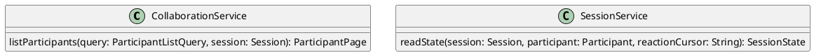

# UC-08 — View Session Participants

### Description

As a participant, I want to view the people in the session so that I can understand who is present and their visible roles.

### Actors

Participant; Collaboration Service.

### Priority

P1.

### Trigger

**TRG-UC-08-01** — The participant opens the participants panel.

### Preconditions

- **PRE-UC-08-01** — The participant is viewing a joined-session interface.

### Postconditions

- **POST-UC-08-01** — The client displays the returned participant list and visible participant states.

### Basic Flow

1. The participant opens the participants panel.
2. The client requests the session participant list.
3. The system returns public participant representations.
4. The client displays the list and visible roles.

### Alternative Flows

#### AF-UC-08-01

1. The participant closes the panel.
2. The client restores the session layout.

### Exception Flows

#### EF-UC-08-01

1. The participant list cannot be returned.
2. The client displays the returned unavailable state without closing the session.

### UML Model

Classifiers and helper semantics are imported from the [shared domain model](shared-domain-model.md).



### Business Rules

```ocl
-- BR-UC-08-01
-- Source: Assumption
-- Assumption: A-19
context CollaborationService::listParticipants(query: ParticipantListQuery, session: Session): ParticipantPage
pre BR_UC_08_01_AuthenticatedMembership:
  RequestContext::authenticated and RequestContext::sessionId = query.sessionId and
  query.requesterParticipantId = RequestContext::participantId and
  Participant.allInstances()->exists(p | p.id = query.requesterParticipantId and
    p.principalId = RequestContext::principalId and p.sessionId = query.sessionId and
    p.status = ParticipantStatus::JOINED)
```

```ocl
-- BR-UC-08-02
-- Source: Assumption
-- Assumption: A-08
context CollaborationService::listParticipants(query: ParticipantListQuery, session: Session): ParticipantPage
pre BR_UC_08_02_PageInput:
  query.sessionId = session.id and session.status <> SessionStatus::ENDED and
  query.pageSize > 0 and query.pageSize <= 50 and Paging::validCursor(session.id, query.cursor, 'participants')
```

```ocl
-- BR-UC-08-03
-- Source: Assumption
-- Assumption: A-08
context CollaborationService::listParticipants(query: ParticipantListQuery, session: Session): ParticipantPage
post BR_UC_08_03_ParticipantPage:
  result = Paging::participants(session.id, query.pageSize, query.cursor) and result.items->size() <= query.pageSize and
  result.items->forAll(p | p.sessionId = session.id and p.status = ParticipantStatus::JOINED)
```

```ocl
-- BR-UC-08-04
-- Source: Assumption
-- Assumption: A-23
context SessionService::readState(session: Session, participant: Participant, reactionCursor: String): SessionState
pre BR_UC_08_04_StateReader:
  RequestContext::authenticated and RequestContext::sessionId = session.id and
  participant.id = RequestContext::participantId and participant.principalId = RequestContext::principalId and participant.sessionId = session.id and
  (participant.status = ParticipantStatus::JOINED or session.status = SessionStatus::ENDED) and
  Paging::validCursor(session.id, reactionCursor, 'reactions')
```

```ocl
-- BR-UC-08-05
-- Source: Assumption
-- Assumption: A-23
context SessionService::readState(session: Session, participant: Participant, reactionCursor: String): SessionState
post BR_UC_08_05_StateSnapshot:
  result.session = session and result.selfParticipant = participant and
  result.stream = if LiveStream.allInstances()->exists(s | s.sessionId = session.id) then LiveStream.allInstances()->any(s | s.sessionId = session.id) else null endif and
  result.recording = Paging::latestRecording(session.id) and
  result.share = if ContentShare.allInstances()->exists(s | s.sessionId = session.id and s.status = ShareStatus::ACTIVE) then ContentShare.allInstances()->any(s | s.sessionId = session.id and s.status = ShareStatus::ACTIVE) else null endif and
  result.media = MediaPreference.allInstances()->any(m | m.participantId = participant.id) and
  result.view = ViewPreference.allInstances()->any(v | v.participantId = participant.id)
```

```ocl
-- BR-UC-08-06
-- Source: Assumption
-- Assumption: A-23
context SessionService::readState(session: Session, participant: Participant, reactionCursor: String): SessionState
post BR_UC_08_06_StateAudience:
  result.stageRequests = StageRequest.allInstances()->select(r | r.sessionId = session.id and
    (participant.role = ParticipantRole::HOST or r.participantId = participant.id)) and
  result.reactions = Paging::reactions(session.id, reactionCursor) and result.reactions->size() <= 50 and
  result.nextReactionCursor = Paging::nextReactionCursor(session.id, reactionCursor)
```

### Related UI

- Live Streaming Desktop Features `6007:86770`.
- Video Conferencing Desktop Features `6007:55138`.
- Live Streaming Mobile Features `6012:90506`.
- Video Conferencing Mobile Features `6012:52233`.

### Related APIs

`API-PARTICIPANT-LIST`.
`API-SESSION-STATE`.

### Notes

The shared model defines trusted context, persistence mapping, and query helpers. Server mutation execution uses MutationGateway and its common OCL constraints in UC-02. API command dispatch selects the named operation; it does not combine the preconditions of different operations. Read operations have no domain writes.
