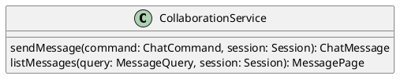

# UC-09 — Send a Chat Message

### Description

As a participant, I want to send a chat message so that I can communicate with people in the session.

### Actors

Participant; Collaboration Service.

### Priority

P1.

### Trigger

**TRG-UC-09-01** — The participant opens chat, enters text, and chooses Send.

### Preconditions

- **PRE-UC-09-01** — The client displays the session chat panel.

### Postconditions

- **POST-UC-09-01** — The client displays the message returned by the system.

### Basic Flow

1. The participant opens the chat panel.
2. The client displays the returned message history.
3. The participant enters a message and chooses Send.
4. The client submits the message.
5. The system returns the created message.
6. The client appends it to the visible conversation.

### Alternative Flows

#### AF-UC-09-01

1. The participant closes chat without sending.
2. The client restores the session layout.

### Exception Flows

#### EF-UC-09-01

1. The collaboration service cannot create the message.
2. The client displays a failure notice and preserves the entered text.

### UML Model

Classifiers and helper semantics are imported from the [shared domain model](shared-domain-model.md).



### Business Rules

```ocl
-- BR-UC-09-01
-- Source: Assumption
-- Assumption: A-19
context CollaborationService::sendMessage(command: ChatCommand, session: Session): ChatMessage
pre BR_UC_09_01_AuthenticatedMembership:
  RequestContext::authenticated and RequestContext::sessionId = command.sessionId and
  command.senderParticipantId = RequestContext::participantId and
  Participant.allInstances()->exists(p | p.id = command.senderParticipantId and
    p.principalId = RequestContext::principalId and p.sessionId = command.sessionId and
    p.status = ParticipantStatus::JOINED)
```

```ocl
-- BR-UC-09-02
-- Source: Assumption
-- Assumption: A-19
context CollaborationService::sendMessage(command: ChatCommand, session: Session): ChatMessage
pre BR_UC_09_02_TargetSession:
  command.sessionId = session.id and session.status <> SessionStatus::ENDED
```

```ocl
-- BR-UC-09-03
-- Source: Assumption
-- Assumption: A-20
context CollaborationService::sendMessage(command: ChatCommand, session: Session): ChatMessage
pre BR_UC_09_03_CommandKey:
  command.idempotencyKey <> null and command.idempotencyKey.trim().size() > 0
```

```ocl
-- BR-UC-09-04
-- Source: Assumption
-- Assumption: A-09
context CollaborationService::sendMessage(command: ChatCommand, session: Session): ChatMessage
pre BR_UC_09_04_MessageBody:
  command.body <> null and command.body.trim().size() > 0 and command.body.trim().size() <= 1000
```

```ocl
-- BR-UC-09-05
-- Source: Assumption
-- Assumption: A-09
context CollaborationService::sendMessage(command: ChatCommand, session: Session): ChatMessage
post BR_UC_09_05_CreatedIdentity:
  result.oclIsNew() and result.id <> null and result.sessionId = command.sessionId and result.senderParticipantId = command.senderParticipantId
```

```ocl
-- BR-UC-09-06
-- Source: Assumption
-- Assumption: A-09
context CollaborationService::sendMessage(command: ChatCommand, session: Session): ChatMessage
post BR_UC_09_06_MessageValue:
  result.body = command.body.trim() and result.sentAt <> null and result.sequence = session.version@pre + 1
```

```ocl
-- BR-UC-09-07
-- Source: Assumption
-- Assumption: A-19
context CollaborationService::listMessages(query: MessageQuery, session: Session): MessagePage
pre BR_UC_09_07_AuthenticatedMembership:
  RequestContext::authenticated and RequestContext::sessionId = query.sessionId and
  query.requesterParticipantId = RequestContext::participantId and
  Participant.allInstances()->exists(p | p.id = query.requesterParticipantId and
    p.principalId = RequestContext::principalId and p.sessionId = query.sessionId and
    p.status = ParticipantStatus::JOINED)
```

```ocl
-- BR-UC-09-08
-- Source: Assumption
-- Assumption: A-23
context CollaborationService::listMessages(query: MessageQuery, session: Session): MessagePage
pre BR_UC_09_08_MessagePageInput:
  query.sessionId = session.id and session.status <> SessionStatus::ENDED and query.pageSize > 0 and query.pageSize <= 50 and
  Paging::validCursor(session.id, query.cursor, 'messages')
```

```ocl
-- BR-UC-09-09
-- Source: Assumption
-- Assumption: A-23
context CollaborationService::listMessages(query: MessageQuery, session: Session): MessagePage
post BR_UC_09_09_MessageHistory:
  result = Paging::messages(session.id, query.pageSize, query.cursor) and result.items->forAll(m | m.sessionId = session.id)
```

### Related UI

- Live Streaming Desktop Features `6007:86770`.
- Video Conferencing Desktop Features `6007:55138`.
- Live Streaming Mobile Features `6012:90506`.
- Video Conferencing Mobile Features `6012:52233`.

### Related APIs

`API-CHAT-MESSAGE-CREATE`.
`API-CHAT-MESSAGE-LIST`.

### Notes

The shared model defines trusted context, persistence mapping, and query helpers. Server mutation execution uses MutationGateway and its common OCL constraints in UC-02. API command dispatch selects the named operation; it does not combine the preconditions of different operations. Read operations have no domain writes.
