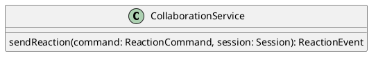

# UC-10 — Send an Emoji Reaction

### Description

As a participant, I want to send an emoji reaction so that I can respond without interrupting the session.

### Actors

Participant; Collaboration Service.

### Priority

P2.

### Trigger

**TRG-UC-10-01** — The participant opens the reaction controls and chooses an emoji.

### Preconditions

- **PRE-UC-10-01** — The participant is viewing a joined-session interface.

### Postconditions

- **POST-UC-10-01** — The client renders the reaction event returned by the system.

### Basic Flow

1. The participant opens the emoji reaction controls.
2. The client presents the available reaction choices.
3. The participant chooses a reaction.
4. The client submits the reaction.
5. The system returns the created event.
6. The client renders the reaction in the session.

### Alternative Flows

#### AF-UC-10-01

1. The participant closes the reaction controls without selecting an item.
2. The client restores the session controls.

### Exception Flows

#### EF-UC-10-01

1. The reaction cannot be created.
2. The client displays the returned failure notice without closing the session.

### UML Model

Classifiers and helper semantics are imported from the [shared domain model](shared-domain-model.md).



### Business Rules

```ocl
-- BR-UC-10-01
-- Source: Assumption
-- Assumption: A-19
context CollaborationService::sendReaction(command: ReactionCommand, session: Session): ReactionEvent
pre BR_UC_10_01_AuthenticatedMembership:
  RequestContext::authenticated and RequestContext::sessionId = command.sessionId and
  command.participantId = RequestContext::participantId and
  Participant.allInstances()->exists(p | p.id = command.participantId and
    p.principalId = RequestContext::principalId and p.sessionId = command.sessionId and
    p.status = ParticipantStatus::JOINED)
```

```ocl
-- BR-UC-10-02
-- Source: Assumption
-- Assumption: A-19
context CollaborationService::sendReaction(command: ReactionCommand, session: Session): ReactionEvent
pre BR_UC_10_02_TargetSession:
  command.sessionId = session.id and session.status <> SessionStatus::ENDED
```

```ocl
-- BR-UC-10-03
-- Source: Assumption
-- Assumption: A-20
context CollaborationService::sendReaction(command: ReactionCommand, session: Session): ReactionEvent
pre BR_UC_10_03_CommandKey:
  command.idempotencyKey <> null and command.idempotencyKey.trim().size() > 0
```

```ocl
-- BR-UC-10-04
-- Source: Assumption
-- Assumption: A-10
context CollaborationService::sendReaction(command: ReactionCommand, session: Session): ReactionEvent
post BR_UC_10_04_CreatedIdentity:
  result.oclIsNew() and result.id <> null and result.sessionId = command.sessionId and result.participantId = command.participantId
```

```ocl
-- BR-UC-10-05
-- Source: Assumption
-- Assumption: A-10
context CollaborationService::sendReaction(command: ReactionCommand, session: Session): ReactionEvent
post BR_UC_10_05_ReactionValue:
  result.reaction = command.reaction and result.createdAt <> null and result.sequence = session.version@pre + 1
```

### Related UI

- Video Conferencing Desktop Features `6007:55138`.
- Component evidence: Modal/Emoji Reactions.

### Related APIs

`API-REACTION-CREATE`.
`API-SESSION-STATE`.

### Notes

The shared model defines trusted context, persistence mapping, and query helpers. Server mutation execution uses MutationGateway and its common OCL constraints in UC-02. API command dispatch selects the named operation; it does not combine the preconditions of different operations. Read operations have no domain writes.
