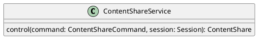

# UC-11 — Share Presentation Content

### Description

As a participant, I want to share my screen or a PDF so that other participants can see presentation content.

### Actors

Participant; Content Share Service.

### Priority

P1.

### Trigger

**TRG-UC-11-01** — The participant chooses the visible screen-share or PDF-share action.

### Preconditions

- **PRE-UC-11-01** — The participant is viewing the session controls.

### Postconditions

- **POST-UC-11-01** — The client displays the returned content-share representation.

### Basic Flow

1. The participant opens the share action.
2. The client presents the screen and PDF choices shown by the design.
3. The participant selects a source and confirms sharing.
4. The client submits the content-share request.
5. The system returns the content-share representation.
6. The client renders the shared content and presenter view.

### Alternative Flows

#### AF-UC-11-01

1. The participant chooses PDF instead of screen content.
2. The client presents the selected PDF in the share layout.

#### AF-UC-11-02

1. The participant chooses to stop the active share.
2. The client submits the stop action and restores the returned session layout.

### Exception Flows

#### EF-UC-11-01

1. The system cannot complete the share action.
2. The client displays the returned failure state and retains the session view.

### UML Model

Classifiers and helper semantics are imported from the [shared domain model](shared-domain-model.md).



### Business Rules

```ocl
-- BR-UC-11-01
-- Source: Assumption
-- Assumption: A-19
context ContentShareService::control(command: ContentShareCommand, session: Session): ContentShare
pre BR_UC_11_01_AuthenticatedMembership:
  RequestContext::authenticated and RequestContext::sessionId = command.sessionId and
  command.ownerParticipantId = RequestContext::participantId and
  Participant.allInstances()->exists(p | p.id = command.ownerParticipantId and
    p.principalId = RequestContext::principalId and p.sessionId = command.sessionId and
    p.status = ParticipantStatus::JOINED)
```

```ocl
-- BR-UC-11-02
-- Source: Assumption
-- Assumption: A-19
context ContentShareService::control(command: ContentShareCommand, session: Session): ContentShare
pre BR_UC_11_02_TargetSession:
  command.sessionId = session.id and session.status <> SessionStatus::ENDED
```

```ocl
-- BR-UC-11-03
-- Source: Assumption
-- Assumption: A-20
context ContentShareService::control(command: ContentShareCommand, session: Session): ContentShare
pre BR_UC_11_03_CommandKey:
  command.idempotencyKey <> null and command.idempotencyKey.trim().size() > 0
```

```ocl
-- BR-UC-11-04
-- Source: Assumption
-- Assumption: A-11
context ContentShareService::control(command: ContentShareCommand, session: Session): ContentShare
pre BR_UC_11_04_StartShare:
  command.action = ShareAction::START implies session.status = SessionStatus::LIVE and command.expectedVersion = null and
  command.kind <> null and command.sourceReference <> null and command.sourceReference.trim().size() > 0 and
  not ContentShare.allInstances()->exists(s | s.sessionId = session.id and s.status = ShareStatus::ACTIVE) and
  (session.kind <> SessionKind::LIVE_STREAM or Participant.allInstances()->exists(p | p.id = command.ownerParticipantId and p.role <> ParticipantRole::VIEWER))
```

```ocl
-- BR-UC-11-05
-- Source: Assumption
-- Assumption: A-11
context ContentShareService::control(command: ContentShareCommand, session: Session): ContentShare
pre BR_UC_11_05_StopShare:
  command.action = ShareAction::STOP implies ContentShare.allInstances()->one(s |
    s.sessionId = session.id and s.status = ShareStatus::ACTIVE and s.version = command.expectedVersion and
    (s.ownerParticipantId = command.ownerParticipantId or Participant.allInstances()->exists(p | p.id = command.ownerParticipantId and p.role = ParticipantRole::HOST)))
```

```ocl
-- BR-UC-11-06
-- Source: Assumption
-- Assumption: A-11
context ContentShareService::control(command: ContentShareCommand, session: Session): ContentShare
post BR_UC_11_06_ShareEffect:
  result.sessionId = session.id and
  if command.action = ShareAction::START then result.oclIsNew() and result.status = ShareStatus::ACTIVE and
    result.ownerParticipantId = command.ownerParticipantId and result.kind = command.kind and result.sourceReference = command.sourceReference and
    result.version = 1 and result.startedAt <> null and result.stoppedAt = null
  else result = ContentShare.allInstances()@pre->any(s | s.sessionId = session.id and s.status@pre = ShareStatus::ACTIVE) and
    result.status = ShareStatus::STOPPED and result.version = command.expectedVersion + 1 and result.stoppedAt <> null endif
```

```ocl
-- BR-UC-11-07
-- Source: Assumption
-- Assumption: A-22
context ContentShare
inv BR_UC_11_07_OneActiveShare:
  ContentShare.allInstances()->select(s | s.sessionId = self.sessionId and s.status = ShareStatus::ACTIVE)->size() <= 1
```

### Related UI

- Live Streaming Desktop Features `6007:86770`.
- Video Conferencing Desktop Features `6007:55138`.
- Video Conferencing Desktop Layouts `6007:77656`.
- Video Conferencing Mobile Features `6012:52233`.

### Related APIs

`API-CONTENT-SHARE-CONTROL`.
`API-SESSION-STATE`.

### Notes

The shared model defines trusted context, persistence mapping, and query helpers. Server mutation execution uses MutationGateway and its common OCL constraints in UC-02. API command dispatch selects the named operation; it does not combine the preconditions of different operations. Read operations have no domain writes.
