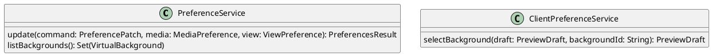

# UC-13 — Select a Virtual Background

### Description

As a participant, I want to select a virtual background so that my preview uses the chosen appearance.

### Actors

Participant; Preference Service.

### Priority

P2.

### Trigger

**TRG-UC-13-01** — The participant opens virtual-background choices.

### Preconditions

- **PRE-UC-13-01** — The client displays a camera preview.

### Postconditions

- **POST-UC-13-01** — The client displays the returned background preference in the preview.

### Basic Flow

1. The participant opens virtual-background choices.
2. The client presents the available background previews.
3. The participant selects a background.
4. The client applies the selection locally in preview, or submits the preference update from the joined session.
5. The client receives the local result or the returned media preference.
6. The client renders the selected background in the preview.

### Alternative Flows

#### AF-UC-13-01

1. The participant selects the no-background choice.
2. The client removes the background treatment from the preview.

### Exception Flows

#### EF-UC-13-01

1. The preference cannot be applied.
2. The client displays the returned failure state and retains the previous preview.

### UML Model

Classifiers and helper semantics are imported from the [shared domain model](shared-domain-model.md).



### Business Rules

```ocl
-- BR-UC-13-01
-- Source: Assumption
-- Assumption: A-13
context PreferenceService::update(command: PreferencePatch, media: MediaPreference, view: ViewPreference): PreferencesResult
pre BR_UC_13_01_AvailableBackground:
  command.hasVirtualBackgroundId implies (command.virtualBackgroundId = null or
    VirtualBackground.allInstances()->exists(b | b.id = command.virtualBackgroundId and b.active))
```

```ocl
-- BR-UC-13-02
-- Source: Assumption
-- Assumption: A-13
context PreferenceService::update(command: PreferencePatch, media: MediaPreference, view: ViewPreference): PreferencesResult
post BR_UC_13_02_BackgroundPatch:
  media.virtualBackgroundId = if command.hasVirtualBackgroundId then command.virtualBackgroundId else media.virtualBackgroundId@pre endif
```

```ocl
-- BR-UC-13-03
-- Source: Assumption
-- Assumption: A-13
context ClientPreferenceService::selectBackground(draft: PreviewDraft, backgroundId: String): PreviewDraft
pre BR_UC_13_03_LocalBackground:
  backgroundId = null or VirtualBackground.allInstances()->exists(b | b.id = backgroundId and b.active)
```

```ocl
-- BR-UC-13-04
-- Source: Assumption
-- Assumption: A-13
context ClientPreferenceService::selectBackground(draft: PreviewDraft, backgroundId: String): PreviewDraft
post BR_UC_13_04_LocalBackgroundDraft:
  result = draft and draft.virtualBackgroundId = backgroundId and
  draft.microphoneDeviceId = draft.microphoneDeviceId@pre and draft.cameraDeviceId = draft.cameraDeviceId@pre and draft.speakerDeviceId = draft.speakerDeviceId@pre
```

```ocl
-- BR-UC-13-05
-- Source: Assumption
-- Assumption: A-19
context PreferenceService::listBackgrounds(): Set(VirtualBackground)
pre BR_UC_13_05_CatalogReader:
  RequestContext::authenticated
```

```ocl
-- BR-UC-13-06
-- Source: Assumption
-- Assumption: A-13
context PreferenceService::listBackgrounds(): Set(VirtualBackground)
post BR_UC_13_06_CatalogResult:
  result = VirtualBackground.allInstances()->select(b | b.active)
```

```ocl
-- BR-UC-13-07
-- Source: Assumption
-- Assumption: A-13
context PreferenceService::listBackgrounds(): Set(VirtualBackground)
post BR_UC_13_07_CatalogIdentity:
  result->isUnique(id) and result->forAll(b | b.assetReference <> null and b.assetReference.trim().size() > 0)
```

### Related UI

- Virtual Background `6026:1184329`.

### Related APIs

`API-PREFERENCES-UPDATE`.
`API-SESSION-JOIN`.
`API-BACKGROUND-LIST`.
`API-SESSION-STATE`.

### Notes

The shared model defines trusted context, persistence mapping, and query helpers. Server mutation execution uses MutationGateway and its common OCL constraints in UC-02. API command dispatch selects the named operation; it does not combine the preconditions of different operations. Read operations have no domain writes.

UC-12 through UC-14 and the personal-pin rules in UC-15 constrain one atomic PreferenceService.update operation. Field-presence guards determine which values change. Client-local preview operations do not call this server operation.
