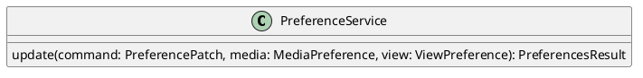

# UC-14 — Change Session Layout

### Description

As a participant, I want to change my session layout or picture-in-picture view so that I can focus on the content that matters to me.

### Actors

Participant; Preference Service.

### Priority

P2.

### Trigger

**TRG-UC-14-01** — The participant chooses a layout or picture-in-picture control.

### Preconditions

- **PRE-UC-14-01** — The client displays a joined-session interface.

### Postconditions

- **POST-UC-14-01** — The client renders the returned view preference.

### Basic Flow

1. The participant opens the view controls.
2. The client presents the layouts shown by the design.
3. The participant selects a layout.
4. The client submits the preference update.
5. The system returns the updated view preference.
6. The client renders the selected layout.

### Alternative Flows

#### AF-UC-14-01

1. The participant enables picture-in-picture.
2. The client renders the returned picture-in-picture view.

#### AF-UC-14-02

1. The participant opens or closes a side panel.
2. The client adjusts the returned session layout.

### Exception Flows

#### EF-UC-14-01

1. The preference update cannot be completed.
2. The client displays the returned failure state and retains the previous layout.

### UML Model

Classifiers and helper semantics are imported from the [shared domain model](shared-domain-model.md).



### Business Rules

```ocl
-- BR-UC-14-01
-- Source: Assumption
-- Assumption: A-14
context PreferenceService::update(command: PreferencePatch, media: MediaPreference, view: ViewPreference): PreferencesResult
pre BR_UC_14_01_NonNullLayoutAndPiP:
  (command.hasLayout implies command.layout <> null) and (command.hasPictureInPicture implies command.pictureInPicture <> null)
```

```ocl
-- BR-UC-14-02
-- Source: Assumption
-- Assumption: A-14
context PreferenceService::update(command: PreferencePatch, media: MediaPreference, view: ViewPreference): PreferencesResult
pre BR_UC_14_02_PresenterLayout:
  (command.hasLayout and command.layout = LayoutMode::PRESENTER) implies
  ContentShare.allInstances()->exists(s | s.sessionId = command.sessionId and s.status = ShareStatus::ACTIVE)
```

```ocl
-- BR-UC-14-03
-- Source: Assumption
-- Assumption: A-14
context PreferenceService::update(command: PreferencePatch, media: MediaPreference, view: ViewPreference): PreferencesResult
pre BR_UC_14_03_PanelValues:
  command.hasSidePanel implies (command.sidePanel = null or command.sidePanel = 'CHAT' or command.sidePanel = 'PARTICIPANTS' or command.sidePanel = 'SETTINGS')
```

```ocl
-- BR-UC-14-04
-- Source: Assumption
-- Assumption: A-14
context PreferenceService::update(command: PreferencePatch, media: MediaPreference, view: ViewPreference): PreferencesResult
post BR_UC_14_04_LayoutPatch:
  view.layout = if command.hasLayout then command.layout
    else if command.hasFocusedParticipantId and command.focusedParticipantId = null and view.layout@pre = LayoutMode::SPOTLIGHT
      then LayoutMode::EQUAL_PROMINENCE else view.layout@pre endif endif
```

```ocl
-- BR-UC-14-05
-- Source: Assumption
-- Assumption: A-14
context PreferenceService::update(command: PreferencePatch, media: MediaPreference, view: ViewPreference): PreferencesResult
post BR_UC_14_05_PiPAndPanelPatch:
  view.pictureInPicture = (if command.hasPictureInPicture then command.pictureInPicture else view.pictureInPicture@pre endif) and
  view.sidePanel = if view.pictureInPicture then null else
    if command.hasSidePanel then command.sidePanel else view.sidePanel@pre endif endif
```

### Related UI

- Live Streaming Desktop Layouts `6007:96234`.
- Live Streaming Mobile Layouts `6012:102740`.
- Video Conferencing Desktop Layouts `6007:77656`.
- Video Conferencing Mobile Layouts `6012:78022`.

### Related APIs

`API-PREFERENCES-UPDATE`.
`API-SESSION-STATE`.

### Notes

The shared model defines trusted context, persistence mapping, and query helpers. Server mutation execution uses MutationGateway and its common OCL constraints in UC-02. API command dispatch selects the named operation; it does not combine the preconditions of different operations. Read operations have no domain writes.

UC-12 through UC-15 constrain one atomic PreferenceService.update operation. All four rule sets apply to one merged patch. Field-presence guards determine which values change. Client-local preview operations do not call this server operation.
