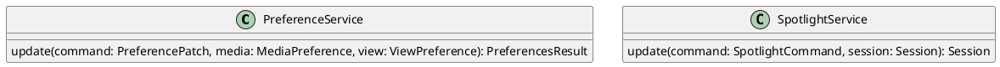

# UC-15 — Pin or Spotlight a Participant

### Description

As a participant, I want to pin a tile for myself or spotlight a tile for everyone so that the intended audience receives the selected visual focus.

### Actors

Participant; Preference Service; Spotlight Service.

### Priority

P2.

### Trigger

**TRG-UC-15-01** — The participant chooses a pin or spotlight action on a visible tile.

### Preconditions

- **PRE-UC-15-01** — The client displays participant tiles in a joined session.

### Postconditions

- **POST-UC-15-01** — The client renders a pinned tile in the caller's view or a spotlighted tile in the shared session view.

### Basic Flow

1. The participant opens the controls for a participant tile.
2. The client presents the visible pin or spotlight action.
3. The participant chooses the personal pin action.
4. The client submits the preference update.
5. The system returns the caller's updated focused view.
6. The client renders the selected tile with visual prominence.

### Alternative Flows

#### AF-UC-15-01

1. The participant removes the personal pin.
2. The client submits the update and restores the returned general layout.

#### AF-UC-15-02

1. The participant chooses the session spotlight action.
2. The client submits the session control update.
3. The system returns the updated shared session representation.
4. Session clients render the selected tile with shared prominence.

#### AF-UC-15-03

1. The participant removes the session spotlight.
2. The client submits the session control update.
3. Session clients restore the shared layout returned by the system.

### Exception Flows

#### EF-UC-15-01

1. The preference update cannot be completed.
2. The client displays the returned failure state and retains the prior focus.

### UML Model

Classifiers and helper semantics are imported from the [shared domain model](shared-domain-model.md).



### Business Rules

```ocl
-- BR-UC-15-01
-- Source: Assumption
-- Assumption: A-15
context PreferenceService::update(command: PreferencePatch, media: MediaPreference, view: ViewPreference): PreferencesResult
pre BR_UC_15_01_FocusTarget:
  (command.hasFocusedParticipantId and command.focusedParticipantId <> null) implies
  Participant.allInstances()->exists(p | p.id = command.focusedParticipantId and p.sessionId = command.sessionId and p.status = ParticipantStatus::JOINED)
```

```ocl
-- BR-UC-15-02
-- Source: Assumption
-- Assumption: A-15
context PreferenceService::update(command: PreferencePatch, media: MediaPreference, view: ViewPreference): PreferencesResult
post BR_UC_15_02_PinPatch:
  view.focusedParticipantId = if command.hasFocusedParticipantId then command.focusedParticipantId else view.focusedParticipantId@pre endif
```

```ocl
-- BR-UC-15-03
-- Source: Assumption
-- Assumption: A-15
context PreferenceService::update(command: PreferencePatch, media: MediaPreference, view: ViewPreference): PreferencesResult
post BR_UC_15_03_PinIsPersonal:
  ViewPreference.allInstances() = ViewPreference.allInstances()@pre and
  ViewPreference.allInstances()@pre->select(v | v.participantId <> command.participantId)->forAll(v |
    v.layout = v.layout@pre and v.focusedParticipantId = v.focusedParticipantId@pre and
    v.sidePanel = v.sidePanel@pre and v.pictureInPicture = v.pictureInPicture@pre and v.updatedAt = v.updatedAt@pre)
```

```ocl
-- BR-UC-15-04
-- Source: Assumption
-- Assumption: A-19
context SpotlightService::update(command: SpotlightCommand, session: Session): Session
pre BR_UC_15_04_AuthenticatedMembership:
  RequestContext::authenticated and RequestContext::sessionId = command.sessionId and
  command.actorParticipantId = RequestContext::participantId and
  Participant.allInstances()->exists(p | p.id = command.actorParticipantId and
    p.principalId = RequestContext::principalId and p.sessionId = command.sessionId and
    p.status = ParticipantStatus::JOINED)
```

```ocl
-- BR-UC-15-05
-- Source: Assumption
-- Assumption: A-20
context SpotlightService::update(command: SpotlightCommand, session: Session): Session
pre BR_UC_15_05_CommandKey:
  command.idempotencyKey <> null and command.idempotencyKey.trim().size() > 0
```

```ocl
-- BR-UC-15-06
-- Source: Assumption
-- Assumption: A-15
context SpotlightService::update(command: SpotlightCommand, session: Session): Session
pre BR_UC_15_06_SpotlightTarget:
  command.targetParticipantId = null or Participant.allInstances()->exists(p |
    p.id = command.targetParticipantId and p.sessionId = command.sessionId and p.status = ParticipantStatus::JOINED)
```

```ocl
-- BR-UC-15-07
-- Source: Assumption
-- Assumption: A-15
context SpotlightService::update(command: SpotlightCommand, session: Session): Session
pre BR_UC_15_07_SpotlightActor:
  Participant.allInstances()->exists(p | p.id = command.actorParticipantId and
    (p.role = ParticipantRole::HOST or p.role = ParticipantRole::BROADCASTER or p.role = ParticipantRole::STAGE_PARTICIPANT))
```

```ocl
-- BR-UC-15-08
-- Source: Assumption
-- Assumption: A-15
context SpotlightService::update(command: SpotlightCommand, session: Session): Session
pre BR_UC_15_08_SessionVersion:
  command.sessionId = session.id and session.status = SessionStatus::LIVE and command.expectedVersion = session.version
```

```ocl
-- BR-UC-15-09
-- Source: Assumption
-- Assumption: A-15
context SpotlightService::update(command: SpotlightCommand, session: Session): Session
post BR_UC_15_09_SharedSpotlight:
  result.id = session.id and result.spotlightedParticipantId = command.targetParticipantId and
  result.version = session.version@pre + 1
```

```ocl
-- BR-UC-15-10
-- Source: Assumption
-- Assumption: A-15
context SpotlightService::update(command: SpotlightCommand, session: Session): Session
post BR_UC_15_10_PersonalPinsUnaffected:
  ViewPreference.allInstances() = ViewPreference.allInstances()@pre
```

### Related UI

- Video Conferencing Desktop Features `6007:55138`.
- Video Conferencing Mobile Layouts `6012:78022`.
- Component evidence: Panel/Tile Menu `6073:15912`, including `Pin Tile for Myself` and `Spotlight Tile for Everyone`.

### Related APIs

`API-PREFERENCES-UPDATE`.
`API-SPOTLIGHT-UPDATE`.
`API-PARTICIPANT-LIST`.
`API-SESSION-STATE`.

### Notes

The shared model defines trusted context, persistence mapping, and query helpers. Server mutation execution uses MutationGateway and its common OCL constraints in UC-02. API command dispatch selects the named operation; it does not combine the preconditions of different operations. Read operations have no domain writes.

BR-UC-15-01 through BR-UC-15-03 constrain the personal pin stored by PreferenceService.update. BR-UC-15-04 through BR-UC-15-10 constrain the shared session spotlight stored by SpotlightService.update. Client-local preview operations do not call either server operation.
