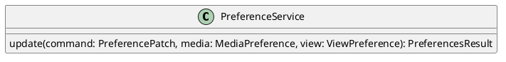

# UC-15 — Pin or Spotlight a Participant

### Description

As a participant, I want to pin or spotlight a participant tile so that the selected person receives visual focus in my session view.

### Actors

Participant; Preference Service.

### Priority

P2.

### Trigger

**TRG-UC-15-01** — The participant chooses a pin or spotlight action on a visible tile.

### Preconditions

- **PRE-UC-15-01** — The client displays participant tiles in a joined session.

### Postconditions

- **POST-UC-15-01** — The client renders the selected participant in the returned focused view.

### Basic Flow

1. The participant opens the controls for a participant tile.
2. The client presents the visible pin or spotlight action.
3. The participant chooses the action.
4. The client submits the preference update.
5. The system returns the updated focused view.
6. The client renders the selected tile with visual prominence.

### Alternative Flows

#### AF-UC-15-01

1. The participant removes the current focus.
2. The client submits the update and restores the returned general layout.

### Exception Flows

#### EF-UC-15-01

1. The preference update cannot be completed.
2. The client displays the returned failure state and retains the prior focus.

### UML Model

Classifiers and helper semantics are imported from the [shared domain model](shared-domain-model.md).



### Business Rules

```ocl
-- BR-UC-15-01
-- Source: Assumption
-- Assumption: A-15
context PreferenceService::update(command: PreferencePatch, media: MediaPreference, view: ViewPreference): PreferencesResult
pre BR_UC_15_01_FocusTarget:
  (command.hasFocusedParticipantId and command.focusedParticipantId <> null) implies
  Participant.allInstances()->exists(p | p.id = command.focusedParticipantId and p.sessionId = command.sessionId and p.status = ParticipantStatus::JOINED)
```

```ocl
-- BR-UC-15-02
-- Source: Assumption
-- Assumption: A-15
context PreferenceService::update(command: PreferencePatch, media: MediaPreference, view: ViewPreference): PreferencesResult
pre BR_UC_15_02_UnpinCombination:
  (command.hasFocusedParticipantId and command.focusedParticipantId = null and command.hasLayout) implies command.layout <> LayoutMode::SPOTLIGHT
```

```ocl
-- BR-UC-15-03
-- Source: Assumption
-- Assumption: A-15
context PreferenceService::update(command: PreferencePatch, media: MediaPreference, view: ViewPreference): PreferencesResult
post BR_UC_15_03_FocusPatch:
  view.focusedParticipantId = if command.hasFocusedParticipantId then command.focusedParticipantId else view.focusedParticipantId@pre endif
```

```ocl
-- BR-UC-15-04
-- Source: Assumption
-- Assumption: A-15
context PreferenceService::update(command: PreferencePatch, media: MediaPreference, view: ViewPreference): PreferencesResult
post BR_UC_15_04_OtherViewsUnchanged:
  ViewPreference.allInstances() = ViewPreference.allInstances()@pre and
  ViewPreference.allInstances()@pre->select(v | v.participantId <> command.participantId)->forAll(v |
    v.layout = v.layout@pre and v.focusedParticipantId = v.focusedParticipantId@pre and
    v.sidePanel = v.sidePanel@pre and v.pictureInPicture = v.pictureInPicture@pre and v.updatedAt = v.updatedAt@pre)
```

### Related UI

- Video Conferencing Desktop Features `6007:55138`.
- Video Conferencing Mobile Layouts `6012:78022`.

### Related APIs

`API-PREFERENCES-UPDATE`.
`API-PARTICIPANT-LIST`.
`API-SESSION-STATE`.

### Notes

The shared model defines trusted context, persistence mapping, and query helpers. Server mutation execution uses MutationGateway and its common OCL constraints in UC-02. API command dispatch selects the named operation; it does not combine the preconditions of different operations. Read operations have no domain writes.

UC-12 through UC-15 constrain one atomic PreferenceService.update operation. All four rule sets apply to one merged patch. Field-presence guards determine which values change. Client-local preview operations do not call this server operation.
