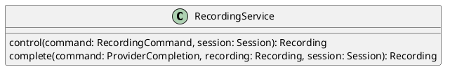

# UC-16 — Control Session Recording

### Description

As a host, I want to start and stop session recording so that the session can be captured through the visible recording controls.

### Actors

Host; Recording Service.

### Priority

P1.

### Trigger

**TRG-UC-16-01** — The host chooses a recording action from the session controls.

### Preconditions

- **PRE-UC-16-01** — The host is viewing the joined-session interface.

### Postconditions

- **POST-UC-16-01** — The client displays the recording state returned by the system.

### Basic Flow

1. The host opens the recording control.
2. The client presents the recording confirmation shown by the design.
3. The host confirms the start action.
4. The client submits the recording-control request.
5. The system returns the recording representation.
6. The client displays the returned recording indicator and refreshes it from session state.

### Alternative Flows

#### AF-UC-16-01

1. The host chooses to stop the active recording.
2. The client submits the stop action and displays the returned stopped state.

### Exception Flows

#### EF-UC-16-01

1. The recording service cannot complete the action.
2. The client displays the returned recording failure state.

### UML Model

Classifiers and helper semantics are imported from the [shared domain model](shared-domain-model.md).



### Business Rules

```ocl
-- BR-UC-16-01
-- Source: Assumption
-- Assumption: A-19
context RecordingService::control(command: RecordingCommand, session: Session): Recording
pre BR_UC_16_01_AuthenticatedMembership:
  RequestContext::authenticated and RequestContext::sessionId = command.sessionId and
  command.actorParticipantId = RequestContext::participantId and
  Participant.allInstances()->exists(p | p.id = command.actorParticipantId and
    p.principalId = RequestContext::principalId and p.sessionId = command.sessionId and
    p.status = ParticipantStatus::JOINED and p.role = ParticipantRole::HOST)
```

```ocl
-- BR-UC-16-02
-- Source: Assumption
-- Assumption: A-19
context RecordingService::control(command: RecordingCommand, session: Session): Recording
pre BR_UC_16_02_TargetSession:
  command.sessionId = session.id and session.status <> SessionStatus::ENDED
```

```ocl
-- BR-UC-16-03
-- Source: Assumption
-- Assumption: A-20
context RecordingService::control(command: RecordingCommand, session: Session): Recording
pre BR_UC_16_03_CommandKey:
  command.idempotencyKey <> null and command.idempotencyKey.trim().size() > 0
```

```ocl
-- BR-UC-16-04
-- Source: Assumption
-- Assumption: A-16
context RecordingService::control(command: RecordingCommand, session: Session): Recording
pre BR_UC_16_04_StartRecording:
  command.action = RecordingAction::START implies command.expectedVersion = null and session.status = SessionStatus::LIVE and
  not Recording.allInstances()->exists(r | r.sessionId = session.id and (r.status = RecordingStatus::STARTING or r.status = RecordingStatus::RECORDING))
```

```ocl
-- BR-UC-16-05
-- Source: Assumption
-- Assumption: A-16
context RecordingService::control(command: RecordingCommand, session: Session): Recording
pre BR_UC_16_05_StopRecording:
  command.action = RecordingAction::STOP implies Recording.allInstances()->one(r | r.sessionId = session.id and
    (r.status = RecordingStatus::STARTING or r.status = RecordingStatus::RECORDING) and r.version = command.expectedVersion)
```

```ocl
-- BR-UC-16-06
-- Source: Assumption
-- Assumption: A-16
context RecordingService::control(command: RecordingCommand, session: Session): Recording
post BR_UC_16_06_RecordingEffect:
  result.sessionId = session.id and
  if command.action = RecordingAction::START then result.oclIsNew() and result.status = RecordingStatus::STARTING and
    result.startedByParticipantId = command.actorParticipantId and result.createdAt <> null and result.startedAt = null and result.version = 1 and result.stoppedAt = null
  else result = Recording.allInstances()@pre->any(r | r.sessionId = session.id and
      (r.status@pre = RecordingStatus::STARTING or r.status@pre = RecordingStatus::RECORDING)) and
    result.status = RecordingStatus::STOPPED and result.version = command.expectedVersion + 1 and result.stoppedAt <> null endif
```

```ocl
-- BR-UC-16-07
-- Source: Assumption
-- Assumption: A-16
context RecordingService::complete(command: ProviderCompletion, recording: Recording, session: Session): Recording
pre BR_UC_16_07_RecordingCallback:
  RequestContext::providerAuthenticated and command.sessionId = session.id and recording.sessionId = session.id and
  command.resourceId = recording.id and command.expectedVersion = recording.version and recording.status = RecordingStatus::STARTING and
  session.status = SessionStatus::LIVE and TransactionContext::lockedSessionId = session.id and TransactionContext::atomicCommit
```

```ocl
-- BR-UC-16-08
-- Source: Assumption
-- Assumption: A-16
context RecordingService::complete(command: ProviderCompletion, recording: Recording, session: Session): Recording
post BR_UC_16_08_RecordingCallbackEffect:
  result = recording and recording.version = recording.version@pre + 1 and session.version = session.version@pre + 1 and
  if command.succeeded then recording.status = RecordingStatus::RECORDING and recording.startedAt <> null
  else recording.status = RecordingStatus::FAILED and recording.stoppedAt <> null endif
```

```ocl
-- BR-UC-16-09
-- Source: Assumption
-- Assumption: A-22
context Recording
inv BR_UC_16_09_OneActiveRecording:
  Recording.allInstances()->select(r | r.sessionId = self.sessionId and (r.status = RecordingStatus::STARTING or r.status = RecordingStatus::RECORDING))->size() <= 1
```

### Related UI

- Video Conferencing Desktop Features `6007:55138`.
- Live Streaming Mobile Features `6012:90506`.
- Video Conferencing Mobile Features `6012:52233`.

### Related APIs

`API-RECORDING-CONTROL`.
`API-SESSION-STATE`.

### Notes

The shared model defines trusted context, persistence mapping, and query helpers. Server mutation execution uses MutationGateway and its common OCL constraints in UC-02. API command dispatch selects the named operation; it does not combine the preconditions of different operations. Read operations have no domain writes.
