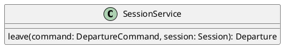

# UC-17 — Leave a Session

### Description

As a participant, I want to leave the session so that my participation ends while the session remains available to others.

### Actors

Participant; Session Service.

### Priority

P0.

### Trigger

**TRG-UC-17-01** — The participant chooses Leave from the session controls.

### Preconditions

- **PRE-UC-17-01** — The participant is viewing the joined-session interface.

### Postconditions

- **POST-UC-17-01** — The client displays the returned post-leave state.
- **POST-UC-17-02** — The interface no longer presents the participant as joined.

### Basic Flow

1. The participant opens the leave control.
2. The client presents the confirmation shown by the design.
3. The participant confirms Leave.
4. The client submits the departure request.
5. The system returns the departure representation.
6. The client displays the post-leave message.

### Alternative Flows

#### AF-UC-17-01

1. The participant cancels the confirmation.
2. The client closes the dialog and restores the session interface.

### Exception Flows

#### EF-UC-17-01

1. The session service cannot complete the action.
2. The client displays the returned failure state and keeps the session interface available.

### UML Model

Classifiers and helper semantics are imported from the [shared domain model](shared-domain-model.md).



### Business Rules

```ocl
-- BR-UC-17-01
-- Source: Assumption
-- Assumption: A-19
context SessionService::leave(command: DepartureCommand, session: Session): Departure
pre BR_UC_17_01_AuthenticatedMembership:
  RequestContext::authenticated and RequestContext::sessionId = command.sessionId and
  command.actorParticipantId = RequestContext::participantId and
  Participant.allInstances()->exists(p | p.id = command.actorParticipantId and
    p.principalId = RequestContext::principalId and p.sessionId = command.sessionId and
    p.status = ParticipantStatus::JOINED)
```

```ocl
-- BR-UC-17-02
-- Source: Assumption
-- Assumption: A-19
context SessionService::leave(command: DepartureCommand, session: Session): Departure
pre BR_UC_17_02_TargetSession:
  command.sessionId = session.id and session.status <> SessionStatus::ENDED
```

```ocl
-- BR-UC-17-03
-- Source: Assumption
-- Assumption: A-20
context SessionService::leave(command: DepartureCommand, session: Session): Departure
pre BR_UC_17_03_CommandKey:
  command.idempotencyKey <> null and command.idempotencyKey.trim().size() > 0
```

```ocl
-- BR-UC-17-04
-- Source: Assumption
-- Assumption: A-17
context SessionService::leave(command: DepartureCommand, session: Session): Departure
pre BR_UC_17_04_DepartureAction:
  command.kind = DepartureKind::LEAVE and command.expectedVersion = session.version
```

```ocl
-- BR-UC-17-05
-- Source: Assumption
-- Assumption: A-17
context SessionService::leave(command: DepartureCommand, session: Session): Departure
post BR_UC_17_05_CreatedIdentity:
  result.oclIsNew() and result.id <> null and result.sessionId = command.sessionId and result.participantId = command.actorParticipantId and result.kind = DepartureKind::LEAVE and result.createdAt <> null
```

```ocl
-- BR-UC-17-06
-- Source: Assumption
-- Assumption: A-17
context SessionService::leave(command: DepartureCommand, session: Session): Departure
pre BR_UC_17_06_HostUsesEnd:
  Participant.allInstances()->any(p | p.id = command.actorParticipantId).role <> ParticipantRole::HOST
```

```ocl
-- BR-UC-17-07
-- Source: Assumption
-- Assumption: A-17
context SessionService::leave(command: DepartureCommand, session: Session): Departure
post BR_UC_17_07_LeftParticipant:
  let p : Participant = Participant.allInstances()->any(p | p.id = command.actorParticipantId) in
  p.status = ParticipantStatus::LEFT and p.leftAt <> null and p.version = p.version@pre + 1 and
  not p.microphoneEnabled and not p.cameraEnabled and session.status = session.status@pre
```

```ocl
-- BR-UC-17-08
-- Source: Assumption
-- Assumption: A-21
context SessionService::leave(command: DepartureCommand, session: Session): Departure
post BR_UC_17_08_DemoteFormerStageParticipants:
  Participant.allInstances()@pre->select(p | p.sessionId = command.sessionId and p.id = command.actorParticipantId and p.role@pre = ParticipantRole::STAGE_PARTICIPANT)->forAll(p |
    p.role = ParticipantRole::VIEWER and not p.microphoneEnabled and not p.cameraEnabled)
```

```ocl
-- BR-UC-17-09
-- Source: Assumption
-- Assumption: A-21
context SessionService::leave(command: DepartureCommand, session: Session): Departure
post BR_UC_17_09_StopContentShares:
  ContentShare.allInstances()@pre->select(cs | cs.sessionId = command.sessionId and cs.ownerParticipantId = command.actorParticipantId and cs.status@pre = ShareStatus::ACTIVE)->forAll(cs |
    cs.status = ShareStatus::STOPPED and cs.stoppedAt <> null and cs.version = cs.version@pre + 1)
```

```ocl
-- BR-UC-17-10
-- Source: Assumption
-- Assumption: A-21
context SessionService::leave(command: DepartureCommand, session: Session): Departure
post BR_UC_17_10_CancelPendingRequests:
  StageRequest.allInstances()@pre->select(r | r.sessionId = command.sessionId and r.participantId = command.actorParticipantId and r.status@pre = StageRequestStatus::PENDING)->forAll(r |
    r.status = StageRequestStatus::CANCELLED and r.decidedAt <> null and r.version = r.version@pre + 1)
```

### Related UI

- Live Streaming Desktop Features `6007:86770`.
- Video Conferencing Desktop Features `6007:55138`.
- Live Streaming Mobile Features `6012:90506`.
- Video Conferencing Mobile Features `6012:52233`.

### Related APIs

`API-SESSION-DEPARTURE`.
`API-SESSION-STATE`.

### Notes

The shared model defines trusted context, persistence mapping, and query helpers. Server mutation execution uses MutationGateway and its common OCL constraints in UC-02. API command dispatch selects the named operation; it does not combine the preconditions of different operations. Read operations have no domain writes.
