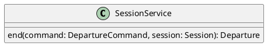

# UC-18 — End a Session for Everyone

### Description

As a host, I want to end the session for everyone so that all participants receive the post-session outcome.

### Actors

Host; Session Service.

### Priority

P0.

### Trigger

**TRG-UC-18-01** — The host chooses End for everyone from the session controls.

### Preconditions

- **PRE-UC-18-01** — The host is viewing the joined-session interface.

### Postconditions

- **POST-UC-18-01** — Each client displays the returned ended-session state.

### Basic Flow

1. The host opens the end-session control.
2. The client presents the confirmation shown by the design.
3. The host confirms End for everyone.
4. The client submits the termination request.
5. The system returns the ended-session representation.
6. Each client requests session state and displays the post-session outcome.

### Alternative Flows

#### AF-UC-18-01

1. The host cancels the confirmation.
2. The client closes the dialog and restores the session interface.

### Exception Flows

#### EF-UC-18-01

1. The session service cannot complete the action.
2. The client displays the returned failure state and keeps the session interface available.

### UML Model

Classifiers and helper semantics are imported from the [shared domain model](shared-domain-model.md).



### Business Rules

```ocl
-- BR-UC-18-01
-- Source: Assumption
-- Assumption: A-19
context SessionService::end(command: DepartureCommand, session: Session): Departure
pre BR_UC_18_01_AuthenticatedMembership:
  RequestContext::authenticated and RequestContext::sessionId = command.sessionId and
  command.actorParticipantId = RequestContext::participantId and
  Participant.allInstances()->exists(p | p.id = command.actorParticipantId and
    p.principalId = RequestContext::principalId and p.sessionId = command.sessionId and
    p.status = ParticipantStatus::JOINED and p.role = ParticipantRole::HOST)
```

```ocl
-- BR-UC-18-02
-- Source: Assumption
-- Assumption: A-19
context SessionService::end(command: DepartureCommand, session: Session): Departure
pre BR_UC_18_02_TargetSession:
  command.sessionId = session.id and session.status <> SessionStatus::ENDED
```

```ocl
-- BR-UC-18-03
-- Source: Assumption
-- Assumption: A-20
context SessionService::end(command: DepartureCommand, session: Session): Departure
pre BR_UC_18_03_CommandKey:
  command.idempotencyKey <> null and command.idempotencyKey.trim().size() > 0
```

```ocl
-- BR-UC-18-04
-- Source: Assumption
-- Assumption: A-18
context SessionService::end(command: DepartureCommand, session: Session): Departure
pre BR_UC_18_04_DepartureAction:
  command.kind = DepartureKind::END and command.expectedVersion = session.version
```

```ocl
-- BR-UC-18-05
-- Source: Assumption
-- Assumption: A-18
context SessionService::end(command: DepartureCommand, session: Session): Departure
post BR_UC_18_05_CreatedIdentity:
  result.oclIsNew() and result.id <> null and result.sessionId = command.sessionId and result.participantId = command.actorParticipantId and result.kind = DepartureKind::END and result.createdAt <> null
```

```ocl
-- BR-UC-18-06
-- Source: Assumption
-- Assumption: A-18
context SessionService::end(command: DepartureCommand, session: Session): Departure
post BR_UC_18_06_SessionEnded:
  session.status = SessionStatus::ENDED and session.endedAt <> null and session.version = session.version@pre + 1
```

```ocl
-- BR-UC-18-07
-- Source: Assumption
-- Assumption: A-18
context SessionService::end(command: DepartureCommand, session: Session): Departure
post BR_UC_18_07_AllParticipantsLeave:
  Participant.allInstances()@pre->select(p | p.sessionId = session.id and p.status@pre = ParticipantStatus::JOINED)->forAll(p |
    p.status = ParticipantStatus::LEFT and p.leftAt <> null and p.version = p.version@pre + 1 and not p.microphoneEnabled and not p.cameraEnabled)
```

```ocl
-- BR-UC-18-08
-- Source: Assumption
-- Assumption: A-18
context SessionService::end(command: DepartureCommand, session: Session): Departure
post BR_UC_18_08_StreamTerminated:
  LiveStream.allInstances()@pre->select(s | s.sessionId = session.id and s.status@pre <> StreamStatus::ENDED)->forAll(s |
    s.status = StreamStatus::ENDED and s.endedAt <> null and s.version = s.version@pre + 1)
```

```ocl
-- BR-UC-18-09
-- Source: Assumption
-- Assumption: A-21
context SessionService::end(command: DepartureCommand, session: Session): Departure
post BR_UC_18_09_StopContentShares:
  ContentShare.allInstances()@pre->select(cs | cs.sessionId = command.sessionId and cs.status@pre = ShareStatus::ACTIVE)->forAll(cs |
    cs.status = ShareStatus::STOPPED and cs.stoppedAt <> null and cs.version = cs.version@pre + 1)
```

```ocl
-- BR-UC-18-10
-- Source: Assumption
-- Assumption: A-21
context SessionService::end(command: DepartureCommand, session: Session): Departure
post BR_UC_18_10_CancelPendingRequests:
  StageRequest.allInstances()@pre->select(r | r.sessionId = command.sessionId and r.status@pre = StageRequestStatus::PENDING)->forAll(r |
    r.status = StageRequestStatus::CANCELLED and r.decidedAt <> null and r.version = r.version@pre + 1)
```

```ocl
-- BR-UC-18-11
-- Source: Assumption
-- Assumption: A-21
context SessionService::end(command: DepartureCommand, session: Session): Departure
post BR_UC_18_11_StopRecordings:
  Recording.allInstances()@pre->select(r | r.sessionId = command.sessionId and
    (r.status@pre = RecordingStatus::STARTING or r.status@pre = RecordingStatus::RECORDING))->forAll(r |
    r.status = RecordingStatus::STOPPED and r.stoppedAt <> null and r.version = r.version@pre + 1)
```

### Related UI

- Live Streaming Desktop Features `6007:86770`.
- Video Conferencing Desktop Features `6007:55138`.
- Live Streaming Mobile Features `6012:90506`.
- Video Conferencing Mobile Features `6012:52233`.

### Related APIs

`API-SESSION-DEPARTURE`.
`API-SESSION-STATE`.

### Notes

The shared model defines trusted context, persistence mapping, and query helpers. Server mutation execution uses MutationGateway and its common OCL constraints in UC-02. API command dispatch selects the named operation; it does not combine the preconditions of different operations. Read operations have no domain writes.
