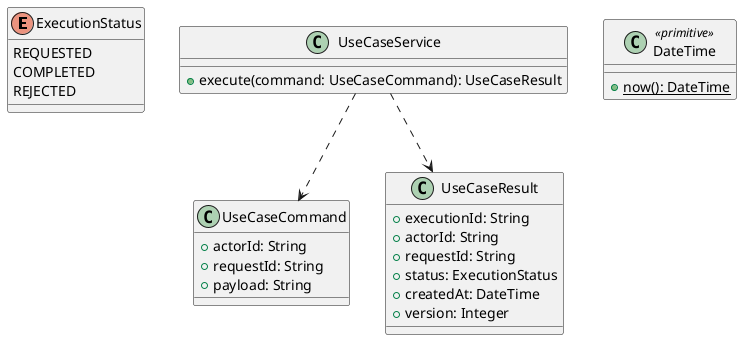

# UC-02 — Sign In

### Description

- Allows a customer with an active, email-verified account to sign in using email and password and access their account area.
- Includes establishing a browser session and reading the current session. Account registration, password recovery, social-provider authentication, logout, and full Dashboard features are separate use cases.

### Actors

Customer.

### Priority

Not specified in the supplied source.

### Trigger

**TRG-UC-02-01** — The actor opens the Sign In interface.

### Preconditions

- **PRE-UC-02-01** — The interaction interface is visible to the actor.

### Postconditions

- **POST-UC-02-01** — The client displays the returned interaction outcome.

### Basic Flow

1. The actor opens the interaction interface.
2. The client displays the available controls.
3. The actor submits the interaction.
4. The client sends the request to the system.
5. The system returns an outcome.
6. The client displays the returned outcome.

### Alternative Flows

#### AF-UC-02-01

1. The actor chooses an available alternative action.
2. The client displays the returned alternative outcome.

### Exception Flows

#### EF-UC-02-01

1. The system returns an unsuccessful outcome.
2. The client displays the returned recovery message.

### UML Model



### Business Rules

```ocl
-- BR-UC-02-01
-- Source: Product source
context UseCaseService::execute(command: UseCaseCommand): UseCaseResult
pre BR_UC_02_01_ActorIsPresent:
  command.actorId <> null and command.actorId.trim().size() > 0
```

```ocl
-- BR-UC-02-02
-- Source: Product source
context UseCaseService::execute(command: UseCaseCommand): UseCaseResult
pre BR_UC_02_02_RequestIsPresent:
  command.requestId <> null and command.requestId.trim().size() > 0
```

```ocl
-- BR-UC-02-03
-- Source: Product source
context UseCaseService::execute(command: UseCaseCommand): UseCaseResult
pre BR_UC_02_03_PayloadIsPresent:
  command.payload <> null and command.payload.trim().size() > 0
```

```ocl
-- BR-UC-02-04
-- Source: Product source
context UseCaseService::execute(command: UseCaseCommand): UseCaseResult
post BR_UC_02_04_ExecutionIsIdentified:
  result.executionId <> null and result.executionId.trim().size() > 0
```

```ocl
-- BR-UC-02-05
-- Source: Product source
context UseCaseService::execute(command: UseCaseCommand): UseCaseResult
post BR_UC_02_05_ResultMatchesRequest:
  result.actorId = command.actorId and result.requestId = command.requestId
```

```ocl
-- BR-UC-02-06
-- Source: Product source
context UseCaseService::execute(command: UseCaseCommand): UseCaseResult
post BR_UC_02_06_ResultIsCompleted:
  result.status = ExecutionStatus::COMPLETED
```

```ocl
-- BR-UC-02-07
-- Source: Product source
context UseCaseService::execute(command: UseCaseCommand): UseCaseResult
post BR_UC_02_07_ResultIsVersioned:
  result.version > 0 and result.createdAt <= DateTime::now()
```

### Related UI

- [Supporting Figma node 1](https://www.figma.com/design/LEzMSML2K1XeZAxmvNvEYm/Clicon---eCommerce-Marketplace-Website-Figma-Template--Community---Community---Copy-?node-id=429-7940&m=dev&t=dzmB5Gsx6BiSx55z-1)

### Related APIs

- [API-UC-02-01](../api/api-uc-02-01.md)
- [API-UC-02-02](../api/api-uc-02-02.md)

### Notes

The complete supplied specification is preserved byte-for-byte at [clicon-uc-02-sign-in.md](../source/clicon-uc-02-sign-in.md). It remains authoritative for detailed flows, payloads, response examples, errors, implementation context, and validation behavior.
