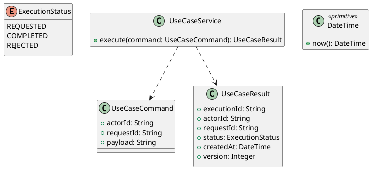

# UC-04 — Browse, Search and Filter Products

### Description

- Allows a visitor or customer to find products by browsing the catalog, entering a search phrase, combining filters, choosing a sort order, and navigating result pages.
- These actions form one goal: obtaining a relevant product list. Viewing full product details, adding to cart, managing a wishlist, comparing products, and checkout belong to separate use cases.
- Filter combination rules, search matching, sort options beyond the visible selection, URL behavior, and API contracts below are project decisions. The referenced Figma frame supplies the desktop controls and layout.

### Actors

Visitor or signed-in Customer.

### Priority

Not specified in the supplied source.

### Trigger

**TRG-UC-04-01** — The actor opens the Browse, Search and Filter Products interface.

### Preconditions

- **PRE-UC-04-01** — The interaction interface is visible to the actor.

### Postconditions

- **POST-UC-04-01** — The client displays the returned interaction outcome.

### Basic Flow

1. The actor opens the interaction interface.
2. The client displays the available controls.
3. The actor submits the interaction.
4. The client sends the request to the system.
5. The system returns an outcome.
6. The client displays the returned outcome.

### Alternative Flows

#### AF-UC-04-01

1. The actor chooses an available alternative action.
2. The client displays the returned alternative outcome.

### Exception Flows

#### EF-UC-04-01

1. The system returns an unsuccessful outcome.
2. The client displays the returned recovery message.

### UML Model



### Business Rules

```ocl
-- BR-UC-04-01
-- Source: Product source
context UseCaseService::execute(command: UseCaseCommand): UseCaseResult
pre BR_UC_04_01_ActorIsPresent:
  command.actorId <> null and command.actorId.trim().size() > 0
```

```ocl
-- BR-UC-04-02
-- Source: Product source
context UseCaseService::execute(command: UseCaseCommand): UseCaseResult
pre BR_UC_04_02_RequestIsPresent:
  command.requestId <> null and command.requestId.trim().size() > 0
```

```ocl
-- BR-UC-04-03
-- Source: Product source
context UseCaseService::execute(command: UseCaseCommand): UseCaseResult
pre BR_UC_04_03_PayloadIsPresent:
  command.payload <> null and command.payload.trim().size() > 0
```

```ocl
-- BR-UC-04-04
-- Source: Product source
context UseCaseService::execute(command: UseCaseCommand): UseCaseResult
post BR_UC_04_04_ExecutionIsIdentified:
  result.executionId <> null and result.executionId.trim().size() > 0
```

```ocl
-- BR-UC-04-05
-- Source: Product source
context UseCaseService::execute(command: UseCaseCommand): UseCaseResult
post BR_UC_04_05_ResultMatchesRequest:
  result.actorId = command.actorId and result.requestId = command.requestId
```

```ocl
-- BR-UC-04-06
-- Source: Product source
context UseCaseService::execute(command: UseCaseCommand): UseCaseResult
post BR_UC_04_06_ResultIsCompleted:
  result.status = ExecutionStatus::COMPLETED
```

```ocl
-- BR-UC-04-07
-- Source: Product source
context UseCaseService::execute(command: UseCaseCommand): UseCaseResult
post BR_UC_04_07_ResultIsVersioned:
  result.version > 0 and result.createdAt <= DateTime::now()
```

### Related UI

- [Supporting Figma node 1](https://www.figma.com/design/LEzMSML2K1XeZAxmvNvEYm/Clicon---eCommerce-Marketplace-Website-Figma-Template--Community---Community---Copy-?node-id=391-4117)

### Related APIs

- [API-UC-04-01](../api/api-uc-04-01.md)
- [API-UC-04-02](../api/api-uc-04-02.md)

### Notes

The complete supplied specification is preserved byte-for-byte at [clicon-uc-04-browse-search-filter-products.md](../source/clicon-uc-04-browse-search-filter-products.md). It remains authoritative for detailed flows, payloads, response examples, errors, implementation context, and validation behavior.
