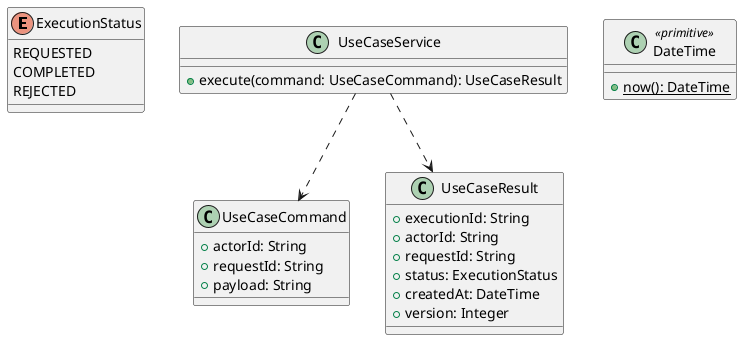

# UC-05 — View Product Details

### Description

- Allows a visitor or customer to inspect a published product, browse its images, select an available product configuration, and read product information before deciding whether to purchase.
- Continues UC-04 through product-card navigation. Includes read-only image/configuration selection, information tabs, related-product navigation, and copying the product link.
- Adding to cart, Buy Now, wishlist, comparison, reading/submitting individual reviews, and external social sharing belong to separate use cases. Their visible controls remain integration points, not simulated successful actions.
- Variant behavior, API contracts, quantity limits, and content for tabs not shown open in Figma are project decisions. The inspected frame establishes the visible desktop layout and controls.

### Actors

Visitor or signed-in Customer.

### Priority

Not specified in the supplied source.

### Trigger

**TRG-UC-05-01** — The actor opens the View Product Details interface.

### Preconditions

- **PRE-UC-05-01** — The interaction interface is visible to the actor.

### Postconditions

- **POST-UC-05-01** — The client displays the returned interaction outcome.

### Basic Flow

1. The actor opens the interaction interface.
2. The client displays the available controls.
3. The actor submits the interaction.
4. The client sends the request to the system.
5. The system returns an outcome.
6. The client displays the returned outcome.

### Alternative Flows

#### AF-UC-05-01

1. The actor chooses an available alternative action.
2. The client displays the returned alternative outcome.

### Exception Flows

#### EF-UC-05-01

1. The system returns an unsuccessful outcome.
2. The client displays the returned recovery message.

### UML Model



### Business Rules

```ocl
-- BR-UC-05-01
-- Source: Product source
context UseCaseService::execute(command: UseCaseCommand): UseCaseResult
pre BR_UC_05_01_ActorIsPresent:
  command.actorId <> null and command.actorId.trim().size() > 0
```

```ocl
-- BR-UC-05-02
-- Source: Product source
context UseCaseService::execute(command: UseCaseCommand): UseCaseResult
pre BR_UC_05_02_RequestIsPresent:
  command.requestId <> null and command.requestId.trim().size() > 0
```

```ocl
-- BR-UC-05-03
-- Source: Product source
context UseCaseService::execute(command: UseCaseCommand): UseCaseResult
pre BR_UC_05_03_PayloadIsPresent:
  command.payload <> null and command.payload.trim().size() > 0
```

```ocl
-- BR-UC-05-04
-- Source: Product source
context UseCaseService::execute(command: UseCaseCommand): UseCaseResult
post BR_UC_05_04_ExecutionIsIdentified:
  result.executionId <> null and result.executionId.trim().size() > 0
```

```ocl
-- BR-UC-05-05
-- Source: Product source
context UseCaseService::execute(command: UseCaseCommand): UseCaseResult
post BR_UC_05_05_ResultMatchesRequest:
  result.actorId = command.actorId and result.requestId = command.requestId
```

```ocl
-- BR-UC-05-06
-- Source: Product source
context UseCaseService::execute(command: UseCaseCommand): UseCaseResult
post BR_UC_05_06_ResultIsCompleted:
  result.status = ExecutionStatus::COMPLETED
```

```ocl
-- BR-UC-05-07
-- Source: Product source
context UseCaseService::execute(command: UseCaseCommand): UseCaseResult
post BR_UC_05_07_ResultIsVersioned:
  result.version > 0 and result.createdAt <= DateTime::now()
```

### Related UI

- [Supporting Figma node 1](https://www.figma.com/design/LEzMSML2K1XeZAxmvNvEYm/Clicon---eCommerce-Marketplace-Website-Figma-Template--Community---Community---Copy-?node-id=394-8951)

### Related APIs

- [API-UC-05-01](../api/api-uc-05-01.md)
- [API-UC-05-02](../api/api-uc-05-02.md)

### Notes

The complete supplied specification is preserved byte-for-byte at [clicon-uc-05-view-product-details.md](../source/clicon-uc-05-view-product-details.md). It remains authoritative for detailed flows, payloads, response examples, errors, implementation context, and validation behavior.
