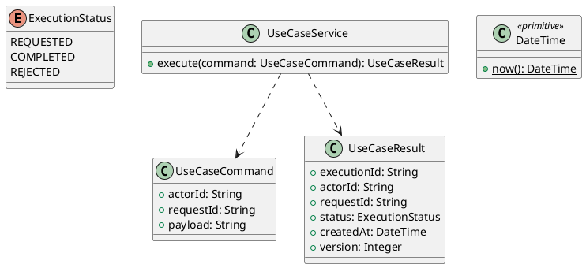

# UC-07 — Checkout and Place Order

### Description

- Allows a visitor or customer to provide billing/delivery information, review a checkout quote, and place a Cash on Delivery order from the saved UC-06 cart.
- Includes the checkout form, order creation, and reloadable order-confirmation screen. Continues UC-06 without requiring account registration or login.
- Payment availability, delivery coverage, quote lifetime, pricing, order rules, and API contracts are project decisions. The inspected Figma frames establish desktop layout and visible controls.
- Online payment, coupons, order history/details, tracking, cancellation, email notifications, and saved address management are separate use cases or integrations. Cash on Delivery placement does not imply that payment has been collected.

### Actors

Visitor or signed-in Customer with a browser cart.

### Priority

Not specified in the supplied source.

### Trigger

**TRG-UC-07-01** — The actor opens the Checkout and Place Order interface.

### Preconditions

- **PRE-UC-07-01** — The interaction interface is visible to the actor.

### Postconditions

- **POST-UC-07-01** — The client displays the returned interaction outcome.

### Basic Flow

1. The actor opens the interaction interface.
2. The client displays the available controls.
3. The actor submits the interaction.
4. The client sends the request to the system.
5. The system returns an outcome.
6. The client displays the returned outcome.

### Alternative Flows

#### AF-UC-07-01

1. The actor chooses an available alternative action.
2. The client displays the returned alternative outcome.

### Exception Flows

#### EF-UC-07-01

1. The system returns an unsuccessful outcome.
2. The client displays the returned recovery message.

### UML Model



### Business Rules

```ocl
-- BR-UC-07-01
-- Source: Product source
context UseCaseService::execute(command: UseCaseCommand): UseCaseResult
pre BR_UC_07_01_ActorIsPresent:
  command.actorId <> null and command.actorId.trim().size() > 0
```

```ocl
-- BR-UC-07-02
-- Source: Product source
context UseCaseService::execute(command: UseCaseCommand): UseCaseResult
pre BR_UC_07_02_RequestIsPresent:
  command.requestId <> null and command.requestId.trim().size() > 0
```

```ocl
-- BR-UC-07-03
-- Source: Product source
context UseCaseService::execute(command: UseCaseCommand): UseCaseResult
pre BR_UC_07_03_PayloadIsPresent:
  command.payload <> null and command.payload.trim().size() > 0
```

```ocl
-- BR-UC-07-04
-- Source: Product source
context UseCaseService::execute(command: UseCaseCommand): UseCaseResult
post BR_UC_07_04_ExecutionIsIdentified:
  result.executionId <> null and result.executionId.trim().size() > 0
```

```ocl
-- BR-UC-07-05
-- Source: Product source
context UseCaseService::execute(command: UseCaseCommand): UseCaseResult
post BR_UC_07_05_ResultMatchesRequest:
  result.actorId = command.actorId and result.requestId = command.requestId
```

```ocl
-- BR-UC-07-06
-- Source: Product source
context UseCaseService::execute(command: UseCaseCommand): UseCaseResult
post BR_UC_07_06_ResultIsCompleted:
  result.status = ExecutionStatus::COMPLETED
```

```ocl
-- BR-UC-07-07
-- Source: Product source
context UseCaseService::execute(command: UseCaseCommand): UseCaseResult
post BR_UC_07_07_ResultIsVersioned:
  result.version > 0 and result.createdAt <= DateTime::now()
```

### Related UI

- [Supporting Figma node 1](https://www.figma.com/design/LEzMSML2K1XeZAxmvNvEYm/Clicon---eCommerce-Marketplace-Website-Figma-Template--Community---Community---Copy-?node-id=493-15194)
- [Supporting Figma node 2](https://www.figma.com/design/LEzMSML2K1XeZAxmvNvEYm/Clicon---eCommerce-Marketplace-Website-Figma-Template--Community---Community---Copy-?node-id=510-16556)

### Related APIs

- [API-UC-07-01](../api/api-uc-07-01.md)
- [API-UC-07-02](../api/api-uc-07-02.md)
- [API-UC-07-03](../api/api-uc-07-03.md)
- [API-UC-07-04](../api/api-uc-07-04.md)

### Notes

The complete supplied specification is preserved byte-for-byte at [clicon-uc-07-checkout-and-place-order.md](../source/clicon-uc-07-checkout-and-place-order.md). It remains authoritative for detailed flows, payloads, response examples, errors, implementation context, and validation behavior.
