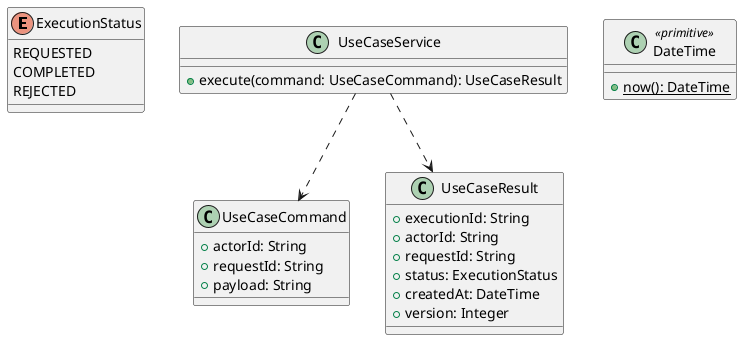

# UC-08 — Track Order

### Description

- Allows a visitor or customer to look up a previously placed order using its displayed order number and checkout billing email, then view fulfillment progress and recorded activity.
- Continues UC-07 using the persisted order and its original browser context. Includes the tracking form and read-only tracking result.
- Lookup eligibility, fulfillment states, API contracts, and recovery behavior below are project decisions. Figma establishes the inspected desktop form, summary, progress indicator, and activity list.
- This UC does not change an order, collect payment, contact a carrier, generate shipment events, send email, or implement order history, cancellation, returns, or full order details.

### Actors

Visitor or signed-in Customer in the browser context that placed the order.

### Priority

Not specified in the supplied source.

### Trigger

**TRG-UC-08-01** — The actor opens the Track Order interface.

### Preconditions

- **PRE-UC-08-01** — The interaction interface is visible to the actor.

### Postconditions

- **POST-UC-08-01** — The client displays the returned interaction outcome.

### Basic Flow

1. The actor opens the interaction interface.
2. The client displays the available controls.
3. The actor submits the interaction.
4. The client sends the request to the system.
5. The system returns an outcome.
6. The client displays the returned outcome.

### Alternative Flows

#### AF-UC-08-01

1. The actor chooses an available alternative action.
2. The client displays the returned alternative outcome.

### Exception Flows

#### EF-UC-08-01

1. The system returns an unsuccessful outcome.
2. The client displays the returned recovery message.

### UML Model



### Business Rules

```ocl
-- BR-UC-08-01
-- Source: Product source
context UseCaseService::execute(command: UseCaseCommand): UseCaseResult
pre BR_UC_08_01_ActorIsPresent:
  command.actorId <> null and command.actorId.trim().size() > 0
```

```ocl
-- BR-UC-08-02
-- Source: Product source
context UseCaseService::execute(command: UseCaseCommand): UseCaseResult
pre BR_UC_08_02_RequestIsPresent:
  command.requestId <> null and command.requestId.trim().size() > 0
```

```ocl
-- BR-UC-08-03
-- Source: Product source
context UseCaseService::execute(command: UseCaseCommand): UseCaseResult
pre BR_UC_08_03_PayloadIsPresent:
  command.payload <> null and command.payload.trim().size() > 0
```

```ocl
-- BR-UC-08-04
-- Source: Product source
context UseCaseService::execute(command: UseCaseCommand): UseCaseResult
post BR_UC_08_04_ExecutionIsIdentified:
  result.executionId <> null and result.executionId.trim().size() > 0
```

```ocl
-- BR-UC-08-05
-- Source: Product source
context UseCaseService::execute(command: UseCaseCommand): UseCaseResult
post BR_UC_08_05_ResultMatchesRequest:
  result.actorId = command.actorId and result.requestId = command.requestId
```

```ocl
-- BR-UC-08-06
-- Source: Product source
context UseCaseService::execute(command: UseCaseCommand): UseCaseResult
post BR_UC_08_06_ResultIsCompleted:
  result.status = ExecutionStatus::COMPLETED
```

```ocl
-- BR-UC-08-07
-- Source: Product source
context UseCaseService::execute(command: UseCaseCommand): UseCaseResult
post BR_UC_08_07_ResultIsVersioned:
  result.version > 0 and result.createdAt <= DateTime::now()
```

### Related UI

- [Supporting Figma node 1](https://www.figma.com/design/LEzMSML2K1XeZAxmvNvEYm/Clicon---eCommerce-Marketplace-Website-Figma-Template--Community---Community---Copy-?node-id=418-10475)
- [Supporting Figma node 2](https://www.figma.com/design/LEzMSML2K1XeZAxmvNvEYm/Clicon---eCommerce-Marketplace-Website-Figma-Template--Community---Community---Copy-?node-id=418-11361)

### Related APIs

- [API-UC-08-01](../api/api-uc-08-01.md)

### Notes

The complete supplied specification is preserved byte-for-byte at [clicon-uc-08-track-order.md](../source/clicon-uc-08-track-order.md). It remains authoritative for detailed flows, payloads, response examples, errors, implementation context, and validation behavior.
