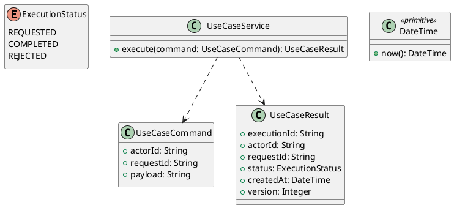

# UC-09 — Manage Wishlist

### Description

- Allows a visitor or customer to save selected product configurations, view their current prices and stock status, remove saved configurations, and add an available saved configuration to the shopping cart.
- Connects UC-05's Add to Wishlist action, the shared Wishlist navigation, and UC-06's existing cart API.
- Variant-level identity, browser persistence, limits, API contracts, and interaction behavior below are project decisions. Figma establishes the inspected desktop list and visible actions.
- This UC does not create orders, reserve inventory, send stock/price notifications, share wishlists, or synchronize lists across accounts/devices.

### Actors

Visitor or signed-in Customer using the same browser context.

### Priority

Not specified in the supplied source.

### Trigger

**TRG-UC-09-01** — The actor opens the Manage Wishlist interface.

### Preconditions

- **PRE-UC-09-01** — The interaction interface is visible to the actor.

### Postconditions

- **POST-UC-09-01** — The client displays the returned interaction outcome.

### Basic Flow

1. The actor opens the interaction interface.
2. The client displays the available controls.
3. The actor submits the interaction.
4. The client sends the request to the system.
5. The system returns an outcome.
6. The client displays the returned outcome.

### Alternative Flows

#### AF-UC-09-01

1. The actor chooses an available alternative action.
2. The client displays the returned alternative outcome.

### Exception Flows

#### EF-UC-09-01

1. The system returns an unsuccessful outcome.
2. The client displays the returned recovery message.

### UML Model



### Business Rules

```ocl
-- BR-UC-09-01
-- Source: Product source
context UseCaseService::execute(command: UseCaseCommand): UseCaseResult
pre BR_UC_09_01_ActorIsPresent:
  command.actorId <> null and command.actorId.trim().size() > 0
```

```ocl
-- BR-UC-09-02
-- Source: Product source
context UseCaseService::execute(command: UseCaseCommand): UseCaseResult
pre BR_UC_09_02_RequestIsPresent:
  command.requestId <> null and command.requestId.trim().size() > 0
```

```ocl
-- BR-UC-09-03
-- Source: Product source
context UseCaseService::execute(command: UseCaseCommand): UseCaseResult
pre BR_UC_09_03_PayloadIsPresent:
  command.payload <> null and command.payload.trim().size() > 0
```

```ocl
-- BR-UC-09-04
-- Source: Product source
context UseCaseService::execute(command: UseCaseCommand): UseCaseResult
post BR_UC_09_04_ExecutionIsIdentified:
  result.executionId <> null and result.executionId.trim().size() > 0
```

```ocl
-- BR-UC-09-05
-- Source: Product source
context UseCaseService::execute(command: UseCaseCommand): UseCaseResult
post BR_UC_09_05_ResultMatchesRequest:
  result.actorId = command.actorId and result.requestId = command.requestId
```

```ocl
-- BR-UC-09-06
-- Source: Product source
context UseCaseService::execute(command: UseCaseCommand): UseCaseResult
post BR_UC_09_06_ResultIsCompleted:
  result.status = ExecutionStatus::COMPLETED
```

```ocl
-- BR-UC-09-07
-- Source: Product source
context UseCaseService::execute(command: UseCaseCommand): UseCaseResult
post BR_UC_09_07_ResultIsVersioned:
  result.version > 0 and result.createdAt <= DateTime::now()
```

### Related UI

- [Supporting Figma node 1](https://www.figma.com/design/LEzMSML2K1XeZAxmvNvEYm/Clicon---eCommerce-Marketplace-Website-Figma-Template--Community---Community---Copy-?node-id=418-11632)

### Related APIs

- [API-UC-09-01](../api/api-uc-09-01.md)
- [API-UC-09-02](../api/api-uc-09-02.md)
- [API-UC-09-03](../api/api-uc-09-03.md)
- [API-UC-09-04](../api/api-uc-09-04.md)
- [API-UC-09-05](../api/api-uc-09-05.md)

### Notes

The complete supplied specification is preserved byte-for-byte at [clicon-uc-09-manage-wishlist.md](../source/clicon-uc-09-manage-wishlist.md). It remains authoritative for detailed flows, payloads, response examples, errors, implementation context, and validation behavior.
