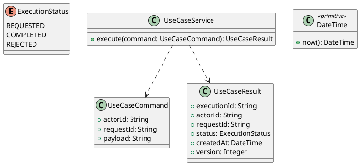

# UC-11 — Manage Account Profile

### Description

- Allows an authenticated customer to view account information and update profile names, optional secondary contact details, and an optional profile location.
- Implements the Account Setting section of the inspected settings frame, using the account established by UC-01 and session defined by UC-02.
- Field semantics, editable boundaries, location fixtures, concurrency behavior, and API contracts are project decisions. Figma establishes the desktop controls and layout.
- Changing the primary email, password, avatar, billing/shipping addresses, or account status is outside this UC. Profile updates do not modify previously placed orders or browser-scoped cart, wishlist, and comparison data.

### Actors

Signed-in Customer with an active, verified account.

### Priority

Not specified in the supplied source.

### Trigger

**TRG-UC-11-01** — The actor opens the Manage Account Profile interface.

### Preconditions

- **PRE-UC-11-01** — The interaction interface is visible to the actor.

### Postconditions

- **POST-UC-11-01** — The client displays the returned interaction outcome.

### Basic Flow

1. The actor opens the interaction interface.
2. The client displays the available controls.
3. The actor submits the interaction.
4. The client sends the request to the system.
5. The system returns an outcome.
6. The client displays the returned outcome.

### Alternative Flows

#### AF-UC-11-01

1. The actor chooses an available alternative action.
2. The client displays the returned alternative outcome.

### Exception Flows

#### EF-UC-11-01

1. The system returns an unsuccessful outcome.
2. The client displays the returned recovery message.

### UML Model



### Business Rules

```ocl
-- BR-UC-11-01
-- Source: Product source
context UseCaseService::execute(command: UseCaseCommand): UseCaseResult
pre BR_UC_11_01_ActorIsPresent:
  command.actorId <> null and command.actorId.trim().size() > 0
```

```ocl
-- BR-UC-11-02
-- Source: Product source
context UseCaseService::execute(command: UseCaseCommand): UseCaseResult
pre BR_UC_11_02_RequestIsPresent:
  command.requestId <> null and command.requestId.trim().size() > 0
```

```ocl
-- BR-UC-11-03
-- Source: Product source
context UseCaseService::execute(command: UseCaseCommand): UseCaseResult
pre BR_UC_11_03_PayloadIsPresent:
  command.payload <> null and command.payload.trim().size() > 0
```

```ocl
-- BR-UC-11-04
-- Source: Product source
context UseCaseService::execute(command: UseCaseCommand): UseCaseResult
post BR_UC_11_04_ExecutionIsIdentified:
  result.executionId <> null and result.executionId.trim().size() > 0
```

```ocl
-- BR-UC-11-05
-- Source: Product source
context UseCaseService::execute(command: UseCaseCommand): UseCaseResult
post BR_UC_11_05_ResultMatchesRequest:
  result.actorId = command.actorId and result.requestId = command.requestId
```

```ocl
-- BR-UC-11-06
-- Source: Product source
context UseCaseService::execute(command: UseCaseCommand): UseCaseResult
post BR_UC_11_06_ResultIsCompleted:
  result.status = ExecutionStatus::COMPLETED
```

```ocl
-- BR-UC-11-07
-- Source: Product source
context UseCaseService::execute(command: UseCaseCommand): UseCaseResult
post BR_UC_11_07_ResultIsVersioned:
  result.version > 0 and result.createdAt <= DateTime::now()
```

### Related UI

- [Supporting Figma node 1](https://www.figma.com/design/LEzMSML2K1XeZAxmvNvEYm/Clicon---eCommerce-Marketplace-Website-Figma-Template--Community---Community---Copy-?node-id=478-17305)

### Related APIs

- [API-UC-11-01](../api/api-uc-11-01.md)
- [API-UC-11-02](../api/api-uc-11-02.md)
- [API-UC-11-03](../api/api-uc-11-03.md)

### Notes

The complete supplied specification is preserved byte-for-byte at [clicon-uc-11-manage-account-profile.md](../source/clicon-uc-11-manage-account-profile.md). It remains authoritative for detailed flows, payloads, response examples, errors, implementation context, and validation behavior.
