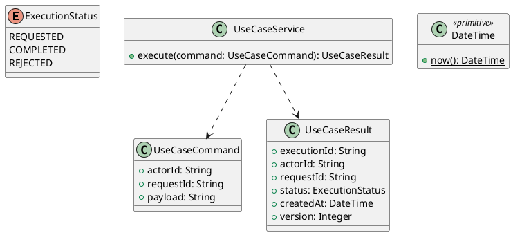

# UC-13 — Manage Saved Billing and Shipping Addresses

### Description

- Allows an authenticated customer to view, create, and replace one saved billing address and one saved shipping address independently from Account Settings.
- Enables deliberate reuse of saved addresses in UC-07 checkout without changing its request or order-snapshot contracts.
- Address slots, validation, revision handling, and checkout mapping are project decisions. Figma establishes the two desktop address forms and their separate save actions.
- Multiple-address books, deletion, default-address selection, geocoding, payment-card management, and carrier address verification are outside this UC.

### Actors

Signed-in Customer with an active, verified account.

### Priority

Not specified in the supplied source.

### Trigger

**TRG-UC-13-01** — The actor opens the Manage Saved Billing and Shipping Addresses interface.

### Preconditions

- **PRE-UC-13-01** — The interaction interface is visible to the actor.

### Postconditions

- **POST-UC-13-01** — The client displays the returned interaction outcome.

### Basic Flow

1. The actor opens the interaction interface.
2. The client displays the available controls.
3. The actor submits the interaction.
4. The client sends the request to the system.
5. The system returns an outcome.
6. The client displays the returned outcome.

### Alternative Flows

#### AF-UC-13-01

1. The actor chooses an available alternative action.
2. The client displays the returned alternative outcome.

### Exception Flows

#### EF-UC-13-01

1. The system returns an unsuccessful outcome.
2. The client displays the returned recovery message.

### UML Model



### Business Rules

```ocl
-- BR-UC-13-01
-- Source: Product source
context UseCaseService::execute(command: UseCaseCommand): UseCaseResult
pre BR_UC_13_01_ActorIsPresent:
  command.actorId <> null and command.actorId.trim().size() > 0
```

```ocl
-- BR-UC-13-02
-- Source: Product source
context UseCaseService::execute(command: UseCaseCommand): UseCaseResult
pre BR_UC_13_02_RequestIsPresent:
  command.requestId <> null and command.requestId.trim().size() > 0
```

```ocl
-- BR-UC-13-03
-- Source: Product source
context UseCaseService::execute(command: UseCaseCommand): UseCaseResult
pre BR_UC_13_03_PayloadIsPresent:
  command.payload <> null and command.payload.trim().size() > 0
```

```ocl
-- BR-UC-13-04
-- Source: Product source
context UseCaseService::execute(command: UseCaseCommand): UseCaseResult
post BR_UC_13_04_ExecutionIsIdentified:
  result.executionId <> null and result.executionId.trim().size() > 0
```

```ocl
-- BR-UC-13-05
-- Source: Product source
context UseCaseService::execute(command: UseCaseCommand): UseCaseResult
post BR_UC_13_05_ResultMatchesRequest:
  result.actorId = command.actorId and result.requestId = command.requestId
```

```ocl
-- BR-UC-13-06
-- Source: Product source
context UseCaseService::execute(command: UseCaseCommand): UseCaseResult
post BR_UC_13_06_ResultIsCompleted:
  result.status = ExecutionStatus::COMPLETED
```

```ocl
-- BR-UC-13-07
-- Source: Product source
context UseCaseService::execute(command: UseCaseCommand): UseCaseResult
post BR_UC_13_07_ResultIsVersioned:
  result.version > 0 and result.createdAt <= DateTime::now()
```

### Related UI

- [Supporting Figma node 1](https://www.figma.com/design/LEzMSML2K1XeZAxmvNvEYm/Clicon---eCommerce-Marketplace-Website-Figma-Template--Community---Community---Copy-?node-id=493-12498)
- [Supporting Figma node 2](https://www.figma.com/design/LEzMSML2K1XeZAxmvNvEYm/Clicon---eCommerce-Marketplace-Website-Figma-Template--Community---Community---Copy-?node-id=494-17004)

### Related APIs

- [API-UC-13-01](../api/api-uc-13-01.md)
- [API-UC-13-02](../api/api-uc-13-02.md)
- [API-UC-13-03](../api/api-uc-13-03.md)

### Notes

The complete supplied specification is preserved byte-for-byte at [clicon-uc-13-manage-saved-addresses.md](../source/clicon-uc-13-manage-saved-addresses.md). It remains authoritative for detailed flows, payloads, response examples, errors, implementation context, and validation behavior.
