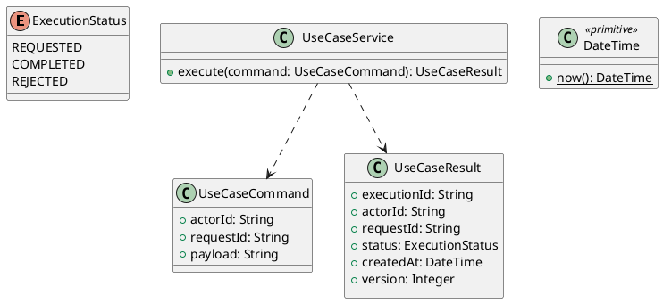

# UC-15 — View Account Order History

### Description

- Allows an authenticated customer to view a paginated summary of orders explicitly associated with their account, including order number, fulfillment summary, placement date, final total, and purchased quantity.
- Includes the account-order association needed to populate this page from future UC-07 checkouts. That association is an explicit integration extension; it was not previously implemented or implied by UC-07's browser-owned confirmation contract.
- Ownership, status mapping, pagination, and API contracts are project decisions. Figma establishes the inspected desktop table, sidebar, and pagination controls.
- Full order details, cancellation, refunds, payment collection, order search, and order-history import are outside this UC. View Details remains an integration point for its owning UC.

### Actors

Signed-in Customer with an active, verified account.

### Priority

Not specified in the supplied source.

### Trigger

**TRG-UC-15-01** — The actor opens the View Account Order History interface.

### Preconditions

- **PRE-UC-15-01** — The interaction interface is visible to the actor.

### Postconditions

- **POST-UC-15-01** — The client displays the returned interaction outcome.

### Basic Flow

1. The actor opens the interaction interface.
2. The client displays the available controls.
3. The actor submits the interaction.
4. The client sends the request to the system.
5. The system returns an outcome.
6. The client displays the returned outcome.

### Alternative Flows

#### AF-UC-15-01

1. The actor chooses an available alternative action.
2. The client displays the returned alternative outcome.

### Exception Flows

#### EF-UC-15-01

1. The system returns an unsuccessful outcome.
2. The client displays the returned recovery message.

### UML Model



### Business Rules

```ocl
-- BR-UC-15-01
-- Source: Product source
context UseCaseService::execute(command: UseCaseCommand): UseCaseResult
pre BR_UC_15_01_ActorIsPresent:
  command.actorId <> null and command.actorId.trim().size() > 0
```

```ocl
-- BR-UC-15-02
-- Source: Product source
context UseCaseService::execute(command: UseCaseCommand): UseCaseResult
pre BR_UC_15_02_RequestIsPresent:
  command.requestId <> null and command.requestId.trim().size() > 0
```

```ocl
-- BR-UC-15-03
-- Source: Product source
context UseCaseService::execute(command: UseCaseCommand): UseCaseResult
pre BR_UC_15_03_PayloadIsPresent:
  command.payload <> null and command.payload.trim().size() > 0
```

```ocl
-- BR-UC-15-04
-- Source: Product source
context UseCaseService::execute(command: UseCaseCommand): UseCaseResult
post BR_UC_15_04_ExecutionIsIdentified:
  result.executionId <> null and result.executionId.trim().size() > 0
```

```ocl
-- BR-UC-15-05
-- Source: Product source
context UseCaseService::execute(command: UseCaseCommand): UseCaseResult
post BR_UC_15_05_ResultMatchesRequest:
  result.actorId = command.actorId and result.requestId = command.requestId
```

```ocl
-- BR-UC-15-06
-- Source: Product source
context UseCaseService::execute(command: UseCaseCommand): UseCaseResult
post BR_UC_15_06_ResultIsCompleted:
  result.status = ExecutionStatus::COMPLETED
```

```ocl
-- BR-UC-15-07
-- Source: Product source
context UseCaseService::execute(command: UseCaseCommand): UseCaseResult
post BR_UC_15_07_ResultIsVersioned:
  result.version > 0 and result.createdAt <= DateTime::now()
```

### Related UI

- [Supporting Figma node 1](https://www.figma.com/design/LEzMSML2K1XeZAxmvNvEYm/Clicon---eCommerce-Marketplace-Website-Figma-Template--Community---Community---Copy-?node-id=478-10910)

### Related APIs

- [API-UC-15-01](../api/api-uc-15-01.md)

### Notes

The complete supplied specification is preserved byte-for-byte at [clicon-uc-15-view-order-history.md](../source/clicon-uc-15-view-order-history.md). It remains authoritative for detailed flows, payloads, response examples, errors, implementation context, and validation behavior.
