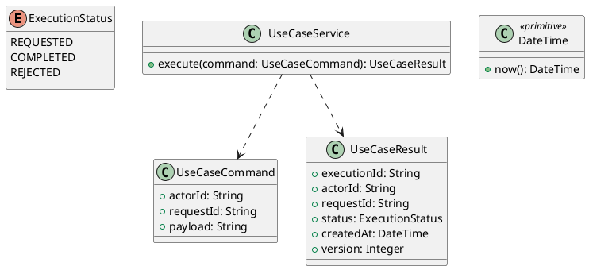

# UC-16 — View Order Details

### Description

- Displays the saved items, final amounts, addresses, contact, notes, and fulfillment activity of one placed order.
- Completes UC-15's View Details and UC-07's View Order integration points. Account detail and original-browser confirmation access have explicit separate boundaries below.
- Access rules, snapshots, API contracts, and missing-data behavior are project decisions; Figma establishes the desktop detail layout. Modification, cancellation, payment collection, and review submission are outside this UC; reviews belong to UC-17.

### Actors

Signed-in order owner, or the visitor in the original checkout browser context.

### Priority

Not specified in the supplied source.

### Trigger

**TRG-UC-16-01** — The actor opens the View Order Details interface.

### Preconditions

- **PRE-UC-16-01** — The interaction interface is visible to the actor.

### Postconditions

- **POST-UC-16-01** — The client displays the returned interaction outcome.

### Basic Flow

1. The actor opens the interaction interface.
2. The client displays the available controls.
3. The actor submits the interaction.
4. The client sends the request to the system.
5. The system returns an outcome.
6. The client displays the returned outcome.

### Alternative Flows

#### AF-UC-16-01

1. The actor chooses an available alternative action.
2. The client displays the returned alternative outcome.

### Exception Flows

#### EF-UC-16-01

1. The system returns an unsuccessful outcome.
2. The client displays the returned recovery message.

### UML Model



### Business Rules

```ocl
-- BR-UC-16-01
-- Source: Product source
context UseCaseService::execute(command: UseCaseCommand): UseCaseResult
pre BR_UC_16_01_ActorIsPresent:
  command.actorId <> null and command.actorId.trim().size() > 0
```

```ocl
-- BR-UC-16-02
-- Source: Product source
context UseCaseService::execute(command: UseCaseCommand): UseCaseResult
pre BR_UC_16_02_RequestIsPresent:
  command.requestId <> null and command.requestId.trim().size() > 0
```

```ocl
-- BR-UC-16-03
-- Source: Product source
context UseCaseService::execute(command: UseCaseCommand): UseCaseResult
pre BR_UC_16_03_PayloadIsPresent:
  command.payload <> null and command.payload.trim().size() > 0
```

```ocl
-- BR-UC-16-04
-- Source: Product source
context UseCaseService::execute(command: UseCaseCommand): UseCaseResult
post BR_UC_16_04_ExecutionIsIdentified:
  result.executionId <> null and result.executionId.trim().size() > 0
```

```ocl
-- BR-UC-16-05
-- Source: Product source
context UseCaseService::execute(command: UseCaseCommand): UseCaseResult
post BR_UC_16_05_ResultMatchesRequest:
  result.actorId = command.actorId and result.requestId = command.requestId
```

```ocl
-- BR-UC-16-06
-- Source: Product source
context UseCaseService::execute(command: UseCaseCommand): UseCaseResult
post BR_UC_16_06_ResultIsCompleted:
  result.status = ExecutionStatus::COMPLETED
```

```ocl
-- BR-UC-16-07
-- Source: Product source
context UseCaseService::execute(command: UseCaseCommand): UseCaseResult
post BR_UC_16_07_ResultIsVersioned:
  result.version > 0 and result.createdAt <= DateTime::now()
```

### Related UI

- [Supporting Figma node 1](https://www.figma.com/design/LEzMSML2K1XeZAxmvNvEYm/Clicon---eCommerce-Marketplace-Website-Figma-Template--Community---Community---Copy-?node-id=478-12692)

### Related APIs

- [API-UC-16-01](../api/api-uc-16-01.md)
- [API-UC-16-02](../api/api-uc-16-02.md)

### Notes

The complete supplied specification is preserved byte-for-byte at [clicon-uc-16-view-order-details.md](../source/clicon-uc-16-view-order-details.md). It remains authoritative for detailed flows, payloads, response examples, errors, implementation context, and validation behavior.
