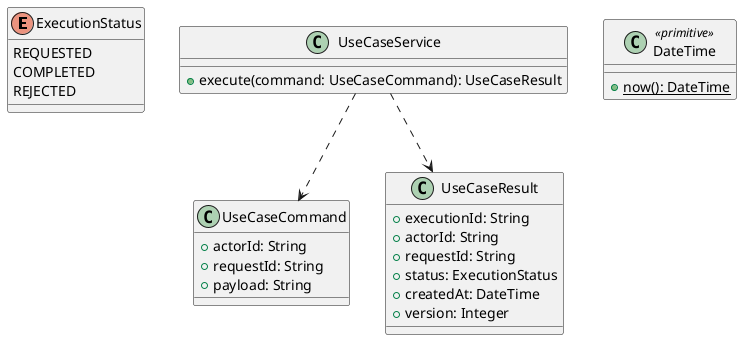

# UC-17 — Rate a Delivered Order

### Description

- Lets the authenticated owner leave one rating and feedback about a delivered order from UC-16's Leave a Rating modal.
- This is an order/service review: the inspected modal has no product selector. It does not alter product ratingAverage/reviewCount in UC-04/UC-05/UC-10, and it does not enable UC-05's product-review tab.
- Eligibility, single-review behavior, contracts, and visibility are project decisions. Editing/deleting reviews and public product reviews are outside this UC.

### Actors

Signed-in Customer whose account owns the delivered order under UC-15.

### Priority

Not specified in the supplied source.

### Trigger

**TRG-UC-17-01** — The actor opens the Rate a Delivered Order interface.

### Preconditions

- **PRE-UC-17-01** — The interaction interface is visible to the actor.

### Postconditions

- **POST-UC-17-01** — The client displays the returned interaction outcome.

### Basic Flow

1. The actor opens the interaction interface.
2. The client displays the available controls.
3. The actor submits the interaction.
4. The client sends the request to the system.
5. The system returns an outcome.
6. The client displays the returned outcome.

### Alternative Flows

#### AF-UC-17-01

1. The actor chooses an available alternative action.
2. The client displays the returned alternative outcome.

### Exception Flows

#### EF-UC-17-01

1. The system returns an unsuccessful outcome.
2. The client displays the returned recovery message.

### UML Model



### Business Rules

```ocl
-- BR-UC-17-01
-- Source: Product source
context UseCaseService::execute(command: UseCaseCommand): UseCaseResult
pre BR_UC_17_01_ActorIsPresent:
  command.actorId <> null and command.actorId.trim().size() > 0
```

```ocl
-- BR-UC-17-02
-- Source: Product source
context UseCaseService::execute(command: UseCaseCommand): UseCaseResult
pre BR_UC_17_02_RequestIsPresent:
  command.requestId <> null and command.requestId.trim().size() > 0
```

```ocl
-- BR-UC-17-03
-- Source: Product source
context UseCaseService::execute(command: UseCaseCommand): UseCaseResult
pre BR_UC_17_03_PayloadIsPresent:
  command.payload <> null and command.payload.trim().size() > 0
```

```ocl
-- BR-UC-17-04
-- Source: Product source
context UseCaseService::execute(command: UseCaseCommand): UseCaseResult
post BR_UC_17_04_ExecutionIsIdentified:
  result.executionId <> null and result.executionId.trim().size() > 0
```

```ocl
-- BR-UC-17-05
-- Source: Product source
context UseCaseService::execute(command: UseCaseCommand): UseCaseResult
post BR_UC_17_05_ResultMatchesRequest:
  result.actorId = command.actorId and result.requestId = command.requestId
```

```ocl
-- BR-UC-17-06
-- Source: Product source
context UseCaseService::execute(command: UseCaseCommand): UseCaseResult
post BR_UC_17_06_ResultIsCompleted:
  result.status = ExecutionStatus::COMPLETED
```

```ocl
-- BR-UC-17-07
-- Source: Product source
context UseCaseService::execute(command: UseCaseCommand): UseCaseResult
post BR_UC_17_07_ResultIsVersioned:
  result.version > 0 and result.createdAt <= DateTime::now()
```

### Related UI

- [Supporting Figma node 1](https://www.figma.com/design/LEzMSML2K1XeZAxmvNvEYm/Clicon---eCommerce-Marketplace-Website-Figma-Template--Community---Community---Copy-?node-id=510-15928)

### Related APIs

- [API-UC-17-01](../api/api-uc-17-01.md)
- [API-UC-17-02](../api/api-uc-17-02.md)

### Notes

The complete supplied specification is preserved byte-for-byte at [clicon-uc-17-rate-delivered-order.md](../source/clicon-uc-17-rate-delivered-order.md). It remains authoritative for detailed flows, payloads, response examples, errors, implementation context, and validation behavior.
