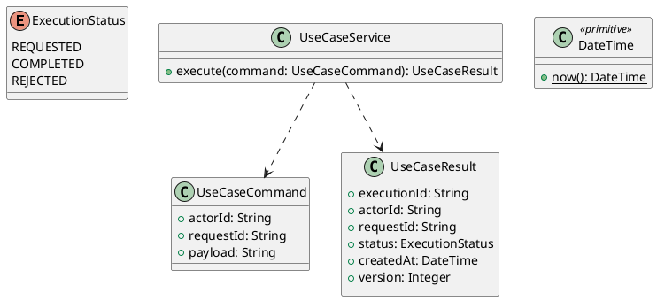

# UC-18 — Find Help and Read FAQs

### Description

- Provides a public help center and searchable FAQ answers with topic navigation and expandable answers. Both screens serve the same self-service help goal.
- Uses the Customer Support and FAQs designs. Support-message submission is UC-19; this UC provides its visible form location and links.
- Help content, topic IDs, routes, search behavior, and API contracts are project decisions. No live chat, phone-service integration, legal policy, refund, or seller workflow is invented from sample labels.

### Actors

Visitor or signed-in Customer.

### Priority

Not specified in the supplied source.

### Trigger

**TRG-UC-18-01** — The actor opens the Find Help and Read FAQs interface.

### Preconditions

- **PRE-UC-18-01** — The interaction interface is visible to the actor.

### Postconditions

- **POST-UC-18-01** — The client displays the returned interaction outcome.

### Basic Flow

1. The actor opens the interaction interface.
2. The client displays the available controls.
3. The actor submits the interaction.
4. The client sends the request to the system.
5. The system returns an outcome.
6. The client displays the returned outcome.

### Alternative Flows

#### AF-UC-18-01

1. The actor chooses an available alternative action.
2. The client displays the returned alternative outcome.

### Exception Flows

#### EF-UC-18-01

1. The system returns an unsuccessful outcome.
2. The client displays the returned recovery message.

### UML Model



### Business Rules

```ocl
-- BR-UC-18-01
-- Source: Product source
context UseCaseService::execute(command: UseCaseCommand): UseCaseResult
pre BR_UC_18_01_ActorIsPresent:
  command.actorId <> null and command.actorId.trim().size() > 0
```

```ocl
-- BR-UC-18-02
-- Source: Product source
context UseCaseService::execute(command: UseCaseCommand): UseCaseResult
pre BR_UC_18_02_RequestIsPresent:
  command.requestId <> null and command.requestId.trim().size() > 0
```

```ocl
-- BR-UC-18-03
-- Source: Product source
context UseCaseService::execute(command: UseCaseCommand): UseCaseResult
pre BR_UC_18_03_PayloadIsPresent:
  command.payload <> null and command.payload.trim().size() > 0
```

```ocl
-- BR-UC-18-04
-- Source: Product source
context UseCaseService::execute(command: UseCaseCommand): UseCaseResult
post BR_UC_18_04_ExecutionIsIdentified:
  result.executionId <> null and result.executionId.trim().size() > 0
```

```ocl
-- BR-UC-18-05
-- Source: Product source
context UseCaseService::execute(command: UseCaseCommand): UseCaseResult
post BR_UC_18_05_ResultMatchesRequest:
  result.actorId = command.actorId and result.requestId = command.requestId
```

```ocl
-- BR-UC-18-06
-- Source: Product source
context UseCaseService::execute(command: UseCaseCommand): UseCaseResult
post BR_UC_18_06_ResultIsCompleted:
  result.status = ExecutionStatus::COMPLETED
```

```ocl
-- BR-UC-18-07
-- Source: Product source
context UseCaseService::execute(command: UseCaseCommand): UseCaseResult
post BR_UC_18_07_ResultIsVersioned:
  result.version > 0 and result.createdAt <= DateTime::now()
```

### Related UI

- [Supporting Figma node 1](https://www.figma.com/design/LEzMSML2K1XeZAxmvNvEYm/Clicon---eCommerce-Marketplace-Website-Figma-Template--Community---Community---Copy-?node-id=447-9904)
- [Supporting Figma node 2](https://www.figma.com/design/LEzMSML2K1XeZAxmvNvEYm/Clicon---eCommerce-Marketplace-Website-Figma-Template--Community---Community---Copy-?node-id=436-8148)

### Related APIs

- [API-UC-18-01](../api/api-uc-18-01.md)
- [API-UC-18-02](../api/api-uc-18-02.md)

### Notes

The complete supplied specification is preserved byte-for-byte at [clicon-uc-18-browse-help-and-faq.md](../source/clicon-uc-18-browse-help-and-faq.md). It remains authoritative for detailed flows, payloads, response examples, errors, implementation context, and validation behavior.
