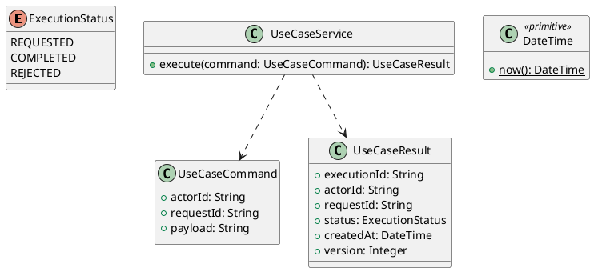

# UC-20 — Browse and Read Blog Articles

### Description

- Lets visitors find published editorial articles through keyword, category, tag, sort, and pagination, then read a complete article and navigate related sidebar content.
- Combines list and reading as one content-discovery goal. Comment reading/posting is UC-21; no article-authoring CMS, advertising service, or external social posting is included.
- Search/sort rules, article schema, and content fixtures are project decisions; Figma supplies the list/detail desktop composition.

### Actors

Visitor or signed-in Customer.

### Priority

Not specified in the supplied source.

### Trigger

**TRG-UC-20-01** — The actor opens the Browse and Read Blog Articles interface.

### Preconditions

- **PRE-UC-20-01** — The interaction interface is visible to the actor.

### Postconditions

- **POST-UC-20-01** — The client displays the returned interaction outcome.

### Basic Flow

1. The actor opens the interaction interface.
2. The client displays the available controls.
3. The actor submits the interaction.
4. The client sends the request to the system.
5. The system returns an outcome.
6. The client displays the returned outcome.

### Alternative Flows

#### AF-UC-20-01

1. The actor chooses an available alternative action.
2. The client displays the returned alternative outcome.

### Exception Flows

#### EF-UC-20-01

1. The system returns an unsuccessful outcome.
2. The client displays the returned recovery message.

### UML Model



### Business Rules

```ocl
-- BR-UC-20-01
-- Source: Product source
context UseCaseService::execute(command: UseCaseCommand): UseCaseResult
pre BR_UC_20_01_ActorIsPresent:
  command.actorId <> null and command.actorId.trim().size() > 0
```

```ocl
-- BR-UC-20-02
-- Source: Product source
context UseCaseService::execute(command: UseCaseCommand): UseCaseResult
pre BR_UC_20_02_RequestIsPresent:
  command.requestId <> null and command.requestId.trim().size() > 0
```

```ocl
-- BR-UC-20-03
-- Source: Product source
context UseCaseService::execute(command: UseCaseCommand): UseCaseResult
pre BR_UC_20_03_PayloadIsPresent:
  command.payload <> null and command.payload.trim().size() > 0
```

```ocl
-- BR-UC-20-04
-- Source: Product source
context UseCaseService::execute(command: UseCaseCommand): UseCaseResult
post BR_UC_20_04_ExecutionIsIdentified:
  result.executionId <> null and result.executionId.trim().size() > 0
```

```ocl
-- BR-UC-20-05
-- Source: Product source
context UseCaseService::execute(command: UseCaseCommand): UseCaseResult
post BR_UC_20_05_ResultMatchesRequest:
  result.actorId = command.actorId and result.requestId = command.requestId
```

```ocl
-- BR-UC-20-06
-- Source: Product source
context UseCaseService::execute(command: UseCaseCommand): UseCaseResult
post BR_UC_20_06_ResultIsCompleted:
  result.status = ExecutionStatus::COMPLETED
```

```ocl
-- BR-UC-20-07
-- Source: Product source
context UseCaseService::execute(command: UseCaseCommand): UseCaseResult
post BR_UC_20_07_ResultIsVersioned:
  result.version > 0 and result.createdAt <= DateTime::now()
```

### Related UI

- [Supporting Figma node 1](https://www.figma.com/design/LEzMSML2K1XeZAxmvNvEYm/Clicon---eCommerce-Marketplace-Website-Figma-Template--Community---Community---Copy-?node-id=494-17620)
- [Supporting Figma node 2](https://www.figma.com/design/LEzMSML2K1XeZAxmvNvEYm/Clicon---eCommerce-Marketplace-Website-Figma-Template--Community---Community---Copy-?node-id=494-18663)

### Related APIs

- [API-UC-20-01](../api/api-uc-20-01.md)
- [API-UC-20-02](../api/api-uc-20-02.md)
- [API-UC-20-03](../api/api-uc-20-03.md)

### Notes

The complete supplied specification is preserved byte-for-byte at [clicon-uc-20-browse-and-read-blog.md](../source/clicon-uc-20-browse-and-read-blog.md). It remains authoritative for detailed flows, payloads, response examples, errors, implementation context, and validation behavior.
