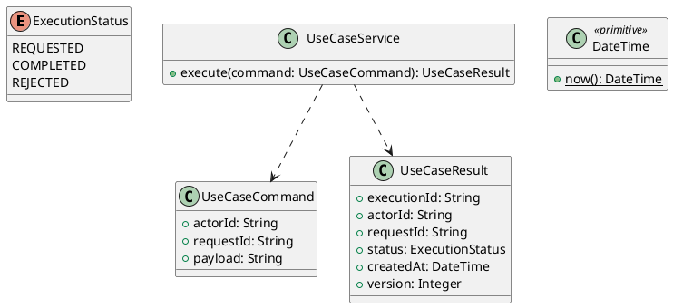

# UC-01 — Register a Job Seeker Account

### Description

- Allows a visitor to create a DH Dental Recruitment account for finding dental-sector employment, using the DentiHire-branded Sign Up form.
- Captures first name, last name, email, password, mobile number, optional referral source, and the visitor's declaration that they are at least 18 years old. Selecting Get Started also records agreement to the displayed project terms notice.
- This specification begins the Job Seeker scope. Hiring Professionals registration and account switching require their own defined lifecycle and are not enabled here.
- Form controls and layout are supported by the Figma frame identified below. API contracts, validation, account state, repeat handling, and limits are project requirements for the research implementation; no DH Dental Technical Report or existing backend contract has been supplied.

### Actors

Unauthenticated visitor registering as a Job Seeker.

### Priority

Not specified in the supplied source.

### Trigger

**TRG-UC-01-01** — The actor opens the Register a Job Seeker Account interface.

### Preconditions

- **PRE-UC-01-01** — The interaction interface is visible to the actor.

### Postconditions

- **POST-UC-01-01** — The client displays the returned interaction outcome.

### Basic Flow

1. The actor opens the interaction interface.
2. The client displays the available controls.
3. The actor submits the interaction.
4. The client sends the request to the system.
5. The system returns an outcome.
6. The client displays the returned outcome.

### Alternative Flows

#### AF-UC-01-01

1. The actor chooses an available alternative action.
2. The client displays the returned alternative outcome.

### Exception Flows

#### EF-UC-01-01

1. The system returns an unsuccessful outcome.
2. The client displays the returned recovery message.

### UML Model



### Business Rules

```ocl
-- BR-UC-01-01
-- Source: Product source
context UseCaseService::execute(command: UseCaseCommand): UseCaseResult
pre BR_UC_01_01_ActorIsPresent:
  command.actorId <> null and command.actorId.trim().size() > 0
```

```ocl
-- BR-UC-01-02
-- Source: Product source
context UseCaseService::execute(command: UseCaseCommand): UseCaseResult
pre BR_UC_01_02_RequestIsPresent:
  command.requestId <> null and command.requestId.trim().size() > 0
```

```ocl
-- BR-UC-01-03
-- Source: Product source
context UseCaseService::execute(command: UseCaseCommand): UseCaseResult
pre BR_UC_01_03_PayloadIsPresent:
  command.payload <> null and command.payload.trim().size() > 0
```

```ocl
-- BR-UC-01-04
-- Source: Product source
context UseCaseService::execute(command: UseCaseCommand): UseCaseResult
post BR_UC_01_04_ExecutionIsIdentified:
  result.executionId <> null and result.executionId.trim().size() > 0
```

```ocl
-- BR-UC-01-05
-- Source: Product source
context UseCaseService::execute(command: UseCaseCommand): UseCaseResult
post BR_UC_01_05_ResultMatchesRequest:
  result.actorId = command.actorId and result.requestId = command.requestId
```

```ocl
-- BR-UC-01-06
-- Source: Product source
context UseCaseService::execute(command: UseCaseCommand): UseCaseResult
post BR_UC_01_06_ResultIsCompleted:
  result.status = ExecutionStatus::COMPLETED
```

```ocl
-- BR-UC-01-07
-- Source: Product source
context UseCaseService::execute(command: UseCaseCommand): UseCaseResult
post BR_UC_01_07_ResultIsVersioned:
  result.version > 0 and result.createdAt <= DateTime::now()
```

### Related UI

- [Supporting Figma node 1](https://www.figma.com/design/5PvZvQ4E6DepIhbL8D35cV/DH-Dental-Recruitment--Community-?node-id=2-2622)

### Related APIs

- [API-UC-01-01](../api/api-uc-01-01.md)

### Notes

The complete supplied specification is preserved byte-for-byte at [dh-dental-uc-01-register-job-seeker.md](../source/dh-dental-uc-01-register-job-seeker.md). It remains authoritative for detailed flows, payloads, response examples, errors, implementation context, and validation behavior.
