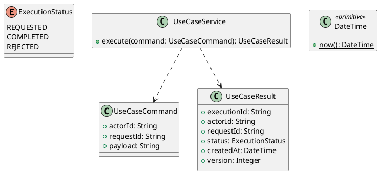

# UC-03 — Search and Filter Available Jobs

### Description

- Allows visitors and signed-in Job Seekers to browse open published dental jobs, search by text, filter by location/work schedule/specialism, and paginate results.
- Search, filters, and pagination are alternate ways to accomplish one job-discovery goal, not separate use cases. Results lead to UC-04 detail.
- Figma supports the list/card/filter controls. Search semantics, canonical job data, fixture normalization, API contracts, and state rules below are project decisions; this is not a Technical Report quotation.

### Actors

Visitor or authenticated Job Seeker. Public job discovery does not require registration or a complete profile.

### Priority

Not specified in the supplied source.

### Trigger

**TRG-UC-03-01** — The actor opens the Search and Filter Available Jobs interface.

### Preconditions

- **PRE-UC-03-01** — The interaction interface is visible to the actor.

### Postconditions

- **POST-UC-03-01** — The client displays the returned interaction outcome.

### Basic Flow

1. The actor opens the interaction interface.
2. The client displays the available controls.
3. The actor submits the interaction.
4. The client sends the request to the system.
5. The system returns an outcome.
6. The client displays the returned outcome.

### Alternative Flows

#### AF-UC-03-01

1. The actor chooses an available alternative action.
2. The client displays the returned alternative outcome.

### Exception Flows

#### EF-UC-03-01

1. The system returns an unsuccessful outcome.
2. The client displays the returned recovery message.

### UML Model



### Business Rules

```ocl
-- BR-UC-03-01
-- Source: Product source
context UseCaseService::execute(command: UseCaseCommand): UseCaseResult
pre BR_UC_03_01_ActorIsPresent:
  command.actorId <> null and command.actorId.trim().size() > 0
```

```ocl
-- BR-UC-03-02
-- Source: Product source
context UseCaseService::execute(command: UseCaseCommand): UseCaseResult
pre BR_UC_03_02_RequestIsPresent:
  command.requestId <> null and command.requestId.trim().size() > 0
```

```ocl
-- BR-UC-03-03
-- Source: Product source
context UseCaseService::execute(command: UseCaseCommand): UseCaseResult
pre BR_UC_03_03_PayloadIsPresent:
  command.payload <> null and command.payload.trim().size() > 0
```

```ocl
-- BR-UC-03-04
-- Source: Product source
context UseCaseService::execute(command: UseCaseCommand): UseCaseResult
post BR_UC_03_04_ExecutionIsIdentified:
  result.executionId <> null and result.executionId.trim().size() > 0
```

```ocl
-- BR-UC-03-05
-- Source: Product source
context UseCaseService::execute(command: UseCaseCommand): UseCaseResult
post BR_UC_03_05_ResultMatchesRequest:
  result.actorId = command.actorId and result.requestId = command.requestId
```

```ocl
-- BR-UC-03-06
-- Source: Product source
context UseCaseService::execute(command: UseCaseCommand): UseCaseResult
post BR_UC_03_06_ResultIsCompleted:
  result.status = ExecutionStatus::COMPLETED
```

```ocl
-- BR-UC-03-07
-- Source: Product source
context UseCaseService::execute(command: UseCaseCommand): UseCaseResult
post BR_UC_03_07_ResultIsVersioned:
  result.version > 0 and result.createdAt <= DateTime::now()
```

### Related UI

- [Supporting Figma node 1](https://www.figma.com/design/5PvZvQ4E6DepIhbL8D35cV/DH-Dental-Recruitment--Community-?node-id=2-1937)

### Related APIs

- [API-UC-03-01](../api/api-uc-03-01.md)
- [API-UC-03-02](../api/api-uc-03-02.md)

### Notes

The complete supplied specification is preserved byte-for-byte at [dh-dental-uc-03-search-filter-jobs.md](../source/dh-dental-uc-03-search-filter-jobs.md). It remains authoritative for detailed flows, payloads, response examples, errors, implementation context, and validation behavior.
