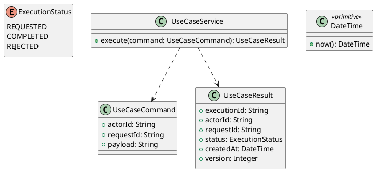

# UC-04 — View Job Details

### Description

- Allows a visitor to inspect a published job's public description, requirements, and office summary. An authenticated eligible Job Seeker can additionally view the member-only office information and available media.
- Reuses the public and signed-in detail compositions without inventing a complete Apply flow. Viewing, signing in, and opening media do not create an application or record interest.
- Figma provides the visible detail sections. Audience boundaries, null handling, related-job ranking, media delivery, and API contracts are project decisions; backend behavior is not established by a static frame.

### Actors

Visitor or authenticated ACTIVE JOB_SEEKER. An incomplete profile and unverified contacts do not prevent reading member details under UC-01/02.

### Priority

Not specified in the supplied source.

### Trigger

**TRG-UC-04-01** — The actor opens the View Job Details interface.

### Preconditions

- **PRE-UC-04-01** — The interaction interface is visible to the actor.

### Postconditions

- **POST-UC-04-01** — The client displays the returned interaction outcome.

### Basic Flow

1. The actor opens the interaction interface.
2. The client displays the available controls.
3. The actor submits the interaction.
4. The client sends the request to the system.
5. The system returns an outcome.
6. The client displays the returned outcome.

### Alternative Flows

#### AF-UC-04-01

1. The actor chooses an available alternative action.
2. The client displays the returned alternative outcome.

### Exception Flows

#### EF-UC-04-01

1. The system returns an unsuccessful outcome.
2. The client displays the returned recovery message.

### UML Model



### Business Rules

```ocl
-- BR-UC-04-01
-- Source: Product source
context UseCaseService::execute(command: UseCaseCommand): UseCaseResult
pre BR_UC_04_01_ActorIsPresent:
  command.actorId <> null and command.actorId.trim().size() > 0
```

```ocl
-- BR-UC-04-02
-- Source: Product source
context UseCaseService::execute(command: UseCaseCommand): UseCaseResult
pre BR_UC_04_02_RequestIsPresent:
  command.requestId <> null and command.requestId.trim().size() > 0
```

```ocl
-- BR-UC-04-03
-- Source: Product source
context UseCaseService::execute(command: UseCaseCommand): UseCaseResult
pre BR_UC_04_03_PayloadIsPresent:
  command.payload <> null and command.payload.trim().size() > 0
```

```ocl
-- BR-UC-04-04
-- Source: Product source
context UseCaseService::execute(command: UseCaseCommand): UseCaseResult
post BR_UC_04_04_ExecutionIsIdentified:
  result.executionId <> null and result.executionId.trim().size() > 0
```

```ocl
-- BR-UC-04-05
-- Source: Product source
context UseCaseService::execute(command: UseCaseCommand): UseCaseResult
post BR_UC_04_05_ResultMatchesRequest:
  result.actorId = command.actorId and result.requestId = command.requestId
```

```ocl
-- BR-UC-04-06
-- Source: Product source
context UseCaseService::execute(command: UseCaseCommand): UseCaseResult
post BR_UC_04_06_ResultIsCompleted:
  result.status = ExecutionStatus::COMPLETED
```

```ocl
-- BR-UC-04-07
-- Source: Product source
context UseCaseService::execute(command: UseCaseCommand): UseCaseResult
post BR_UC_04_07_ResultIsVersioned:
  result.version > 0 and result.createdAt <= DateTime::now()
```

### Related UI

- [Supporting Figma node 1](https://www.figma.com/design/5PvZvQ4E6DepIhbL8D35cV/DH-Dental-Recruitment--Community-?node-id=2-2309)
- [Supporting Figma node 2](https://www.figma.com/design/5PvZvQ4E6DepIhbL8D35cV/DH-Dental-Recruitment--Community-?node-id=2-3837)

### Related APIs

- [API-UC-04-01](../api/api-uc-04-01.md)
- [API-UC-04-02](../api/api-uc-04-02.md)
- [API-UC-04-03](../api/api-uc-04-03.md)

### Notes

The complete supplied specification is preserved byte-for-byte at [dh-dental-uc-04-view-job-details.md](../source/dh-dental-uc-04-view-job-details.md). It remains authoritative for detailed flows, payloads, response examples, errors, implementation context, and validation behavior.
