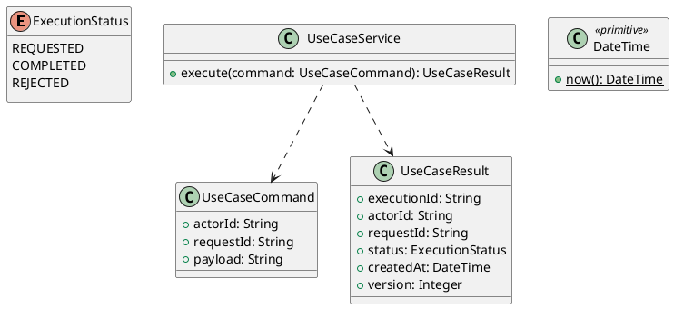

# UC-05 — Manage Basic Profile Information

### Description

- Allows a signed-in Job Seeker to view and update their name, fluent languages, desired position, available start month, and optional profile photo as one profile-editing task.
- Names stay consistent with the account created in UC-01. The desired position becomes the category used by UC-07 recommendations; this UC does not publish a candidate profile or verify professional qualifications.
- The Figma read/edit frames establish the visible fields. Field rules, photo handling, routes, version conflicts, and API contracts below are research implementation decisions. They are not quotations from a supplied Technical Report.

### Actors

Authenticated ACTIVE JOB_SEEKER.

### Priority

Not specified in the supplied source.

### Trigger

**TRG-UC-05-01** — The actor opens the Manage Basic Profile Information interface.

### Preconditions

- **PRE-UC-05-01** — The interaction interface is visible to the actor.

### Postconditions

- **POST-UC-05-01** — The client displays the returned interaction outcome.

### Basic Flow

1. The actor opens the interaction interface.
2. The client displays the available controls.
3. The actor submits the interaction.
4. The client sends the request to the system.
5. The system returns an outcome.
6. The client displays the returned outcome.

### Alternative Flows

#### AF-UC-05-01

1. The actor chooses an available alternative action.
2. The client displays the returned alternative outcome.

### Exception Flows

#### EF-UC-05-01

1. The system returns an unsuccessful outcome.
2. The client displays the returned recovery message.

### UML Model



### Business Rules

```ocl
-- BR-UC-05-01
-- Source: Product source
context UseCaseService::execute(command: UseCaseCommand): UseCaseResult
pre BR_UC_05_01_ActorIsPresent:
  command.actorId <> null and command.actorId.trim().size() > 0
```

```ocl
-- BR-UC-05-02
-- Source: Product source
context UseCaseService::execute(command: UseCaseCommand): UseCaseResult
pre BR_UC_05_02_RequestIsPresent:
  command.requestId <> null and command.requestId.trim().size() > 0
```

```ocl
-- BR-UC-05-03
-- Source: Product source
context UseCaseService::execute(command: UseCaseCommand): UseCaseResult
pre BR_UC_05_03_PayloadIsPresent:
  command.payload <> null and command.payload.trim().size() > 0
```

```ocl
-- BR-UC-05-04
-- Source: Product source
context UseCaseService::execute(command: UseCaseCommand): UseCaseResult
post BR_UC_05_04_ExecutionIsIdentified:
  result.executionId <> null and result.executionId.trim().size() > 0
```

```ocl
-- BR-UC-05-05
-- Source: Product source
context UseCaseService::execute(command: UseCaseCommand): UseCaseResult
post BR_UC_05_05_ResultMatchesRequest:
  result.actorId = command.actorId and result.requestId = command.requestId
```

```ocl
-- BR-UC-05-06
-- Source: Product source
context UseCaseService::execute(command: UseCaseCommand): UseCaseResult
post BR_UC_05_06_ResultIsCompleted:
  result.status = ExecutionStatus::COMPLETED
```

```ocl
-- BR-UC-05-07
-- Source: Product source
context UseCaseService::execute(command: UseCaseCommand): UseCaseResult
post BR_UC_05_07_ResultIsVersioned:
  result.version > 0 and result.createdAt <= DateTime::now()
```

### Related UI

- [Supporting Figma node 1](https://www.figma.com/design/5PvZvQ4E6DepIhbL8D35cV/DH-Dental-Recruitment--Community-?node-id=2-4549)
- [Supporting Figma node 2](https://www.figma.com/design/5PvZvQ4E6DepIhbL8D35cV/DH-Dental-Recruitment--Community-?node-id=2-4631)

### Related APIs

- [API-UC-05-01](../api/api-uc-05-01.md)
- [API-UC-05-02](../api/api-uc-05-02.md)
- [API-UC-05-03](../api/api-uc-05-03.md)

### Notes

The complete supplied specification is preserved byte-for-byte at [dh-dental-uc-05-manage-basic-profile.md](../source/dh-dental-uc-05-manage-basic-profile.md). It remains authoritative for detailed flows, payloads, response examples, errors, implementation context, and validation behavior.
