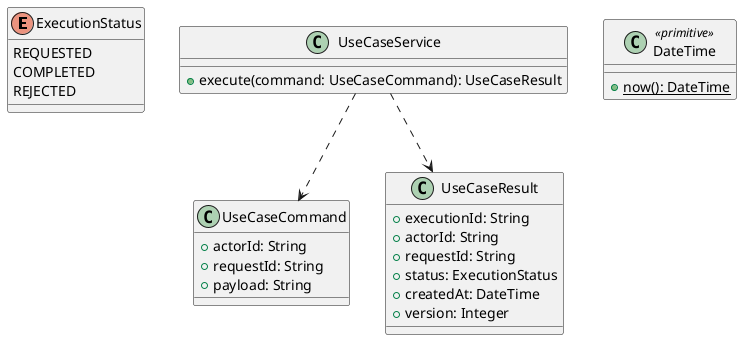

# UC-07 — View Personalized Job Recommendations

### Description

- Allows an authenticated Job Seeker to browse visible jobs in their saved desired position, ordered by how many active job preferences they satisfy.
- Uses UC-05 basic information and UC-06 preferences to provide a reproducible personalized listing. It differs from UC-03 manual public search and UC-04 related jobs; it creates no application or saved-job state.
- Figma supplies the Recommendations page, cards, sidebar, pagination, and preference-modal entry point. The recommendation rules, explanations, setup/empty/error states, route, and API contract are explicit research decisions. This is a deterministic feature; the UI does not claim AI prediction, a professional suitability score, or verified qualifications.

### Actors

Authenticated ACTIVE JOB_SEEKER.

### Priority

Not specified in the supplied source.

### Trigger

**TRG-UC-07-01** — The actor opens the View Personalized Job Recommendations interface.

### Preconditions

- **PRE-UC-07-01** — The interaction interface is visible to the actor.

### Postconditions

- **POST-UC-07-01** — The client displays the returned interaction outcome.

### Basic Flow

1. The actor opens the interaction interface.
2. The client displays the available controls.
3. The actor submits the interaction.
4. The client sends the request to the system.
5. The system returns an outcome.
6. The client displays the returned outcome.

### Alternative Flows

#### AF-UC-07-01

1. The actor chooses an available alternative action.
2. The client displays the returned alternative outcome.

### Exception Flows

#### EF-UC-07-01

1. The system returns an unsuccessful outcome.
2. The client displays the returned recovery message.

### UML Model



### Business Rules

```ocl
-- BR-UC-07-01
-- Source: Product source
context UseCaseService::execute(command: UseCaseCommand): UseCaseResult
pre BR_UC_07_01_ActorIsPresent:
  command.actorId <> null and command.actorId.trim().size() > 0
```

```ocl
-- BR-UC-07-02
-- Source: Product source
context UseCaseService::execute(command: UseCaseCommand): UseCaseResult
pre BR_UC_07_02_RequestIsPresent:
  command.requestId <> null and command.requestId.trim().size() > 0
```

```ocl
-- BR-UC-07-03
-- Source: Product source
context UseCaseService::execute(command: UseCaseCommand): UseCaseResult
pre BR_UC_07_03_PayloadIsPresent:
  command.payload <> null and command.payload.trim().size() > 0
```

```ocl
-- BR-UC-07-04
-- Source: Product source
context UseCaseService::execute(command: UseCaseCommand): UseCaseResult
post BR_UC_07_04_ExecutionIsIdentified:
  result.executionId <> null and result.executionId.trim().size() > 0
```

```ocl
-- BR-UC-07-05
-- Source: Product source
context UseCaseService::execute(command: UseCaseCommand): UseCaseResult
post BR_UC_07_05_ResultMatchesRequest:
  result.actorId = command.actorId and result.requestId = command.requestId
```

```ocl
-- BR-UC-07-06
-- Source: Product source
context UseCaseService::execute(command: UseCaseCommand): UseCaseResult
post BR_UC_07_06_ResultIsCompleted:
  result.status = ExecutionStatus::COMPLETED
```

```ocl
-- BR-UC-07-07
-- Source: Product source
context UseCaseService::execute(command: UseCaseCommand): UseCaseResult
post BR_UC_07_07_ResultIsVersioned:
  result.version > 0 and result.createdAt <= DateTime::now()
```

### Related UI

- [Supporting Figma node 1](https://www.figma.com/design/5PvZvQ4E6DepIhbL8D35cV/DH-Dental-Recruitment--Community-?node-id=2-2956)
- [Supporting Figma node 2](https://www.figma.com/design/5PvZvQ4E6DepIhbL8D35cV/DH-Dental-Recruitment--Community-?node-id=2-3370)
- [Supporting Figma node 3](https://www.figma.com/design/5PvZvQ4E6DepIhbL8D35cV/DH-Dental-Recruitment--Community-?node-id=2-3837)

### Related APIs

- [API-UC-07-01](../api/api-uc-07-01.md)

### Notes

The complete supplied specification is preserved byte-for-byte at [dh-dental-uc-07-view-job-recommendations.md](../source/dh-dental-uc-07-view-job-recommendations.md). It remains authoritative for detailed flows, payloads, response examples, errors, implementation context, and validation behavior.
