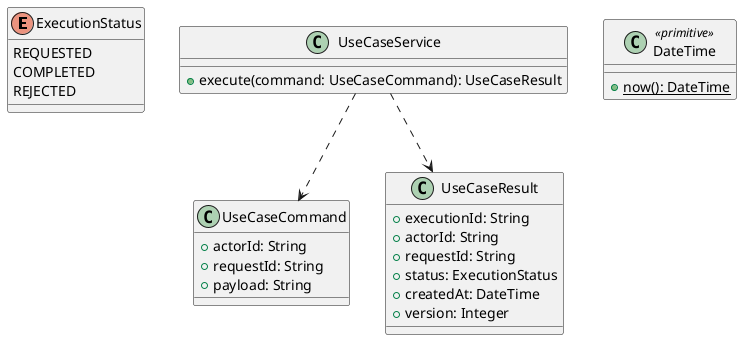

# UC-10 — Record and Manage an Introduction Video

### Description

- Allows a Job Seeker to record a short introduction in the browser, review it, and explicitly save it to their account. A compatible local video can be selected as an alternative; a saved video can be played, replaced, or removed.
- The source supports a camera/recording area, Record Your Answers, a policy link, and a sample-video/mobile-app panel. Review, save, replacement, deletion, and upload-fallback states are project supplements needed to define an end-to-end feature.
- This UC stores one account-level introduction, not a job-specific application answer. It sends nothing to a recruiter and does not submit an application. Duration/format limits, routes, state transitions, and backend contracts are declared research decisions.

### Actors

Authenticated ACTIVE JOB_SEEKER.

### Priority

Not specified in the supplied source.

### Trigger

**TRG-UC-10-01** — The actor opens the Record and Manage an Introduction Video interface.

### Preconditions

- **PRE-UC-10-01** — The interaction interface is visible to the actor.

### Postconditions

- **POST-UC-10-01** — The client displays the returned interaction outcome.

### Basic Flow

1. The actor opens the interaction interface.
2. The client displays the available controls.
3. The actor submits the interaction.
4. The client sends the request to the system.
5. The system returns an outcome.
6. The client displays the returned outcome.

### Alternative Flows

#### AF-UC-10-01

1. The actor chooses an available alternative action.
2. The client displays the returned alternative outcome.

### Exception Flows

#### EF-UC-10-01

1. The system returns an unsuccessful outcome.
2. The client displays the returned recovery message.

### UML Model



### Business Rules

```ocl
-- BR-UC-10-01
-- Source: Product source
context UseCaseService::execute(command: UseCaseCommand): UseCaseResult
pre BR_UC_10_01_ActorIsPresent:
  command.actorId <> null and command.actorId.trim().size() > 0
```

```ocl
-- BR-UC-10-02
-- Source: Product source
context UseCaseService::execute(command: UseCaseCommand): UseCaseResult
pre BR_UC_10_02_RequestIsPresent:
  command.requestId <> null and command.requestId.trim().size() > 0
```

```ocl
-- BR-UC-10-03
-- Source: Product source
context UseCaseService::execute(command: UseCaseCommand): UseCaseResult
pre BR_UC_10_03_PayloadIsPresent:
  command.payload <> null and command.payload.trim().size() > 0
```

```ocl
-- BR-UC-10-04
-- Source: Product source
context UseCaseService::execute(command: UseCaseCommand): UseCaseResult
post BR_UC_10_04_ExecutionIsIdentified:
  result.executionId <> null and result.executionId.trim().size() > 0
```

```ocl
-- BR-UC-10-05
-- Source: Product source
context UseCaseService::execute(command: UseCaseCommand): UseCaseResult
post BR_UC_10_05_ResultMatchesRequest:
  result.actorId = command.actorId and result.requestId = command.requestId
```

```ocl
-- BR-UC-10-06
-- Source: Product source
context UseCaseService::execute(command: UseCaseCommand): UseCaseResult
post BR_UC_10_06_ResultIsCompleted:
  result.status = ExecutionStatus::COMPLETED
```

```ocl
-- BR-UC-10-07
-- Source: Product source
context UseCaseService::execute(command: UseCaseCommand): UseCaseResult
post BR_UC_10_07_ResultIsVersioned:
  result.version > 0 and result.createdAt <= DateTime::now()
```

### Related UI

- [Supporting Figma node 1](https://www.figma.com/design/5PvZvQ4E6DepIhbL8D35cV/DH-Dental-Recruitment--Community-?node-id=2-4160)

### Related APIs

- [API-UC-10-01](../api/api-uc-10-01.md)
- [API-UC-10-02](../api/api-uc-10-02.md)
- [API-UC-10-03](../api/api-uc-10-03.md)
- [API-UC-10-04](../api/api-uc-10-04.md)

### Notes

The complete supplied specification is preserved byte-for-byte at [dh-dental-uc-10-manage-introduction-video.md](../source/dh-dental-uc-10-manage-introduction-video.md). It remains authoritative for detailed flows, payloads, response examples, errors, implementation context, and validation behavior.
