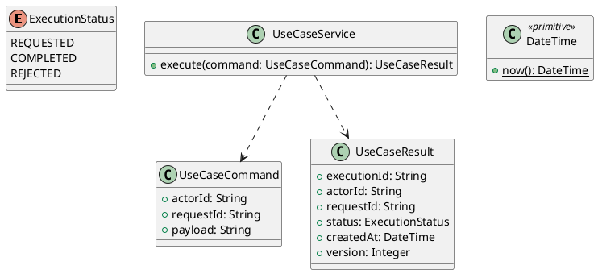

# UC-12 — Change Password

### Description

- Allows a signed-in Job Seeker who knows their current password to replace it with a new password and then sign in again.
- The Figma form supplies a read-only email, current password, new password, repeated new password, and Save Changes. It is distinct from forgotten-password recovery, which remains unavailable under UC-02.
- Password interpretation follows UC-01/02. Current-password confirmation, observable attempt limits, session-ending behavior, errors, and API contract are explicit project decisions; implementation algorithms are not prescribed by this UC.

### Actors

Authenticated ACTIVE JOB_SEEKER who knows their current password.

### Priority

Not specified in the supplied source.

### Trigger

**TRG-UC-12-01** — The actor opens the Change Password interface.

### Preconditions

- **PRE-UC-12-01** — The interaction interface is visible to the actor.

### Postconditions

- **POST-UC-12-01** — The client displays the returned interaction outcome.

### Basic Flow

1. The actor opens the interaction interface.
2. The client displays the available controls.
3. The actor submits the interaction.
4. The client sends the request to the system.
5. The system returns an outcome.
6. The client displays the returned outcome.

### Alternative Flows

#### AF-UC-12-01

1. The actor chooses an available alternative action.
2. The client displays the returned alternative outcome.

### Exception Flows

#### EF-UC-12-01

1. The system returns an unsuccessful outcome.
2. The client displays the returned recovery message.

### UML Model



### Business Rules

```ocl
-- BR-UC-12-01
-- Source: Product source
context UseCaseService::execute(command: UseCaseCommand): UseCaseResult
pre BR_UC_12_01_ActorIsPresent:
  command.actorId <> null and command.actorId.trim().size() > 0
```

```ocl
-- BR-UC-12-02
-- Source: Product source
context UseCaseService::execute(command: UseCaseCommand): UseCaseResult
pre BR_UC_12_02_RequestIsPresent:
  command.requestId <> null and command.requestId.trim().size() > 0
```

```ocl
-- BR-UC-12-03
-- Source: Product source
context UseCaseService::execute(command: UseCaseCommand): UseCaseResult
pre BR_UC_12_03_PayloadIsPresent:
  command.payload <> null and command.payload.trim().size() > 0
```

```ocl
-- BR-UC-12-04
-- Source: Product source
context UseCaseService::execute(command: UseCaseCommand): UseCaseResult
post BR_UC_12_04_ExecutionIsIdentified:
  result.executionId <> null and result.executionId.trim().size() > 0
```

```ocl
-- BR-UC-12-05
-- Source: Product source
context UseCaseService::execute(command: UseCaseCommand): UseCaseResult
post BR_UC_12_05_ResultMatchesRequest:
  result.actorId = command.actorId and result.requestId = command.requestId
```

```ocl
-- BR-UC-12-06
-- Source: Product source
context UseCaseService::execute(command: UseCaseCommand): UseCaseResult
post BR_UC_12_06_ResultIsCompleted:
  result.status = ExecutionStatus::COMPLETED
```

```ocl
-- BR-UC-12-07
-- Source: Product source
context UseCaseService::execute(command: UseCaseCommand): UseCaseResult
post BR_UC_12_07_ResultIsVersioned:
  result.version > 0 and result.createdAt <= DateTime::now()
```

### Related UI

- [Supporting Figma node 1](https://www.figma.com/design/5PvZvQ4E6DepIhbL8D35cV/DH-Dental-Recruitment--Community-?node-id=2-4345)

### Related APIs

- [API-UC-12-01](../api/api-uc-12-01.md)
- [API-UC-12-02](../api/api-uc-12-02.md)

### Notes

The complete supplied specification is preserved byte-for-byte at [dh-dental-uc-12-change-password.md](../source/dh-dental-uc-12-change-password.md). It remains authoritative for detailed flows, payloads, response examples, errors, implementation context, and validation behavior.
