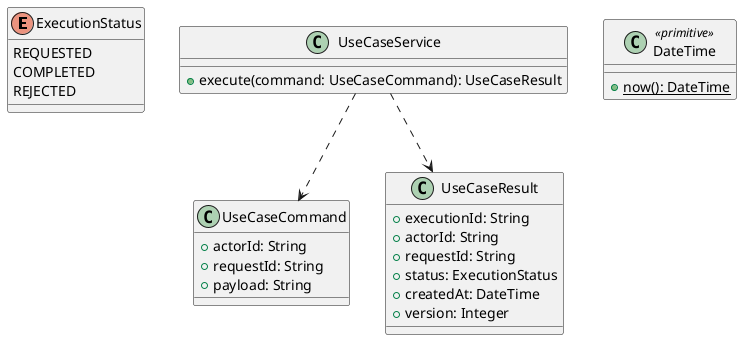

# UC-13 — Sign Out

### Description

- Allows an actor to end the browser session presented to the application and return to the public job catalog.
- The source account menu contains Sign out. Session scope, idempotent behavior, reconciliation, destination, and response contract are project decisions needed to make that action functional.
- This is a current-session action. It does not close an account, switch account roles, delete saved profile content, or sign out independent browser sessions. UC-12 separately defines ending all pre-change sessions after a password change.

### Actors

Actor using the current browser session, including a Job Seeker whose session has expired or whose account has become ineligible.

### Priority

Not specified in the supplied source.

### Trigger

**TRG-UC-13-01** — The actor opens the Sign Out interface.

### Preconditions

- **PRE-UC-13-01** — The interaction interface is visible to the actor.

### Postconditions

- **POST-UC-13-01** — The client displays the returned interaction outcome.

### Basic Flow

1. The actor opens the interaction interface.
2. The client displays the available controls.
3. The actor submits the interaction.
4. The client sends the request to the system.
5. The system returns an outcome.
6. The client displays the returned outcome.

### Alternative Flows

#### AF-UC-13-01

1. The actor chooses an available alternative action.
2. The client displays the returned alternative outcome.

### Exception Flows

#### EF-UC-13-01

1. The system returns an unsuccessful outcome.
2. The client displays the returned recovery message.

### UML Model



### Business Rules

```ocl
-- BR-UC-13-01
-- Source: Product source
context UseCaseService::execute(command: UseCaseCommand): UseCaseResult
pre BR_UC_13_01_ActorIsPresent:
  command.actorId <> null and command.actorId.trim().size() > 0
```

```ocl
-- BR-UC-13-02
-- Source: Product source
context UseCaseService::execute(command: UseCaseCommand): UseCaseResult
pre BR_UC_13_02_RequestIsPresent:
  command.requestId <> null and command.requestId.trim().size() > 0
```

```ocl
-- BR-UC-13-03
-- Source: Product source
context UseCaseService::execute(command: UseCaseCommand): UseCaseResult
pre BR_UC_13_03_PayloadIsPresent:
  command.payload <> null and command.payload.trim().size() > 0
```

```ocl
-- BR-UC-13-04
-- Source: Product source
context UseCaseService::execute(command: UseCaseCommand): UseCaseResult
post BR_UC_13_04_ExecutionIsIdentified:
  result.executionId <> null and result.executionId.trim().size() > 0
```

```ocl
-- BR-UC-13-05
-- Source: Product source
context UseCaseService::execute(command: UseCaseCommand): UseCaseResult
post BR_UC_13_05_ResultMatchesRequest:
  result.actorId = command.actorId and result.requestId = command.requestId
```

```ocl
-- BR-UC-13-06
-- Source: Product source
context UseCaseService::execute(command: UseCaseCommand): UseCaseResult
post BR_UC_13_06_ResultIsCompleted:
  result.status = ExecutionStatus::COMPLETED
```

```ocl
-- BR-UC-13-07
-- Source: Product source
context UseCaseService::execute(command: UseCaseCommand): UseCaseResult
post BR_UC_13_07_ResultIsVersioned:
  result.version > 0 and result.createdAt <= DateTime::now()
```

### Related UI

- [Supporting Figma node 1](https://www.figma.com/design/5PvZvQ4E6DepIhbL8D35cV/DH-Dental-Recruitment--Community-?node-id=2-4121)

### Related APIs

- [API-UC-13-01](../api/api-uc-13-01.md)
- [API-UC-13-02](../api/api-uc-13-02.md)

### Notes

The complete supplied specification is preserved byte-for-byte at [dh-dental-uc-13-sign-out.md](../source/dh-dental-uc-13-sign-out.md). It remains authoritative for detailed flows, payloads, response examples, errors, implementation context, and validation behavior.
