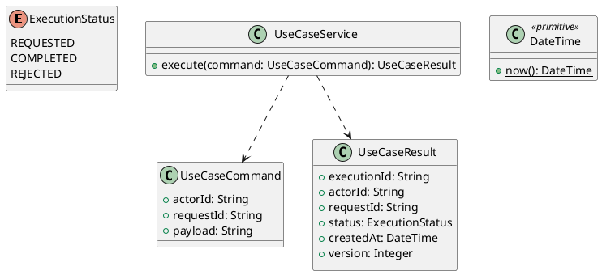

# UC-17 — Manage Public Profile Visibility

### Description

- Allows a Job Seeker to preview a limited public representation of their existing profile, explicitly publish it, replace that published snapshot after later edits, or make it private again.
- This enables the directory/detail goals in UC-18/19. Registration and private-profile editing remain private by default and do not automatically publish anything.
- The source menu's Make Profile Private action and public profile screens establish a visibility concept. The reverse publish action, preview screen, snapshot scope, confirmation, and contracts are explicit research additions; no owner publication editor or complete workflow has been verified in the source.

### Actors

Authenticated ACTIVE JOB_SEEKER.

### Priority

Not specified in the supplied source.

### Trigger

**TRG-UC-17-01** — The actor opens the Manage Public Profile Visibility interface.

### Preconditions

- **PRE-UC-17-01** — The interaction interface is visible to the actor.

### Postconditions

- **POST-UC-17-01** — The client displays the returned interaction outcome.

### Basic Flow

1. The actor opens the interaction interface.
2. The client displays the available controls.
3. The actor submits the interaction.
4. The client sends the request to the system.
5. The system returns an outcome.
6. The client displays the returned outcome.

### Alternative Flows

#### AF-UC-17-01

1. The actor chooses an available alternative action.
2. The client displays the returned alternative outcome.

### Exception Flows

#### EF-UC-17-01

1. The system returns an unsuccessful outcome.
2. The client displays the returned recovery message.

### UML Model



### Business Rules

```ocl
-- BR-UC-17-01
-- Source: Product source
context UseCaseService::execute(command: UseCaseCommand): UseCaseResult
pre BR_UC_17_01_ActorIsPresent:
  command.actorId <> null and command.actorId.trim().size() > 0
```

```ocl
-- BR-UC-17-02
-- Source: Product source
context UseCaseService::execute(command: UseCaseCommand): UseCaseResult
pre BR_UC_17_02_RequestIsPresent:
  command.requestId <> null and command.requestId.trim().size() > 0
```

```ocl
-- BR-UC-17-03
-- Source: Product source
context UseCaseService::execute(command: UseCaseCommand): UseCaseResult
pre BR_UC_17_03_PayloadIsPresent:
  command.payload <> null and command.payload.trim().size() > 0
```

```ocl
-- BR-UC-17-04
-- Source: Product source
context UseCaseService::execute(command: UseCaseCommand): UseCaseResult
post BR_UC_17_04_ExecutionIsIdentified:
  result.executionId <> null and result.executionId.trim().size() > 0
```

```ocl
-- BR-UC-17-05
-- Source: Product source
context UseCaseService::execute(command: UseCaseCommand): UseCaseResult
post BR_UC_17_05_ResultMatchesRequest:
  result.actorId = command.actorId and result.requestId = command.requestId
```

```ocl
-- BR-UC-17-06
-- Source: Product source
context UseCaseService::execute(command: UseCaseCommand): UseCaseResult
post BR_UC_17_06_ResultIsCompleted:
  result.status = ExecutionStatus::COMPLETED
```

```ocl
-- BR-UC-17-07
-- Source: Product source
context UseCaseService::execute(command: UseCaseCommand): UseCaseResult
post BR_UC_17_07_ResultIsVersioned:
  result.version > 0 and result.createdAt <= DateTime::now()
```

### Related UI

- [Supporting Figma node 1](https://www.figma.com/design/5PvZvQ4E6DepIhbL8D35cV/DH-Dental-Recruitment--Community-?node-id=2-4121)
- [Supporting Figma node 2](https://www.figma.com/design/5PvZvQ4E6DepIhbL8D35cV/DH-Dental-Recruitment--Community-?node-id=2-1478)
- [Supporting Figma node 3](https://www.figma.com/design/5PvZvQ4E6DepIhbL8D35cV/DH-Dental-Recruitment--Community-?node-id=2-1700)

### Related APIs

- [API-UC-17-01](../api/api-uc-17-01.md)
- [API-UC-17-02](../api/api-uc-17-02.md)

### Notes

The complete supplied specification is preserved byte-for-byte at [dh-dental-uc-17-manage-public-profile.md](../source/dh-dental-uc-17-manage-public-profile.md). It remains authoritative for detailed flows, payloads, response examples, errors, implementation context, and validation behavior.
