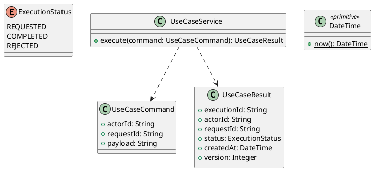

# UC-18 — Search and Filter Public Candidate Profiles

### Description

- Allows any visitor to browse, search, filter, and paginate only the candidate profiles explicitly published through UC-17.
- Uses the source's public profile grid and filters. Search semantics, preferred-city interpretation, stable ordering, and API contract are research decisions, not evidence of an employer account or hiring authorization workflow.
- A published position is the candidate's desired position, and skills/experience are self-declared; the directory is not a professional verification service.

### Actors

Visitor or signed-in user.

### Priority

Not specified in the supplied source.

### Trigger

**TRG-UC-18-01** — The actor opens the Search and Filter Public Candidate Profiles interface.

### Preconditions

- **PRE-UC-18-01** — The interaction interface is visible to the actor.

### Postconditions

- **POST-UC-18-01** — The client displays the returned interaction outcome.

### Basic Flow

1. The actor opens the interaction interface.
2. The client displays the available controls.
3. The actor submits the interaction.
4. The client sends the request to the system.
5. The system returns an outcome.
6. The client displays the returned outcome.

### Alternative Flows

#### AF-UC-18-01

1. The actor chooses an available alternative action.
2. The client displays the returned alternative outcome.

### Exception Flows

#### EF-UC-18-01

1. The system returns an unsuccessful outcome.
2. The client displays the returned recovery message.

### UML Model



### Business Rules

```ocl
-- BR-UC-18-01
-- Source: Product source
context UseCaseService::execute(command: UseCaseCommand): UseCaseResult
pre BR_UC_18_01_ActorIsPresent:
  command.actorId <> null and command.actorId.trim().size() > 0
```

```ocl
-- BR-UC-18-02
-- Source: Product source
context UseCaseService::execute(command: UseCaseCommand): UseCaseResult
pre BR_UC_18_02_RequestIsPresent:
  command.requestId <> null and command.requestId.trim().size() > 0
```

```ocl
-- BR-UC-18-03
-- Source: Product source
context UseCaseService::execute(command: UseCaseCommand): UseCaseResult
pre BR_UC_18_03_PayloadIsPresent:
  command.payload <> null and command.payload.trim().size() > 0
```

```ocl
-- BR-UC-18-04
-- Source: Product source
context UseCaseService::execute(command: UseCaseCommand): UseCaseResult
post BR_UC_18_04_ExecutionIsIdentified:
  result.executionId <> null and result.executionId.trim().size() > 0
```

```ocl
-- BR-UC-18-05
-- Source: Product source
context UseCaseService::execute(command: UseCaseCommand): UseCaseResult
post BR_UC_18_05_ResultMatchesRequest:
  result.actorId = command.actorId and result.requestId = command.requestId
```

```ocl
-- BR-UC-18-06
-- Source: Product source
context UseCaseService::execute(command: UseCaseCommand): UseCaseResult
post BR_UC_18_06_ResultIsCompleted:
  result.status = ExecutionStatus::COMPLETED
```

```ocl
-- BR-UC-18-07
-- Source: Product source
context UseCaseService::execute(command: UseCaseCommand): UseCaseResult
post BR_UC_18_07_ResultIsVersioned:
  result.version > 0 and result.createdAt <= DateTime::now()
```

### Related UI

- [Supporting Figma node 1](https://www.figma.com/design/5PvZvQ4E6DepIhbL8D35cV/DH-Dental-Recruitment--Community-?node-id=2-1700)

### Related APIs

- [API-UC-18-01](../api/api-uc-18-01.md)
- [API-UC-18-02](../api/api-uc-18-02.md)

### Notes

The complete supplied specification is preserved byte-for-byte at [dh-dental-uc-18-search-public-profiles.md](../source/dh-dental-uc-18-search-public-profiles.md). It remains authoritative for detailed flows, payloads, response examples, errors, implementation context, and validation behavior.
