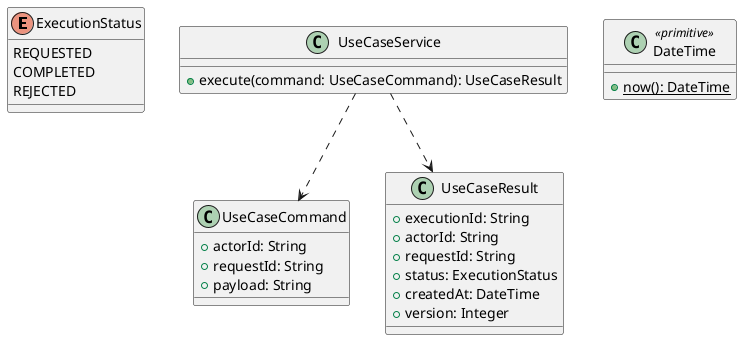

# UC-01 — Register a Student Account and Verify Email

### Description

- Allows a visitor to enter their name and email, choose a password, accept the project terms, and verify a six-digit email code to create an active Student account.
- This is one business goal across three screens; password entry and email verification are not separate use cases.
- API contracts, lifecycle, validation, and email behavior below are proposed EdTech project requirements. No Technical Report or existing backend contract was supplied. Figma establishes the visible UI, not these backend rules.
- Instructor support is an approved project extension to be specified separately. This UC creates only STUDENT accounts; choosing Instructor must not silently register a Student or grant Instructor capabilities.

### Actors

Visitor registering as a Student.

### Priority

Not specified in the supplied source.

### Trigger

**TRG-UC-01-01** — The actor opens the Register a Student Account and Verify Email interface.

### Preconditions

- **PRE-UC-01-01** — The interaction interface is visible to the actor.

### Postconditions

- **POST-UC-01-01** — The client displays the returned interaction outcome.

### Basic Flow

1. The actor opens the interaction interface.
2. The client displays the available controls.
3. The actor submits the interaction.
4. The client sends the request to the system.
5. The system returns an outcome.
6. The client displays the returned outcome.

### Alternative Flows

#### AF-UC-01-01

1. The actor chooses an available alternative action.
2. The client displays the returned alternative outcome.

### Exception Flows

#### EF-UC-01-01

1. The system returns an unsuccessful outcome.
2. The client displays the returned recovery message.

### UML Model



### Business Rules

```ocl
-- BR-UC-01-01
-- Source: Product source
context UseCaseService::execute(command: UseCaseCommand): UseCaseResult
pre BR_UC_01_01_ActorIsPresent:
  command.actorId <> null and command.actorId.trim().size() > 0
```

```ocl
-- BR-UC-01-02
-- Source: Product source
context UseCaseService::execute(command: UseCaseCommand): UseCaseResult
pre BR_UC_01_02_RequestIsPresent:
  command.requestId <> null and command.requestId.trim().size() > 0
```

```ocl
-- BR-UC-01-03
-- Source: Product source
context UseCaseService::execute(command: UseCaseCommand): UseCaseResult
pre BR_UC_01_03_PayloadIsPresent:
  command.payload <> null and command.payload.trim().size() > 0
```

```ocl
-- BR-UC-01-04
-- Source: Product source
context UseCaseService::execute(command: UseCaseCommand): UseCaseResult
post BR_UC_01_04_ExecutionIsIdentified:
  result.executionId <> null and result.executionId.trim().size() > 0
```

```ocl
-- BR-UC-01-05
-- Source: Product source
context UseCaseService::execute(command: UseCaseCommand): UseCaseResult
post BR_UC_01_05_ResultMatchesRequest:
  result.actorId = command.actorId and result.requestId = command.requestId
```

```ocl
-- BR-UC-01-06
-- Source: Product source
context UseCaseService::execute(command: UseCaseCommand): UseCaseResult
post BR_UC_01_06_ResultIsCompleted:
  result.status = ExecutionStatus::COMPLETED
```

```ocl
-- BR-UC-01-07
-- Source: Product source
context UseCaseService::execute(command: UseCaseCommand): UseCaseResult
post BR_UC_01_07_ResultIsVersioned:
  result.version > 0 and result.createdAt <= DateTime::now()
```

### Related UI

- [Supporting Figma node 1](https://www.figma.com/design/JDzl2rsSdGcA8tgcDG4kgy/EdTech-Platform-for-online-learning--Community-?node-id=222-2480)
- [Supporting Figma node 2](https://www.figma.com/design/JDzl2rsSdGcA8tgcDG4kgy/EdTech-Platform-for-online-learning--Community-?node-id=225-18)
- [Supporting Figma node 3](https://www.figma.com/design/JDzl2rsSdGcA8tgcDG4kgy/EdTech-Platform-for-online-learning--Community-?node-id=222-2408)

### Related APIs

- [API-UC-01-01](../api/api-uc-01-01.md)
- [API-UC-01-02](../api/api-uc-01-02.md)
- [API-UC-01-03](../api/api-uc-01-03.md)

### Notes

The complete supplied specification is preserved byte-for-byte at [edtech-uc-01-register-student.md](../source/edtech-uc-01-register-student.md). It remains authoritative for detailed flows, payloads, response examples, errors, implementation context, and validation behavior.
