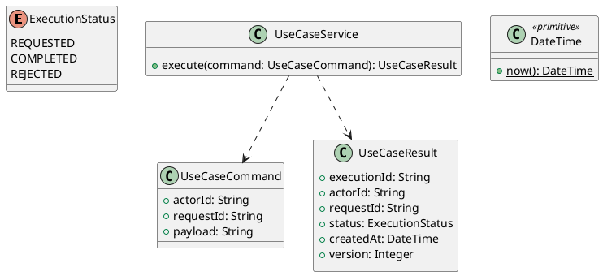

# UC-03 — Set Up a Student Learning Profile

### Description

- Collects the Student's learning goals, interests, current occupation, and education level through the four initial setup screens.
- Replaces UC-02's `/student/onboarding` integration shell. The four steps belong to one onboarding goal, with saved progress and an explicit completion outcome.
- The field choices and selection maxima are supported by Figma. Minimum selections, persistence, API contracts, concurrency behavior, and completion rules below are proposed project requirements, not quotations from a supplied Technical Report.
- The question Your Current Role describes occupation. It must not change account.role, grant Instructor privileges, or act as an application-role selector.

### Actors

Authenticated Student with an incomplete learning profile.

### Priority

Not specified in the supplied source.

### Trigger

**TRG-UC-03-01** — The actor opens the Set Up a Student Learning Profile interface.

### Preconditions

- **PRE-UC-03-01** — The interaction interface is visible to the actor.

### Postconditions

- **POST-UC-03-01** — The client displays the returned interaction outcome.

### Basic Flow

1. The actor opens the interaction interface.
2. The client displays the available controls.
3. The actor submits the interaction.
4. The client sends the request to the system.
5. The system returns an outcome.
6. The client displays the returned outcome.

### Alternative Flows

#### AF-UC-03-01

1. The actor chooses an available alternative action.
2. The client displays the returned alternative outcome.

### Exception Flows

#### EF-UC-03-01

1. The system returns an unsuccessful outcome.
2. The client displays the returned recovery message.

### UML Model



### Business Rules

```ocl
-- BR-UC-03-01
-- Source: Product source
context UseCaseService::execute(command: UseCaseCommand): UseCaseResult
pre BR_UC_03_01_ActorIsPresent:
  command.actorId <> null and command.actorId.trim().size() > 0
```

```ocl
-- BR-UC-03-02
-- Source: Product source
context UseCaseService::execute(command: UseCaseCommand): UseCaseResult
pre BR_UC_03_02_RequestIsPresent:
  command.requestId <> null and command.requestId.trim().size() > 0
```

```ocl
-- BR-UC-03-03
-- Source: Product source
context UseCaseService::execute(command: UseCaseCommand): UseCaseResult
pre BR_UC_03_03_PayloadIsPresent:
  command.payload <> null and command.payload.trim().size() > 0
```

```ocl
-- BR-UC-03-04
-- Source: Product source
context UseCaseService::execute(command: UseCaseCommand): UseCaseResult
post BR_UC_03_04_ExecutionIsIdentified:
  result.executionId <> null and result.executionId.trim().size() > 0
```

```ocl
-- BR-UC-03-05
-- Source: Product source
context UseCaseService::execute(command: UseCaseCommand): UseCaseResult
post BR_UC_03_05_ResultMatchesRequest:
  result.actorId = command.actorId and result.requestId = command.requestId
```

```ocl
-- BR-UC-03-06
-- Source: Product source
context UseCaseService::execute(command: UseCaseCommand): UseCaseResult
post BR_UC_03_06_ResultIsCompleted:
  result.status = ExecutionStatus::COMPLETED
```

```ocl
-- BR-UC-03-07
-- Source: Product source
context UseCaseService::execute(command: UseCaseCommand): UseCaseResult
post BR_UC_03_07_ResultIsVersioned:
  result.version > 0 and result.createdAt <= DateTime::now()
```

### Related UI

- [Supporting Figma node 1](https://www.figma.com/design/JDzl2rsSdGcA8tgcDG4kgy/EdTech-Platform-for-online-learning--Community-?node-id=222-2355)
- [Supporting Figma node 2](https://www.figma.com/design/JDzl2rsSdGcA8tgcDG4kgy/EdTech-Platform-for-online-learning--Community-?node-id=222-2263)
- [Supporting Figma node 3](https://www.figma.com/design/JDzl2rsSdGcA8tgcDG4kgy/EdTech-Platform-for-online-learning--Community-?node-id=222-2198)
- [Supporting Figma node 4](https://www.figma.com/design/JDzl2rsSdGcA8tgcDG4kgy/EdTech-Platform-for-online-learning--Community-?node-id=222-2147)

### Related APIs

- [API-UC-03-01](../api/api-uc-03-01.md)
- [API-UC-03-02](../api/api-uc-03-02.md)
- [API-UC-03-03](../api/api-uc-03-03.md)

### Notes

The complete supplied specification is preserved byte-for-byte at [edtech-uc-03-student-onboarding.md](../source/edtech-uc-03-student-onboarding.md). It remains authoritative for detailed flows, payloads, response examples, errors, implementation context, and validation behavior.
