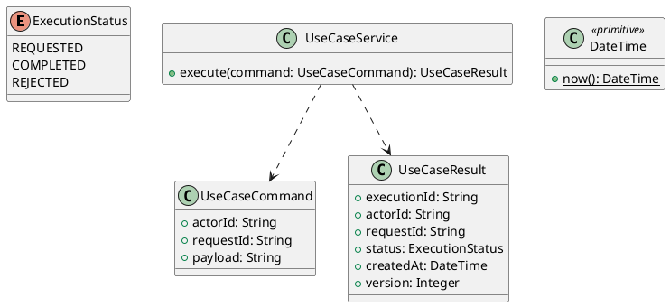

# UC-06 — View Assigned Courses and Module Progress

### Description

- Lets a Student find their assigned courses, filter/sort the collection, expand module progress, and select a module for learning when its destination is implemented.
- Implements My Courses without conflating catalogue discovery with course access. Uses UC-04 CourseCard and UC-05 progress rules.
- Assignment fixtures, query contracts, and deferred learning navigation are project decisions. This UC is not enrollment, course purchasing, lesson playback, or certificate generation.

### Actors

Authenticated Student with completed onboarding.

### Priority

Not specified in the supplied source.

### Trigger

**TRG-UC-06-01** — The actor opens the View Assigned Courses and Module Progress interface.

### Preconditions

- **PRE-UC-06-01** — The interaction interface is visible to the actor.

### Postconditions

- **POST-UC-06-01** — The client displays the returned interaction outcome.

### Basic Flow

1. The actor opens the interaction interface.
2. The client displays the available controls.
3. The actor submits the interaction.
4. The client sends the request to the system.
5. The system returns an outcome.
6. The client displays the returned outcome.

### Alternative Flows

#### AF-UC-06-01

1. The actor chooses an available alternative action.
2. The client displays the returned alternative outcome.

### Exception Flows

#### EF-UC-06-01

1. The system returns an unsuccessful outcome.
2. The client displays the returned recovery message.

### UML Model



### Business Rules

```ocl
-- BR-UC-06-01
-- Source: Product source
context UseCaseService::execute(command: UseCaseCommand): UseCaseResult
pre BR_UC_06_01_ActorIsPresent:
  command.actorId <> null and command.actorId.trim().size() > 0
```

```ocl
-- BR-UC-06-02
-- Source: Product source
context UseCaseService::execute(command: UseCaseCommand): UseCaseResult
pre BR_UC_06_02_RequestIsPresent:
  command.requestId <> null and command.requestId.trim().size() > 0
```

```ocl
-- BR-UC-06-03
-- Source: Product source
context UseCaseService::execute(command: UseCaseCommand): UseCaseResult
pre BR_UC_06_03_PayloadIsPresent:
  command.payload <> null and command.payload.trim().size() > 0
```

```ocl
-- BR-UC-06-04
-- Source: Product source
context UseCaseService::execute(command: UseCaseCommand): UseCaseResult
post BR_UC_06_04_ExecutionIsIdentified:
  result.executionId <> null and result.executionId.trim().size() > 0
```

```ocl
-- BR-UC-06-05
-- Source: Product source
context UseCaseService::execute(command: UseCaseCommand): UseCaseResult
post BR_UC_06_05_ResultMatchesRequest:
  result.actorId = command.actorId and result.requestId = command.requestId
```

```ocl
-- BR-UC-06-06
-- Source: Product source
context UseCaseService::execute(command: UseCaseCommand): UseCaseResult
post BR_UC_06_06_ResultIsCompleted:
  result.status = ExecutionStatus::COMPLETED
```

```ocl
-- BR-UC-06-07
-- Source: Product source
context UseCaseService::execute(command: UseCaseCommand): UseCaseResult
post BR_UC_06_07_ResultIsVersioned:
  result.version > 0 and result.createdAt <= DateTime::now()
```

### Related UI

- [Supporting Figma node 1](https://www.figma.com/design/JDzl2rsSdGcA8tgcDG4kgy/EdTech?node-id=222-1174)

### Related APIs

- [API-UC-06-01](../api/api-uc-06-01.md)
- [API-UC-06-02](../api/api-uc-06-02.md)

### Notes

The complete supplied specification is preserved byte-for-byte at [edtech-uc-06-view-my-courses.md](../source/edtech-uc-06-view-my-courses.md). It remains authoritative for detailed flows, payloads, response examples, errors, implementation context, and validation behavior.
