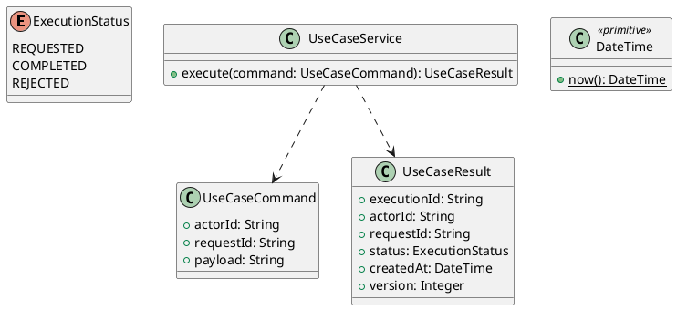

# UC-07 — View Course Modules and Learning Content

### Description

- Lets an enrolled Student inspect a module's ordered video lessons and quizzes and open a learning unit.
- Enables UC-06's Start/Resume/View module actions and provides a shared learning shell for UC-08 video and UC-09 quiz.
- Curriculum ordering, read contracts, route behavior, and the normalization of sample content are project requirements. Figma supports the course-material screen; no Technical Report or backend behavior is inferred from it.

### Actors

Authenticated, onboarded Student enrolled in the selected course.

### Priority

Not specified in the supplied source.

### Trigger

**TRG-UC-07-01** — The actor opens the View Course Modules and Learning Content interface.

### Preconditions

- **PRE-UC-07-01** — The interaction interface is visible to the actor.

### Postconditions

- **POST-UC-07-01** — The client displays the returned interaction outcome.

### Basic Flow

1. The actor opens the interaction interface.
2. The client displays the available controls.
3. The actor submits the interaction.
4. The client sends the request to the system.
5. The system returns an outcome.
6. The client displays the returned outcome.

### Alternative Flows

#### AF-UC-07-01

1. The actor chooses an available alternative action.
2. The client displays the returned alternative outcome.

### Exception Flows

#### EF-UC-07-01

1. The system returns an unsuccessful outcome.
2. The client displays the returned recovery message.

### UML Model



### Business Rules

```ocl
-- BR-UC-07-01
-- Source: Product source
context UseCaseService::execute(command: UseCaseCommand): UseCaseResult
pre BR_UC_07_01_ActorIsPresent:
  command.actorId <> null and command.actorId.trim().size() > 0
```

```ocl
-- BR-UC-07-02
-- Source: Product source
context UseCaseService::execute(command: UseCaseCommand): UseCaseResult
pre BR_UC_07_02_RequestIsPresent:
  command.requestId <> null and command.requestId.trim().size() > 0
```

```ocl
-- BR-UC-07-03
-- Source: Product source
context UseCaseService::execute(command: UseCaseCommand): UseCaseResult
pre BR_UC_07_03_PayloadIsPresent:
  command.payload <> null and command.payload.trim().size() > 0
```

```ocl
-- BR-UC-07-04
-- Source: Product source
context UseCaseService::execute(command: UseCaseCommand): UseCaseResult
post BR_UC_07_04_ExecutionIsIdentified:
  result.executionId <> null and result.executionId.trim().size() > 0
```

```ocl
-- BR-UC-07-05
-- Source: Product source
context UseCaseService::execute(command: UseCaseCommand): UseCaseResult
post BR_UC_07_05_ResultMatchesRequest:
  result.actorId = command.actorId and result.requestId = command.requestId
```

```ocl
-- BR-UC-07-06
-- Source: Product source
context UseCaseService::execute(command: UseCaseCommand): UseCaseResult
post BR_UC_07_06_ResultIsCompleted:
  result.status = ExecutionStatus::COMPLETED
```

```ocl
-- BR-UC-07-07
-- Source: Product source
context UseCaseService::execute(command: UseCaseCommand): UseCaseResult
post BR_UC_07_07_ResultIsVersioned:
  result.version > 0 and result.createdAt <= DateTime::now()
```

### Related UI

- [Supporting Figma node 1](https://www.figma.com/design/JDzl2rsSdGcA8tgcDG4kgy/EdTech?node-id=222-1030)

### Related APIs

- [API-UC-07-01](../api/api-uc-07-01.md)

### Notes

The complete supplied specification is preserved byte-for-byte at [edtech-uc-07-view-course-content.md](../source/edtech-uc-07-view-course-content.md). It remains authoritative for detailed flows, payloads, response examples, errors, implementation context, and validation behavior.
