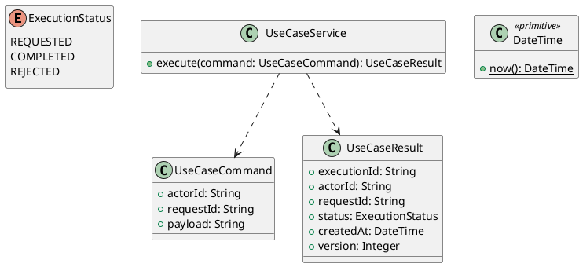

# UC-08 — Watch a Video Lesson and Save Progress

### Description

- Lets an enrolled Student play a course video, resume its saved position, and record completed playback coverage for unit-level progress.
- Completes UC-07 VIDEO navigation and supplies actual video-unit completion to UC-05/06. The experiment records player-reported playback coverage; it does not claim verified attendance, attention, or proctoring.
- The 90% completion threshold, progress contract, and concurrency rules are project decisions. The Figma frame supports the player layout and controls.

### Actors

Authenticated, onboarded Student enrolled in the video course.

### Priority

Not specified in the supplied source.

### Trigger

**TRG-UC-08-01** — The actor opens the Watch a Video Lesson and Save Progress interface.

### Preconditions

- **PRE-UC-08-01** — The interaction interface is visible to the actor.

### Postconditions

- **POST-UC-08-01** — The client displays the returned interaction outcome.

### Basic Flow

1. The actor opens the interaction interface.
2. The client displays the available controls.
3. The actor submits the interaction.
4. The client sends the request to the system.
5. The system returns an outcome.
6. The client displays the returned outcome.

### Alternative Flows

#### AF-UC-08-01

1. The actor chooses an available alternative action.
2. The client displays the returned alternative outcome.

### Exception Flows

#### EF-UC-08-01

1. The system returns an unsuccessful outcome.
2. The client displays the returned recovery message.

### UML Model



### Business Rules

```ocl
-- BR-UC-08-01
-- Source: Product source
context UseCaseService::execute(command: UseCaseCommand): UseCaseResult
pre BR_UC_08_01_ActorIsPresent:
  command.actorId <> null and command.actorId.trim().size() > 0
```

```ocl
-- BR-UC-08-02
-- Source: Product source
context UseCaseService::execute(command: UseCaseCommand): UseCaseResult
pre BR_UC_08_02_RequestIsPresent:
  command.requestId <> null and command.requestId.trim().size() > 0
```

```ocl
-- BR-UC-08-03
-- Source: Product source
context UseCaseService::execute(command: UseCaseCommand): UseCaseResult
pre BR_UC_08_03_PayloadIsPresent:
  command.payload <> null and command.payload.trim().size() > 0
```

```ocl
-- BR-UC-08-04
-- Source: Product source
context UseCaseService::execute(command: UseCaseCommand): UseCaseResult
post BR_UC_08_04_ExecutionIsIdentified:
  result.executionId <> null and result.executionId.trim().size() > 0
```

```ocl
-- BR-UC-08-05
-- Source: Product source
context UseCaseService::execute(command: UseCaseCommand): UseCaseResult
post BR_UC_08_05_ResultMatchesRequest:
  result.actorId = command.actorId and result.requestId = command.requestId
```

```ocl
-- BR-UC-08-06
-- Source: Product source
context UseCaseService::execute(command: UseCaseCommand): UseCaseResult
post BR_UC_08_06_ResultIsCompleted:
  result.status = ExecutionStatus::COMPLETED
```

```ocl
-- BR-UC-08-07
-- Source: Product source
context UseCaseService::execute(command: UseCaseCommand): UseCaseResult
post BR_UC_08_07_ResultIsVersioned:
  result.version > 0 and result.createdAt <= DateTime::now()
```

### Related UI

- [Supporting Figma node 1](https://www.figma.com/design/JDzl2rsSdGcA8tgcDG4kgy/EdTech?node-id=222-912)

### Related APIs

- [API-UC-08-01](../api/api-uc-08-01.md)
- [API-UC-08-02](../api/api-uc-08-02.md)
- [API-UC-08-03](../api/api-uc-08-03.md)

### Notes

The complete supplied specification is preserved byte-for-byte at [edtech-uc-08-watch-video-lesson.md](../source/edtech-uc-08-watch-video-lesson.md). It remains authoritative for detailed flows, payloads, response examples, errors, implementation context, and validation behavior.
