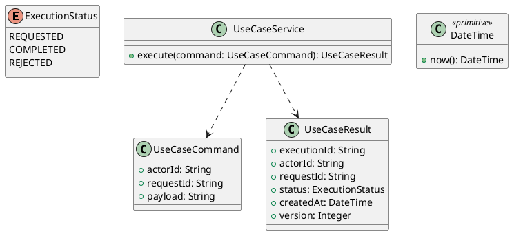

# UC-09 — Take a Course Quiz and View the Result

### Description

- Lets an enrolled Student start/resume a timed quiz, save answers, submit for grading, and view their result and highest score.
- Treats overview, attempt, draft, submission, and result as one quiz-taking business goal. Completes UC-07 QUIZ navigation and contributes quiz completion to the common course progress.
- Attempt limit, grading, passing threshold, timer authority, repeat behavior, and API contracts are project decisions. Figma supplies the three quiz screens, not an existing Technical Report or backend contract.

### Actors

Authenticated, onboarded Student enrolled in the quiz course.

### Priority

Not specified in the supplied source.

### Trigger

**TRG-UC-09-01** — The actor opens the Take a Course Quiz and View the Result interface.

### Preconditions

- **PRE-UC-09-01** — The interaction interface is visible to the actor.

### Postconditions

- **POST-UC-09-01** — The client displays the returned interaction outcome.

### Basic Flow

1. The actor opens the interaction interface.
2. The client displays the available controls.
3. The actor submits the interaction.
4. The client sends the request to the system.
5. The system returns an outcome.
6. The client displays the returned outcome.

### Alternative Flows

#### AF-UC-09-01

1. The actor chooses an available alternative action.
2. The client displays the returned alternative outcome.

### Exception Flows

#### EF-UC-09-01

1. The system returns an unsuccessful outcome.
2. The client displays the returned recovery message.

### UML Model



### Business Rules

```ocl
-- BR-UC-09-01
-- Source: Product source
context UseCaseService::execute(command: UseCaseCommand): UseCaseResult
pre BR_UC_09_01_ActorIsPresent:
  command.actorId <> null and command.actorId.trim().size() > 0
```

```ocl
-- BR-UC-09-02
-- Source: Product source
context UseCaseService::execute(command: UseCaseCommand): UseCaseResult
pre BR_UC_09_02_RequestIsPresent:
  command.requestId <> null and command.requestId.trim().size() > 0
```

```ocl
-- BR-UC-09-03
-- Source: Product source
context UseCaseService::execute(command: UseCaseCommand): UseCaseResult
pre BR_UC_09_03_PayloadIsPresent:
  command.payload <> null and command.payload.trim().size() > 0
```

```ocl
-- BR-UC-09-04
-- Source: Product source
context UseCaseService::execute(command: UseCaseCommand): UseCaseResult
post BR_UC_09_04_ExecutionIsIdentified:
  result.executionId <> null and result.executionId.trim().size() > 0
```

```ocl
-- BR-UC-09-05
-- Source: Product source
context UseCaseService::execute(command: UseCaseCommand): UseCaseResult
post BR_UC_09_05_ResultMatchesRequest:
  result.actorId = command.actorId and result.requestId = command.requestId
```

```ocl
-- BR-UC-09-06
-- Source: Product source
context UseCaseService::execute(command: UseCaseCommand): UseCaseResult
post BR_UC_09_06_ResultIsCompleted:
  result.status = ExecutionStatus::COMPLETED
```

```ocl
-- BR-UC-09-07
-- Source: Product source
context UseCaseService::execute(command: UseCaseCommand): UseCaseResult
post BR_UC_09_07_ResultIsVersioned:
  result.version > 0 and result.createdAt <= DateTime::now()
```

### Related UI

- [Supporting Figma node 1](https://www.figma.com/design/JDzl2rsSdGcA8tgcDG4kgy/EdTech?node-id=222-801)
- [Supporting Figma node 2](https://www.figma.com/design/JDzl2rsSdGcA8tgcDG4kgy/EdTech?node-id=222-650)
- [Supporting Figma node 3](https://www.figma.com/design/JDzl2rsSdGcA8tgcDG4kgy/EdTech?node-id=222-535)

### Related APIs

- [API-UC-09-01](../api/api-uc-09-01.md)
- [API-UC-09-02](../api/api-uc-09-02.md)
- [API-UC-09-03](../api/api-uc-09-03.md)
- [API-UC-09-04](../api/api-uc-09-04.md)
- [API-UC-09-05](../api/api-uc-09-05.md)

### Notes

The complete supplied specification is preserved byte-for-byte at [edtech-uc-09-take-course-quiz.md](../source/edtech-uc-09-take-course-quiz.md). It remains authoritative for detailed flows, payloads, response examples, errors, implementation context, and validation behavior.
