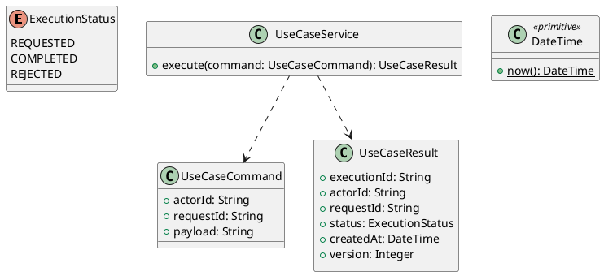

# UC-14 — Recover a Forgotten Password

### Description

- Allows an eligible Student to request a password-recovery email, open a time-limited link, and set a new password without knowing the old one.
- Enables UC-02's Forgot Password entry. Email-request/reset forms and link-based recovery are project-designed additions; only the entry link is supplied by Figma.
- Uses local Mailpit for the experiment, as UC-01 does. This is account recovery, not registration verification or automatic sign-in.

### Actors

Visitor who controls the email address of an ACTIVE, verified STUDENT account.

### Priority

Not specified in the supplied source.

### Trigger

**TRG-UC-14-01** — The actor opens the Recover a Forgotten Password interface.

### Preconditions

- **PRE-UC-14-01** — The interaction interface is visible to the actor.

### Postconditions

- **POST-UC-14-01** — The client displays the returned interaction outcome.

### Basic Flow

1. The actor opens the interaction interface.
2. The client displays the available controls.
3. The actor submits the interaction.
4. The client sends the request to the system.
5. The system returns an outcome.
6. The client displays the returned outcome.

### Alternative Flows

#### AF-UC-14-01

1. The actor chooses an available alternative action.
2. The client displays the returned alternative outcome.

### Exception Flows

#### EF-UC-14-01

1. The system returns an unsuccessful outcome.
2. The client displays the returned recovery message.

### UML Model



### Business Rules

```ocl
-- BR-UC-14-01
-- Source: Product source
context UseCaseService::execute(command: UseCaseCommand): UseCaseResult
pre BR_UC_14_01_ActorIsPresent:
  command.actorId <> null and command.actorId.trim().size() > 0
```

```ocl
-- BR-UC-14-02
-- Source: Product source
context UseCaseService::execute(command: UseCaseCommand): UseCaseResult
pre BR_UC_14_02_RequestIsPresent:
  command.requestId <> null and command.requestId.trim().size() > 0
```

```ocl
-- BR-UC-14-03
-- Source: Product source
context UseCaseService::execute(command: UseCaseCommand): UseCaseResult
pre BR_UC_14_03_PayloadIsPresent:
  command.payload <> null and command.payload.trim().size() > 0
```

```ocl
-- BR-UC-14-04
-- Source: Product source
context UseCaseService::execute(command: UseCaseCommand): UseCaseResult
post BR_UC_14_04_ExecutionIsIdentified:
  result.executionId <> null and result.executionId.trim().size() > 0
```

```ocl
-- BR-UC-14-05
-- Source: Product source
context UseCaseService::execute(command: UseCaseCommand): UseCaseResult
post BR_UC_14_05_ResultMatchesRequest:
  result.actorId = command.actorId and result.requestId = command.requestId
```

```ocl
-- BR-UC-14-06
-- Source: Product source
context UseCaseService::execute(command: UseCaseCommand): UseCaseResult
post BR_UC_14_06_ResultIsCompleted:
  result.status = ExecutionStatus::COMPLETED
```

```ocl
-- BR-UC-14-07
-- Source: Product source
context UseCaseService::execute(command: UseCaseCommand): UseCaseResult
post BR_UC_14_07_ResultIsVersioned:
  result.version > 0 and result.createdAt <= DateTime::now()
```

### Related UI

- [Supporting Figma node 1](https://www.figma.com/design/JDzl2rsSdGcA8tgcDG4kgy/EdTech?node-id=222-2528)

### Related APIs

- [API-UC-14-01](../api/api-uc-14-01.md)
- [API-UC-14-02](../api/api-uc-14-02.md)

### Notes

The complete supplied specification is preserved byte-for-byte at [edtech-uc-14-recover-password.md](../source/edtech-uc-14-recover-password.md). It remains authoritative for detailed flows, payloads, response examples, errors, implementation context, and validation behavior.
