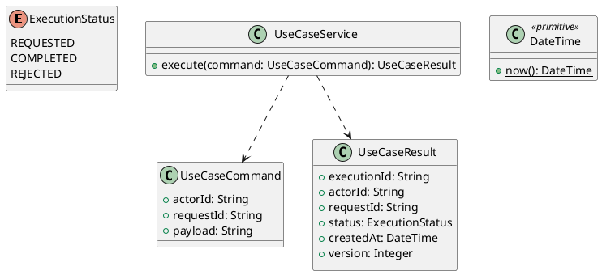

# UC-15 — Sign Out of the Current Browser Session

### Description

- Lets a signed-in Student end the current browser session and return to Login.
- Completes the Logout controls in the account menu and Profile screen. Unlike UC-13/14, this operation does not end every device's session.
- Session termination, unsaved-work behavior, and API contract are project decisions; Figma supports the visible action, not its backend implementation.

### Actors

Signed-in Student, including an account with incomplete onboarding. An already-ended session also receives successful logout.

### Priority

Not specified in the supplied source.

### Trigger

**TRG-UC-15-01** — The actor opens the Sign Out of the Current Browser Session interface.

### Preconditions

- **PRE-UC-15-01** — The interaction interface is visible to the actor.

### Postconditions

- **POST-UC-15-01** — The client displays the returned interaction outcome.

### Basic Flow

1. The actor opens the interaction interface.
2. The client displays the available controls.
3. The actor submits the interaction.
4. The client sends the request to the system.
5. The system returns an outcome.
6. The client displays the returned outcome.

### Alternative Flows

#### AF-UC-15-01

1. The actor chooses an available alternative action.
2. The client displays the returned alternative outcome.

### Exception Flows

#### EF-UC-15-01

1. The system returns an unsuccessful outcome.
2. The client displays the returned recovery message.

### UML Model



### Business Rules

```ocl
-- BR-UC-15-01
-- Source: Product source
context UseCaseService::execute(command: UseCaseCommand): UseCaseResult
pre BR_UC_15_01_ActorIsPresent:
  command.actorId <> null and command.actorId.trim().size() > 0
```

```ocl
-- BR-UC-15-02
-- Source: Product source
context UseCaseService::execute(command: UseCaseCommand): UseCaseResult
pre BR_UC_15_02_RequestIsPresent:
  command.requestId <> null and command.requestId.trim().size() > 0
```

```ocl
-- BR-UC-15-03
-- Source: Product source
context UseCaseService::execute(command: UseCaseCommand): UseCaseResult
pre BR_UC_15_03_PayloadIsPresent:
  command.payload <> null and command.payload.trim().size() > 0
```

```ocl
-- BR-UC-15-04
-- Source: Product source
context UseCaseService::execute(command: UseCaseCommand): UseCaseResult
post BR_UC_15_04_ExecutionIsIdentified:
  result.executionId <> null and result.executionId.trim().size() > 0
```

```ocl
-- BR-UC-15-05
-- Source: Product source
context UseCaseService::execute(command: UseCaseCommand): UseCaseResult
post BR_UC_15_05_ResultMatchesRequest:
  result.actorId = command.actorId and result.requestId = command.requestId
```

```ocl
-- BR-UC-15-06
-- Source: Product source
context UseCaseService::execute(command: UseCaseCommand): UseCaseResult
post BR_UC_15_06_ResultIsCompleted:
  result.status = ExecutionStatus::COMPLETED
```

```ocl
-- BR-UC-15-07
-- Source: Product source
context UseCaseService::execute(command: UseCaseCommand): UseCaseResult
post BR_UC_15_07_ResultIsVersioned:
  result.version > 0 and result.createdAt <= DateTime::now()
```

### Related UI

- [Supporting Figma node 1](https://www.figma.com/design/JDzl2rsSdGcA8tgcDG4kgy/EdTech?node-id=231-822)
- [Supporting Figma node 2](https://www.figma.com/design/JDzl2rsSdGcA8tgcDG4kgy/EdTech?node-id=222-436)

### Related APIs

- [API-UC-15-01](../api/api-uc-15-01.md)
- [API-UC-15-02](../api/api-uc-15-02.md)

### Notes

The complete supplied specification is preserved byte-for-byte at [edtech-uc-15-sign-out.md](../source/edtech-uc-15-sign-out.md). It remains authoritative for detailed flows, payloads, response examples, errors, implementation context, and validation behavior.
