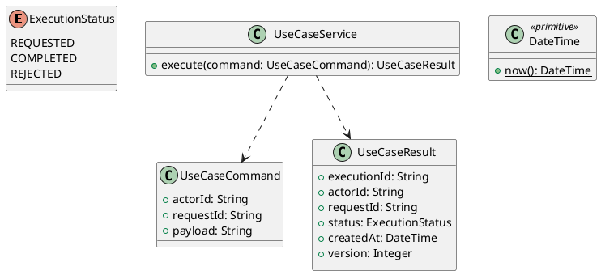

# UC-16 — Register an Instructor Account

### Description

- Allows an invited Instructor to register, verify their email, and subsequently access course management through the shared sign-in flow.
- Extends the Instructor tab visible in the Student registration design. Invitation eligibility, Instructor routes, account lifecycle, and API contracts are project requirements; they are not supplied by a Technical Report or inferred from Figma.
- This UC explicitly extends the Student-only eligibility of UC-02, UC-13, and UC-14 to support the account defined here. It does not convert an existing Student into an Instructor.

### Actors

Visitor with a project-issued Instructor invitation for their email address.

### Priority

Not specified in the supplied source.

### Trigger

**TRG-UC-16-01** — The actor opens the Register an Instructor Account interface.

### Preconditions

- **PRE-UC-16-01** — The interaction interface is visible to the actor.

### Postconditions

- **POST-UC-16-01** — The client displays the returned interaction outcome.

### Basic Flow

1. The actor opens the interaction interface.
2. The client displays the available controls.
3. The actor submits the interaction.
4. The client sends the request to the system.
5. The system returns an outcome.
6. The client displays the returned outcome.

### Alternative Flows

#### AF-UC-16-01

1. The actor chooses an available alternative action.
2. The client displays the returned alternative outcome.

### Exception Flows

#### EF-UC-16-01

1. The system returns an unsuccessful outcome.
2. The client displays the returned recovery message.

### UML Model



### Business Rules

```ocl
-- BR-UC-16-01
-- Source: Product source
context UseCaseService::execute(command: UseCaseCommand): UseCaseResult
pre BR_UC_16_01_ActorIsPresent:
  command.actorId <> null and command.actorId.trim().size() > 0
```

```ocl
-- BR-UC-16-02
-- Source: Product source
context UseCaseService::execute(command: UseCaseCommand): UseCaseResult
pre BR_UC_16_02_RequestIsPresent:
  command.requestId <> null and command.requestId.trim().size() > 0
```

```ocl
-- BR-UC-16-03
-- Source: Product source
context UseCaseService::execute(command: UseCaseCommand): UseCaseResult
pre BR_UC_16_03_PayloadIsPresent:
  command.payload <> null and command.payload.trim().size() > 0
```

```ocl
-- BR-UC-16-04
-- Source: Product source
context UseCaseService::execute(command: UseCaseCommand): UseCaseResult
post BR_UC_16_04_ExecutionIsIdentified:
  result.executionId <> null and result.executionId.trim().size() > 0
```

```ocl
-- BR-UC-16-05
-- Source: Product source
context UseCaseService::execute(command: UseCaseCommand): UseCaseResult
post BR_UC_16_05_ResultMatchesRequest:
  result.actorId = command.actorId and result.requestId = command.requestId
```

```ocl
-- BR-UC-16-06
-- Source: Product source
context UseCaseService::execute(command: UseCaseCommand): UseCaseResult
post BR_UC_16_06_ResultIsCompleted:
  result.status = ExecutionStatus::COMPLETED
```

```ocl
-- BR-UC-16-07
-- Source: Product source
context UseCaseService::execute(command: UseCaseCommand): UseCaseResult
post BR_UC_16_07_ResultIsVersioned:
  result.version > 0 and result.createdAt <= DateTime::now()
```

### Related UI

- [Supporting Figma node 1](https://www.figma.com/design/JDzl2rsSdGcA8tgcDG4kgy/EdTech-Platform-for-online-learning--Community-?node-id=222-2480)

### Related APIs

- [API-UC-16-01](../api/api-uc-16-01.md)
- [API-UC-16-02](../api/api-uc-16-02.md)
- [API-UC-16-03](../api/api-uc-16-03.md)

### Notes

The complete supplied specification is preserved byte-for-byte at [edtech-uc-16-register-instructor.md](../source/edtech-uc-16-register-instructor.md). It remains authoritative for detailed flows, payloads, response examples, errors, implementation context, and validation behavior.
